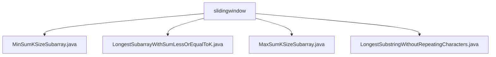

# 基础信息

|      |      |
|------|------|
| 名称 | slidingwindow |
| 编码语言 | .java |
| 代码路径 | Java/src/main/java/com/thealgorithms/slidingwindow |
| 包名 | Java.src.main.java.com.thealgorithms.slidingwindow |
| 概述说明 | 查找最小、最大和子数组及最长无重复子串的滑动窗口算法。 |

# 说明

## 概述
该代码模块主要涉及滑动窗口算法的实现，用于解决多种与子数组或子串相关的优化问题。滑动窗口技术通过动态调整窗口的大小或位置，避免重复计算，从而提高算法的效率。该模块包含以下几个核心功能：
1. 查找大小为k的子数组的最小和。
2. 查找元素之和小于或等于给定整数k的最长子数组。
3. 查找大小为k的子数组的最大和。
4. 计算字符串中不包含重复字符的最长子串的长度。

这些功能广泛应用于数据分析、时间序列处理、字符串处理等场景，能够高效地解决与连续子数组或子串相关的优化问题。

## 主要业务场景
1. **查找大小为k的子数组的最小和**  
   - 应用场景：在需要分析固定长度窗口内数据的最小值的情况下使用，例如在时间序列中寻找最小波动区间。
   - 核心算法：通过滑动窗口技术遍历数组，计算所有可能的k大小子数组的和，并找出其中的最小值。

2. **查找元素之和小于或等于给定整数k的最长子数组**  
   - 应用场景：在需要找到满足特定条件的最长子数组时使用，例如在预算限制下寻找最长的可行项目序列。
   - 核心算法：遍历数组，计算不同子数组的和，并比较这些子数组的长度，以确定最长的符合条件的子数组。

3. **查找大小为k的子数组的最大和**  
   - 应用场景：在需要分析固定长度窗口内数据的最大值的情况下使用，例如在时间序列中寻找最大收益区间。
   - 核心算法：通过滑动窗口技术遍历数组，计算所有可能的k大小子数组的和，并找出其中的最大值。

4. **计算字符串中不包含重复字符的最长子串的长度**  
   - 应用场景：在需要查找字符串中连续唯一字符序列的情况下使用，例如在文本处理中寻找最长无重复单词。
   - 核心算法：通过滑动窗口技术遍历字符串，动态跟踪当前子串的字符及其位置，确保无重复字符出现，并返回最长无重复字符子串的长度。

这些业务场景展示了滑动窗口算法在处理连续子数组或子串问题中的强大能力，能够高效地解决实际应用中的优化需求。

### 包内部结构视图

该流程图展示了在`slidingwindow`目录下的四个Java文件之间的层级关系。每个文件都直接隶属于`slidingwindow`目录，没有进一步的子目录结构。这些文件分别实现了不同的滑动窗口算法，包括最小和、最长子数组、最大和以及最长无重复字符子串的计算。

# 文件列表 File List

| 名称   | 类型  | 说明 |
|-------|------|-------------|
| [LongestSubarrayWithSumLessOrEqualToK.java](LongestSubarrayWithSumLessOrEqualToK.md) | file | 求数组中和不超过k的最长子数组长度。 |
| [LongestSubstringWithoutRepeatingCharacters.java](LongestSubstringWithoutRepeatingCharacters.md) | file | 计算字符串中无重复字符的最长子串长度。 |
| [MaxSumKSizeSubarray.java](MaxSumKSizeSubarray.md) | file | 查找长度为k的子数组的最大和。 |
| [MinSumKSizeSubarray.java](MinSumKSizeSubarray.md) | file | 查找长度为k的子数组的最小和。 |

