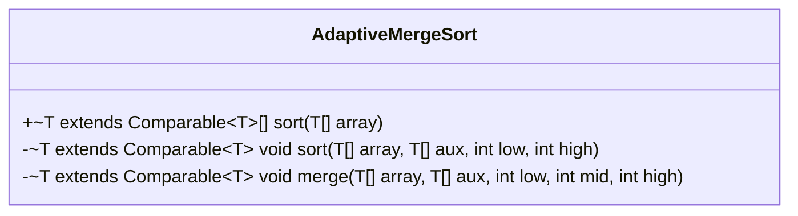
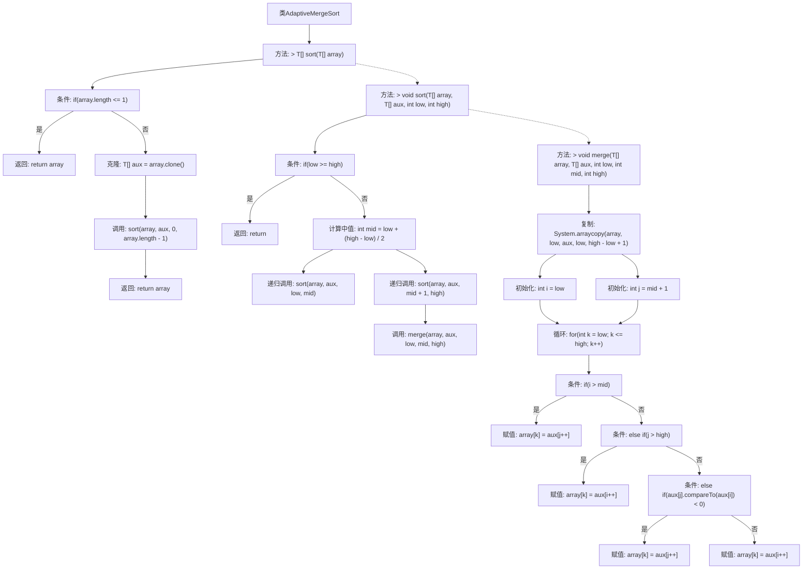

# 基础信息

|      |      |
|------|------|
| 名称 | AdaptiveMergeSort |
| 编码语言 | .java |
| 代码路径 | Java/src/main/java/com/thealgorithms/sorts/AdaptiveMergeSort.java |
| 包名 | com.thealgorithms.sorts |
| 依赖项 | [] |
| 概述说明 | 自适应归并排序通过递归分治合并数组元素。 |

# 说明

自适应归并排序算法是一种基于递归分治策略的排序方法，通过将数组元素不断分割成更小的子数组，直至每个子数组仅包含一个元素，然后逐步合并这些子数组，最终实现整个数组的有序排列。该算法的核心在于其自适应性，能够根据输入数据的特性动态调整分治策略，从而提高排序效率。整个过程包括分割、排序和合并三个主要步骤，确保最终结果的有序性和准确性。

# 类列表 Class Summary

| 名称   | 类型  | 说明 |
|-------|------|-------------|
| AdaptiveMergeSort | class | 自适应归并排序算法实现，递归分治合并数组元素。 |

## 类 AdaptiveMergeSort

|      |      |
|------|------|
| 访问范围 | public |
| 类型 | class |
| 名称 | AdaptiveMergeSort |
| 说明 | 自适应归并排序算法实现，递归分治合并数组元素。 |

### UML类图

**描述：**  
`AdaptiveMergeSort` 类实现了一个自适应归并排序算法，适用于实现了 `Comparable` 接口的泛型数组。该类包含一个公有方法 `sort`，用于对数组进行排序，以及两个私有方法 `sort` 和 `merge`，分别用于递归排序和合并两个子数组。通过克隆数组作为辅助数组，该方法确保在排序过程中不会修改原始数组，最终返回排序后的数组。

### 内部方法调用关系图

这段代码实现了自适应归并排序算法。`AdaptiveMergeSort`类包含三个主要方法：`sort`、`sort`（递归）和`merge`。`sort`方法首先检查数组长度，若长度小于等于1则直接返回数组，否则克隆数组并调用递归排序方法。递归排序方法将数组分为两部分，分别对左右两部分进行排序，最后调用`merge`方法合并两个有序子数组。`merge`方法通过复制数组元素并比较大小，将两个子数组合并为一个有序数组。

### 字段列表 Field List

| 名称  | 类型  | 说明 |
|-------|-------|------|

### 方法列表 Method List

| 名称  | 类型  | 说明 |
|-------|-------|------|
| sort | T[] | 泛型数组排序方法，支持克隆辅助数组并递归排序。 |
| merge | void | 合并排序的归并操作，将数组分段合并，保持有序。 |
| sort | void | 私有方法对数组进行递归排序并合并。 |

