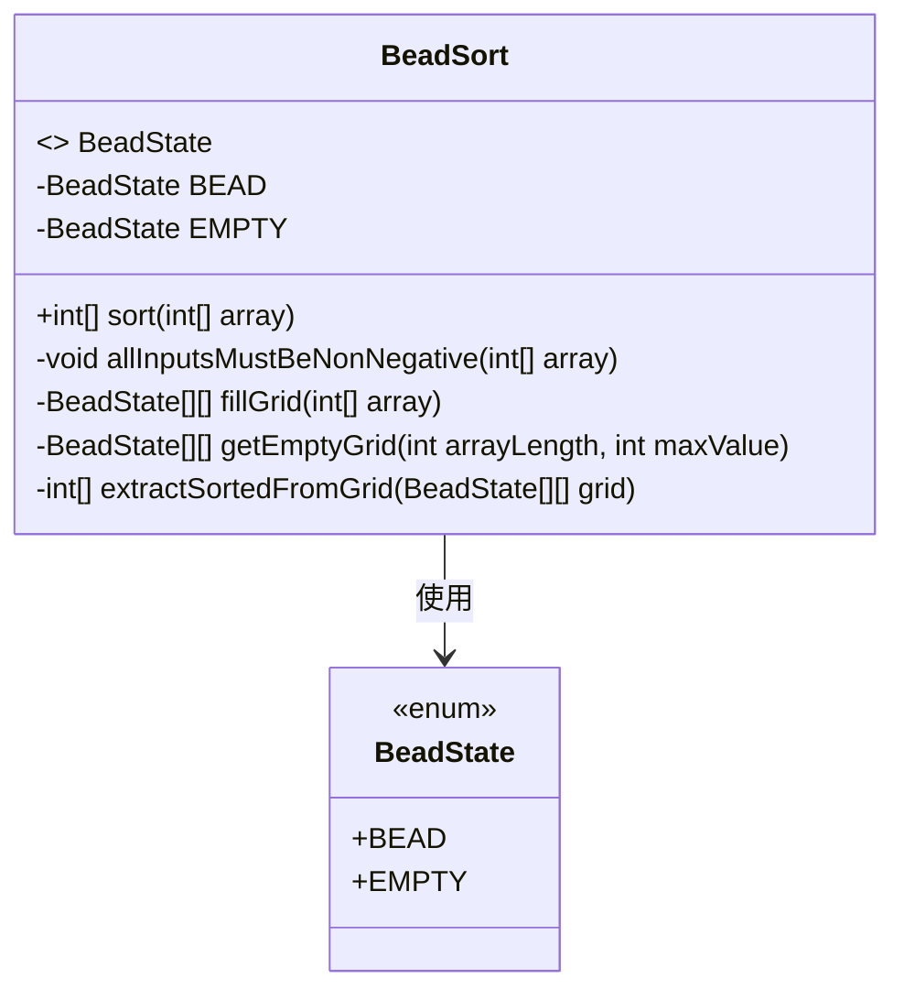
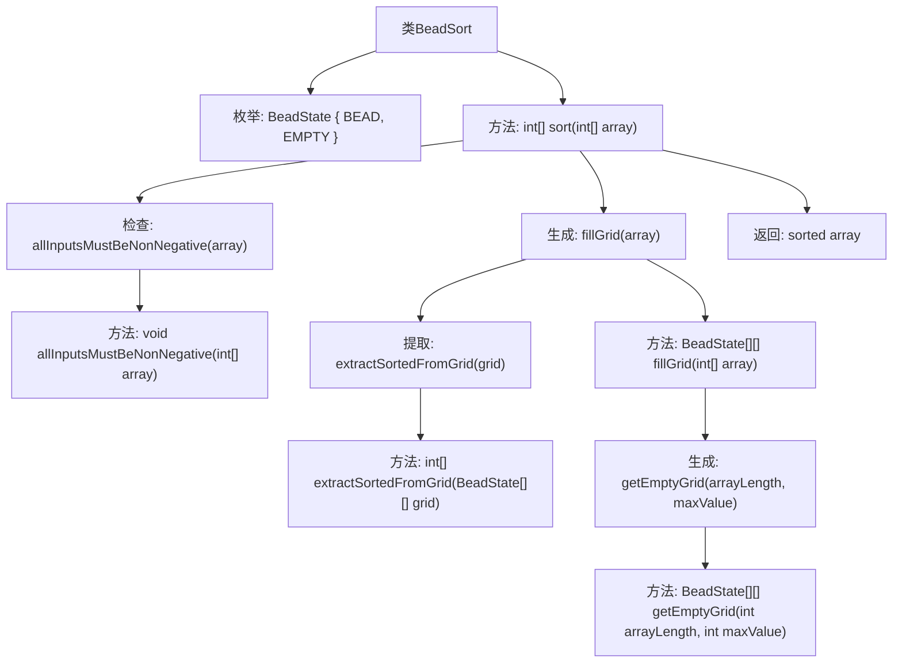

# 基础信息

|      |      |
|------|------|
| 名称 | BeadSort |
| 编码语言 | .java |
| 代码路径 | Java/src/main/java/com/thealgorithms/sorts/BeadSort.java |
| 包名 | com.thealgorithms.sorts |
| 依赖项 | ['java.util.Arrays'] |
| 概述说明 | BeadSort算法实现非负整数数组排序，含输入验证和网格填充。 |

# 说明

BeadSort算法是一种用于对非负整数数组进行排序的非比较排序算法。该算法的实现包括输入验证和网格填充两个关键步骤。输入验证确保数组中的元素均为非负整数，避免无效数据影响排序结果。网格填充阶段，算法通过模拟珠子在重力作用下的自然下落过程，将数组元素转换为珠子在网格中的分布，从而实现排序。BeadSort算法在处理非负整数数组时表现出色，尤其适用于特定场景下的排序需求。

# 类列表 Class Summary

| 名称   | 类型  | 说明 |
|-------|------|-------------|
| BeadSort | class | BeadSort算法实现，处理非负整数数组排序，包含输入验证和网格填充。 |

## 类 BeadSort

|      |      |
|------|------|
| 访问范围 | public |
| 类型 | class |
| 名称 | BeadSort |
| 说明 | BeadSort算法实现，处理非负整数数组排序，包含输入验证和网格填充。 |

### UML类图

类图描述：
`BeadSort` 类实现了一个基于珠排序算法的排序功能。它包含一个枚举类型 `BeadState`，用于表示珠子的状态（`BEAD` 或 `EMPTY`）。`BeadSort` 类的主要方法 `sort` 接受一个非负整数数组并返回排序后的数组。私有方法 `allInputsMustBeNonNegative` 用于验证输入数组中的所有元素是否为非负数，`fillGrid` 方法用于填充珠子网格，`getEmptyGrid` 方法用于初始化空网格，`extractSortedFromGrid` 方法用于从网格中提取排序后的数组。

### 内部方法调用关系图

这段代码实现了BeadSort算法，用于对非负整数数组进行排序。首先，`allInputsMustBeNonNegative`方法检查数组中是否包含负数，若有则抛出异常。接着，`fillGrid`方法根据数组中的最大值创建一个二维网格，并在网格中填充珠子（`BEAD`）。`getEmptyGrid`方法用于初始化一个空的二维网格。最后，`extractSortedFromGrid`方法从网格中提取排序后的数组并返回。整个流程确保了数组的正确排序。

### 字段列表 Field List

| 名称  | 类型  | 说明 |
|-------|-------|------|

### 方法列表 Method List

| 名称  | 类型  | 说明 |
|-------|-------|------|
| allInputsMustBeNonNegative | void | 方法检查数组元素均为非负数，否则抛出异常。 |
| sort | int[] | 该方法对非负整数数组进行排序，先填充网格再提取排序结果。 |
| getEmptyGrid | BeadState[][] | 生成空二维数组，所有元素初始化为EMPTY状态。 |
| fillGrid | BeadState[][] | 该方法通过数组生成二维网格，表示珠子状态。 |
| extractSortedFromGrid | int[] | 从二维数组中提取每行末尾连续BeadState.BEAD的数量并排序。 |

