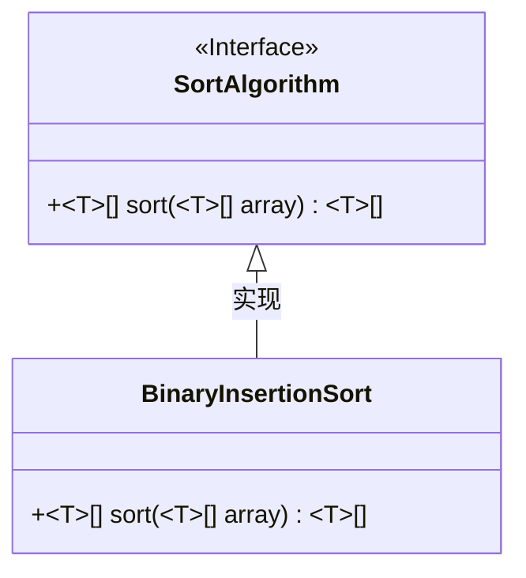
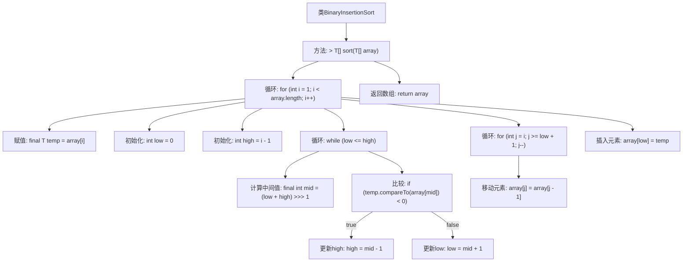

# 基础信息

|      |      |
|------|------|
| 名称 | BinaryInsertionSort |
| 编码语言 | .java |
| 代码路径 | Java/src/main/java/com/thealgorithms/sorts/BinaryInsertionSort.java |
| 包名 | com.thealgorithms.sorts |
| 依赖项 | [] |
| 概述说明 | 二分插入排序利用二分查找优化插入位置，提高排序效率。 |

# 说明

二分插入排序算法通过结合二分查找技术优化传统插入排序的性能。其核心思想是在已排序部分使用二分查找快速确定新元素的插入位置，从而减少比较次数，提升整体排序效率。该算法适用于数据量较小且部分有序的场景，能够有效降低时间复杂度，但空间复杂度保持不变。实现过程中需注意二分查找的边界条件和插入操作的细节，以确保算法的正确性和稳定性。

# 类列表 Class Summary

| 名称   | 类型  | 说明 |
|-------|------|-------------|
| BinaryInsertionSort | class | 二分插入排序算法实现，通过二分查找确定插入位置，提升排序效率。 |

## 类 BinaryInsertionSort

|      |      |
|------|------|
| 访问范围 | public |
| 类型 | class |
| 名称 | BinaryInsertionSort |
| 说明 | 二分插入排序算法实现，通过二分查找确定插入位置，提升排序效率。 |

### UML类图

这段代码实现了一个名为 `BinaryInsertionSort` 的类，该类实现了 `SortAlgorithm` 接口。`BinaryInsertionSort` 类中的 `sort` 方法使用二分插入排序算法对泛型数组进行排序。该算法通过二分查找确定元素插入位置，然后将元素插入到正确位置，从而提高插入排序的效率。`SortAlgorithm` 接口定义了排序算法的通用行为，`BinaryInsertionSort` 类通过实现该接口提供了具体的排序功能。

### 内部方法调用关系图

这段代码实现了二分插入排序算法，通过将未排序的元素插入到已排序部分的正确位置来排序数组。代码首先遍历数组，对每个元素使用二分查找确定其插入位置，然后通过移动元素为其腾出空间，最后将元素插入到正确位置。该算法的时间复杂度为O(n^2)，但由于使用了二分查找，减少了比较次数，提高了效率。

### 字段列表 Field List

| 名称  | 类型  | 说明 |
|-------|-------|------|

### 方法列表 Method List

| 名称  | 类型  | 说明 |
|-------|-------|------|
| sort | T[] | 该方法使用二分插入排序对数组进行排序，返回排序后的数组。 |

