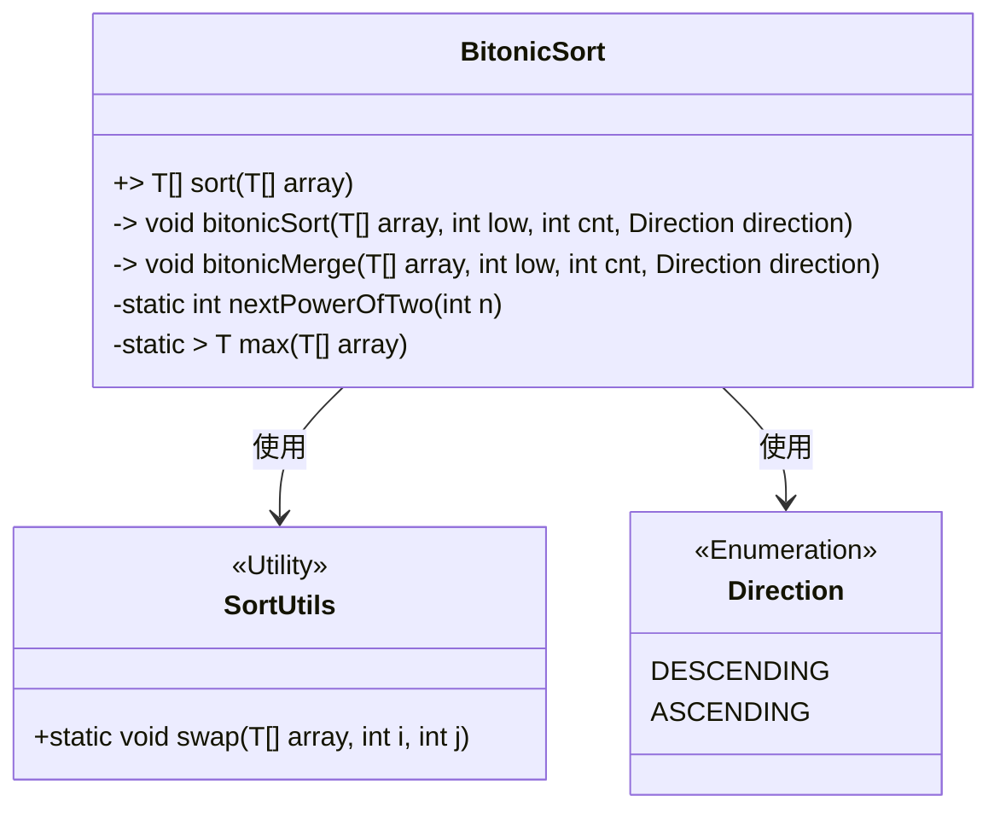
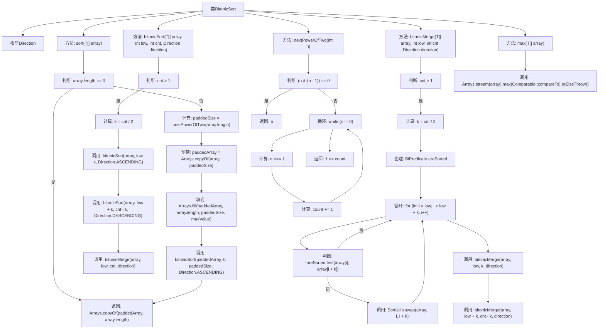

# 基础信息

|      |      |
|------|------|
| 名称 | BitonicSort |
| 编码语言 | .java |
| 代码路径 | Java/src/main/java/com/thealgorithms/sorts/BitonicSort.java |
| 包名 | com.thealgorithms.sorts |
| 依赖项 | ['java.util.Arrays', 'java.util.function.BiPredicate'] |
| 概述说明 | BitonicSort类实现升序降序排序，通过填充最大值和递归合并完成。 |

# 说明

BitonicSort类实现了一种排序算法，支持升序和降序两种排序方式。该算法通过填充最大值并递归合并的方式完成排序。具体来说，它首先将数据填充至最大长度，然后通过递归将数据分成多个子序列进行排序和合并，最终实现整体排序。该算法适用于并行计算环境，能够高效处理大规模数据。

# 类列表 Class Summary

| 名称   | 类型  | 说明 |
|-------|------|-------------|
| BitonicSort | class | BitonicSort类实现排序算法，支持升序降序，通过填充最大值并递归合并完成排序。 |

## 类 BitonicSort

|      |      |
|------|------|
| 访问范围 | public |
| 类型 | class |
| 名称 | BitonicSort |
| 说明 | BitonicSort类实现排序算法，支持升序降序，通过填充最大值并递归合并完成排序。 |

### UML类图

这段代码实现了Bitonic Sort算法，用于对数组进行排序。`BitonicSort`类包含一个公共方法`sort`，用于对外提供排序功能，以及多个私有方法用于内部实现排序逻辑。`Direction`枚举类定义了排序方向（升序或降序），`SortUtils`工具类提供了交换数组元素的静态方法。`BitonicSort`类通过递归调用`bitonicSort`和`bitonicMerge`方法，实现了Bitonic Sort算法的核心逻辑。

### 内部方法调用关系图

流程图描述了BitonicSort类的内部逻辑，展示了排序算法的执行流程。首先检查数组是否为空，然后计算并填充数组到最近的2的幂次方大小，接着进行Bitonic排序和合并操作。排序过程中，递归地对数组进行分割和合并，最终返回排序后的数组。流程图清晰地展示了各个方法之间的调用关系和条件判断。

### 字段列表 Field List

| 名称  | 类型  | 说明 |
|-------|-------|------|

### 方法列表 Method List

| 名称  | 类型  | 说明 |
|-------|-------|------|
| sort | T[] | 重写sort方法，对数组进行位排序并返回结果。 |
| nextPowerOfTwo | int | 计算大于等于n的最小2的幂。 |
| max | T | 该方法通过流操作查找数组中的最大元素。 |
| bitonicSort | void | 私有方法实现双调排序，递归分割数组并按指定方向排序后合并。 |
| bitonicMerge | void | 私有方法实现双调归并排序，根据方向比较并交换数组元素，递归处理子数组。 |

