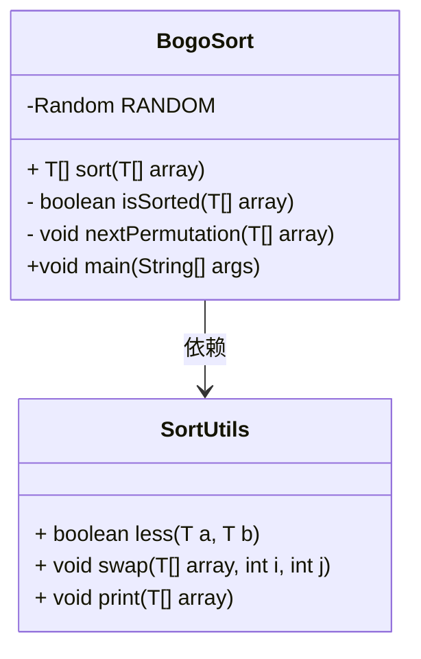
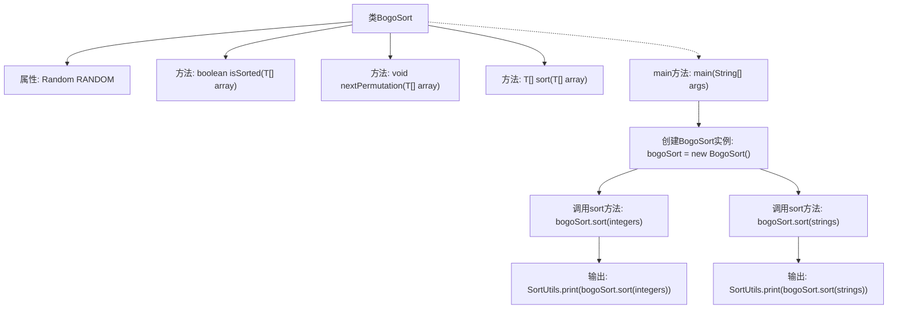

# 基础信息

|      |      |
|------|------|
| 名称 | BogoSort |
| 编码语言 | .java |
| 代码路径 | Java/src/main/java/com/thealgorithms/sorts/BogoSort.java |
| 包名 | com.thealgorithms.sorts |
| 依赖项 | ['java.util.Random'] |
| 概述说明 | BogoSort通过随机排列数组直至有序实现排序。 |

# 说明

BogoSort是一种随机排序算法，其核心思想是通过不断随机排列数组中的元素，直到数组最终达到有序状态。该算法不依赖于任何特定的排序策略，而是完全基于随机性。由于每次排列都是随机的，BogoSort的效率极低，特别是在处理大规模数据时，其时间复杂度可能非常高。尽管BogoSort在实际应用中并不实用，但它常被用作教学示例，以展示排序算法的多样性和随机性在算法设计中的作用。

# 类列表 Class Summary

| 名称   | 类型  | 说明 |
|-------|------|-------------|
| BogoSort | class | BogoSort实现随机排序算法，通过不断随机排列数组直到有序。 |

## 类 BogoSort

|      |      |
|------|------|
| 访问范围 | public |
| 类型 | class |
| 名称 | BogoSort |
| 说明 | BogoSort实现随机排序算法，通过不断随机排列数组直到有序。 |

### UML类图

**描述：**
`BogoSort` 类实现了 `SortAlgorithm` 接口，使用了一种称为 BogoSort 的排序算法。该算法通过随机打乱数组直到其有序为止。`BogoSort` 类依赖于 `SortUtils` 类中的辅助方法 `less`、`swap` 和 `print` 来完成比较、交换和打印数组的功能。`isSorted` 方法用于检查数组是否已排序，而 `nextPermutation` 方法则随机打乱数组。`sort` 方法通过不断调用 `nextPermutation` 直到数组有序为止。`main` 方法展示了如何使用 `BogoSort` 对整数和字符串数组进行排序。

### 内部方法调用关系图

这段代码实现了一个名为 `BogoSort` 的排序算法，该算法通过随机打乱数组直到数组有序为止。代码首先定义了一个 `isSorted` 方法用于检查数组是否有序，然后定义了一个 `nextPermutation` 方法用于随机打乱数组。`sort` 方法则通过不断调用 `nextPermutation` 直到数组有序。`main` 方法中分别对整数数组和字符串数组进行排序并输出结果。

### 字段列表 Field List

| 名称  | 类型  | 说明 |
|-------|-------|------|
| RANDOM = new Random() | Random | 声明一个私有的静态随机数生成器实例。 |

### 方法列表 Method List

| 名称  | 类型  | 说明 |
|-------|-------|------|
| isSorted | boolean | 检查泛型数组是否按升序排列。 |
| nextPermutation | void | 静态方法nextPermutation随机打乱数组元素顺序。 |
| sort | T[] | 该方法通过不断生成排列直到数组有序，实现通用数组排序。 |
| main | void | Java代码示例：使用BogoSort对整数和字符串数组进行排序并打印结果。 |

