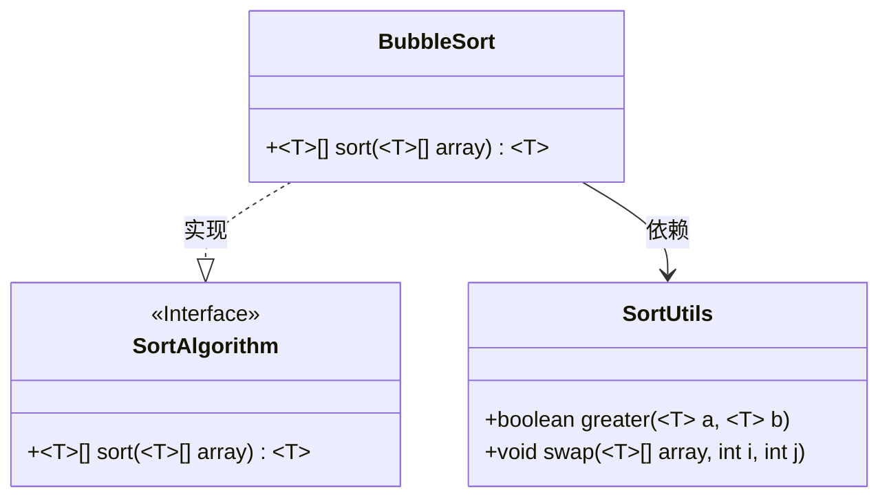
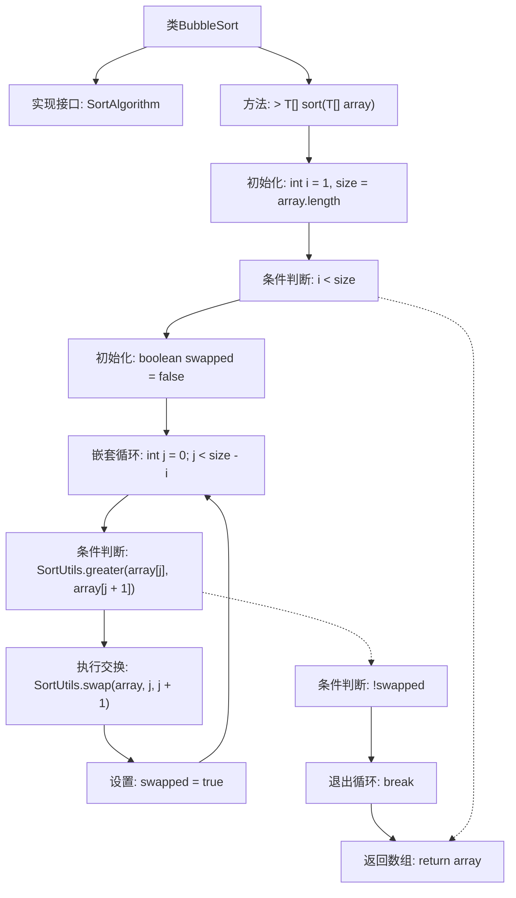

# 基础信息

|      |      |
|------|------|
| 名称 | BubbleSort |
| 编码语言 | .java |
| 代码路径 | Java/src/main/java/com/thealgorithms/sorts/BubbleSort.java |
| 包名 | com.thealgorithms.sorts |
| 依赖项 | [] |
| 概述说明 | BubbleSort类实现通用冒泡排序，返回排序数组。 |

# 说明

BubbleSort类实现了通用的冒泡排序算法，该算法通过重复遍历数组，比较相邻元素并交换位置，逐步将最大元素移动到数组末尾，最终返回排序后的数组。

# 类列表 Class Summary

| 名称   | 类型  | 说明 |
|-------|------|-------------|
| BubbleSort | class | BubbleSort类实现通用冒泡排序算法，返回排序后的数组。 |

## 类 BubbleSort

|      |      |
|------|------|
| 访问范围 | None |
| 类型 | class |
| 名称 | BubbleSort |
| 说明 | BubbleSort类实现通用冒泡排序算法，返回排序后的数组。 |

### UML类图

这段代码展示了`BubbleSort`类实现了`SortAlgorithm`接口，并依赖于`SortUtils`工具类来进行比较和交换操作。`BubbleSort`类中的`sort`方法实现了泛型冒泡排序算法，通过比较相邻元素并在必要时交换它们的位置来排序数组。如果在一轮遍历中没有发生任何交换，算法会提前终止，从而提高效率。

### 内部方法调用关系图

这段代码实现了冒泡排序算法，通过嵌套循环比较相邻元素并交换它们的位置，直到数组完全排序。外层循环控制遍历次数，内层循环执行实际的比较和交换操作。如果在某次遍历中没有发生任何交换，则提前退出循环，优化了排序效率。最终返回排序后的数组。

### 字段列表 Field List

| 名称  | 类型  | 说明 |
|-------|-------|------|

### 方法列表 Method List

| 名称  | 类型  | 说明 |
|-------|-------|------|
| sort | T[] | 重写排序方法，使用冒泡排序算法优化数组排序。 |

