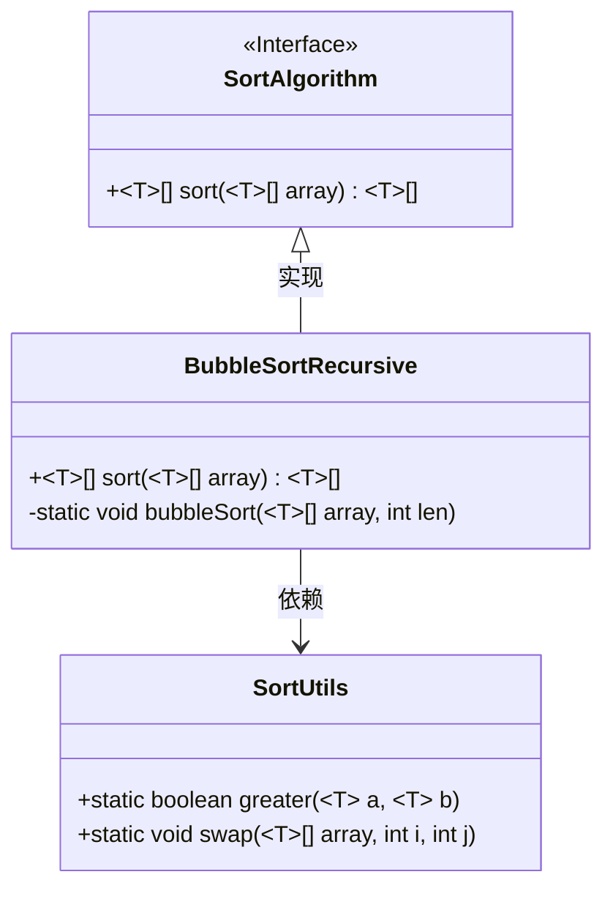
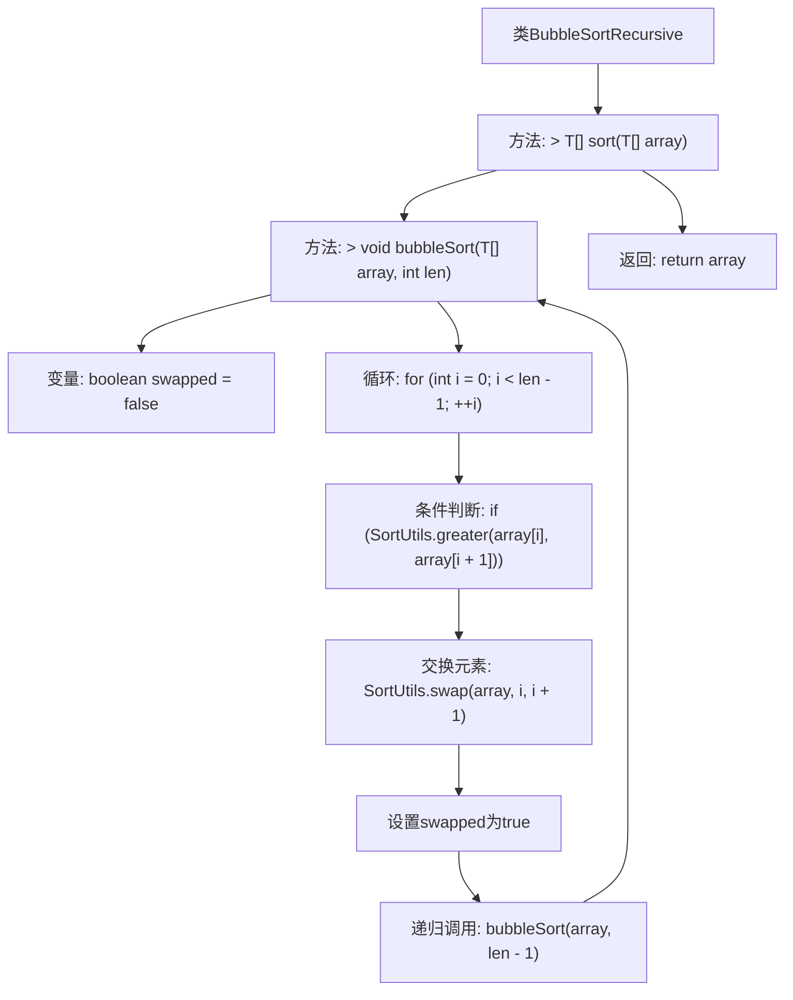

# 基础信息

|      |      |
|------|------|
| 名称 | BubbleSortRecursive |
| 编码语言 | .java |
| 代码路径 | Java/src/main/java/com/thealgorithms/sorts/BubbleSortRecursive.java |
| 包名 | com.thealgorithms.sorts |
| 依赖项 | [] |
| 概述说明 | 递归冒泡排序通过比较交换元素并递归调用实现排序。 |

# 说明

递归实现冒泡排序是一种通过递归调用完成排序的算法。其核心思想是通过比较相邻元素并交换位置，将最大元素逐步移动到数组末尾。每次递归调用都会减少待排序数组的长度，直到整个数组有序。该算法利用递归代替传统的循环结构，实现了相同的排序效果。递归终止条件是数组长度为1，此时数组已经有序。这种实现方式简洁但可能因递归深度较大而导致栈溢出问题。

# 类列表 Class Summary

| 名称   | 类型  | 说明 |
|-------|------|-------------|
| BubbleSortRecursive | class | 递归实现冒泡排序，通过比较交换元素并递归调用完成排序。 |

## 类 BubbleSortRecursive

|      |      |
|------|------|
| 访问范围 | public |
| 类型 | class |
| 名称 | BubbleSortRecursive |
| 说明 | 递归实现冒泡排序，通过比较交换元素并递归调用完成排序。 |

### UML类图

类图描述：
该代码实现了一个递归的冒泡排序算法。`BubbleSortRecursive`类实现了`SortAlgorithm`接口，并提供了`sort`方法来对数组进行排序。`bubbleSort`方法是一个私有静态方法，用于递归地执行冒泡排序。`SortUtils`类提供了`greater`和`swap`两个静态方法，用于比较和交换数组中的元素。`BubbleSortRecursive`类依赖于`SortUtils`类来完成排序操作。

### 内部方法调用关系图

这段代码实现了一个递归的冒泡排序算法。`BubbleSortRecursive`类包含两个方法：`sort`和`bubbleSort`。`sort`方法调用`bubbleSort`方法进行排序，并返回排序后的数组。`bubbleSort`方法通过递归的方式实现冒泡排序，每次循环比较相邻元素并在必要时交换它们的位置。如果发生了交换，则递归调用`bubbleSort`方法继续排序，直到数组完全有序。

### 字段列表 Field List

| 名称  | 类型  | 说明 |
|-------|-------|------|

### 方法列表 Method List

| 名称  | 类型  | 说明 |
|-------|-------|------|
| sort | T[] | 重写sort方法，使用冒泡排序对数组进行排序并返回。 |
| bubbleSort | void | 私有静态方法实现冒泡排序，递归优化已交换元素。 |

