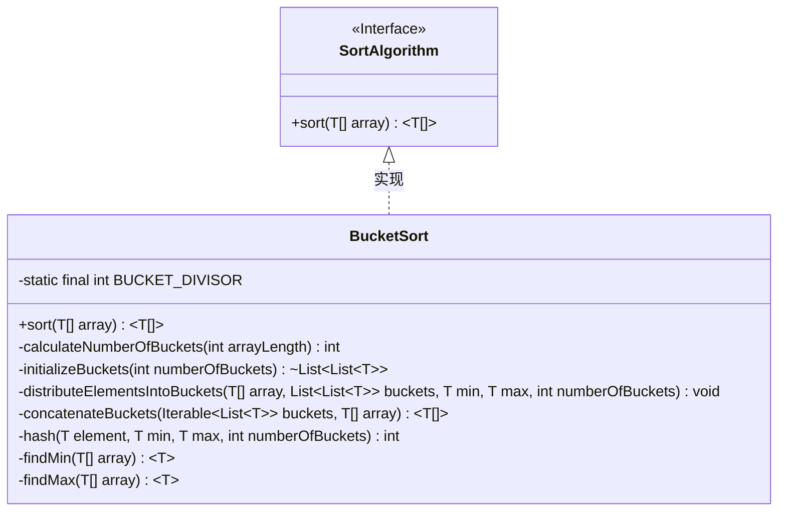
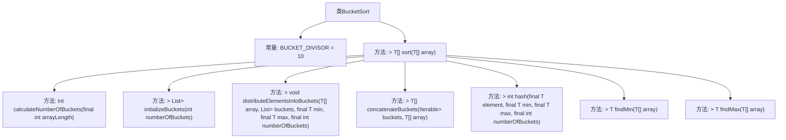

# 基础信息

|      |      |
|------|------|
| 名称 | BucketSort |
| 编码语言 | .java |
| 代码路径 | Java/src/main/java/com/thealgorithms/sorts/BucketSort.java |
| 包名 | com.thealgorithms.sorts |
| 依赖项 | ['java.util.ArrayList', 'java.util.Collections', 'java.util.List'] |
| 概述说明 | 桶排序实现步骤：初始化桶、分配元素、排序桶、合并结果。 |

# 说明

桶排序算法实现主要包括四个步骤。首先，初始化桶，根据元素范围和桶的数量确定每个桶的容量。其次，将待排序元素分配到相应的桶中，确保每个桶内的元素在特定范围内。接着，对每个桶内的元素进行排序，通常使用其他排序算法如插入排序。最后，将所有桶中的元素按顺序合并，得到最终的有序序列。整个过程通过分桶和排序的方式，有效提高了排序效率。

# 类列表 Class Summary

| 名称   | 类型  | 说明 |
|-------|------|-------------|
| BucketSort | class | 桶排序算法实现，包括初始化桶、元素分配、桶排序及合并。 |

## 类 BucketSort

|      |      |
|------|------|
| 访问范围 | public |
| 类型 | class |
| 名称 | BucketSort |
| 说明 | 桶排序算法实现，包括初始化桶、元素分配、桶排序及合并。 |

### UML类图

类图描述：
`BucketSort` 类实现了 `SortAlgorithm` 接口，提供了桶排序算法的具体实现。该类包含多个私有方法，用于计算桶的数量、初始化桶、将元素分配到桶中、合并排序后的桶以及计算元素在桶中的索引。`BucketSort` 类通过 `sort` 方法对外提供排序功能，内部通过 `findMin` 和 `findMax` 方法找到数组中的最小值和最大值，以便正确分配元素到桶中。

### 内部方法调用关系图

**描述：**  
这段代码实现了桶排序算法。首先，通过`calculateNumberOfBuckets`方法计算所需的桶数量，然后使用`initializeBuckets`方法初始化这些桶。接着，通过`distributeElementsIntoBuckets`方法将数组中的元素分配到相应的桶中。最后，使用`concatenateBuckets`方法将排序后的桶元素合并回原数组。整个过程中，还使用了`findMin`和`findMax`方法来找到数组中的最小值和最大值，以及`hash`方法来确定元素应放入哪个桶。

### 字段列表 Field List

| 名称  | 类型  | 说明 |
|-------|-------|------|
| BUCKET_DIVISOR = 10 | int | 定义一个私有静态常量BUCKET_DIVISOR，值为10。 |

### 方法列表 Method List

| 名称  | 类型  | 说明 |
|-------|-------|------|
| calculateNumberOfBuckets | int | 计算数组长度对应的桶数，至少为1。 |
| initializeBuckets | List<List<T>> | 初始化指定数量的空桶列表。 |
| distributeElementsIntoBuckets | void | 私有方法将数组元素按哈希值分配到指定数量的桶中。 |
| findMin | T | 泛型方法查找数组中的最小元素。 |
| sort | T[] | 重写sort方法，实现基于桶排序的数组排序。 |
| concatenateBuckets | T[] | 合并并排序多个桶中的元素到指定数组。 |
| findMax | T | 泛型方法查找数组中的最大元素并返回。 |
| hash | int | 私有方法计算元素哈希值，基于范围归一化后映射到指定桶数。 |

