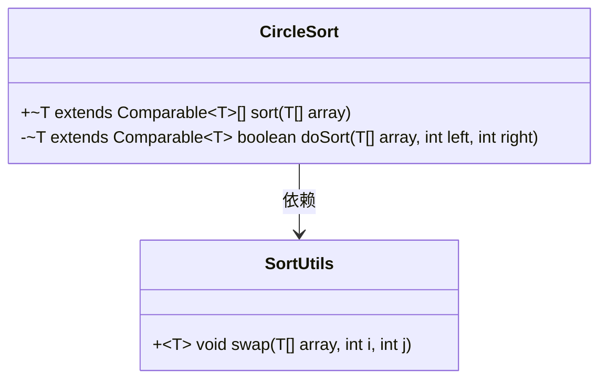
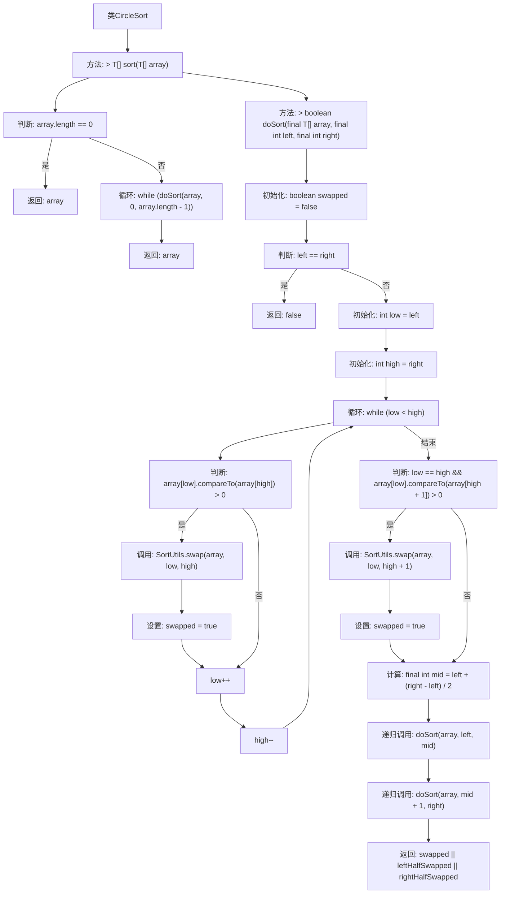

# 基础信息

|      |      |
|------|------|
| 名称 | CircleSort |
| 编码语言 | .java |
| 代码路径 | Java/src/main/java/com/thealgorithms/sorts/CircleSort.java |
| 包名 | com.thealgorithms.sorts |
| 依赖项 | [] |
| 概述说明 | CircleSort算法递归比较数组两端元素，交换后循环直至排序完成。 |

# 说明

CircleSort算法是一种递归排序方法，通过不断比较数组两端的元素来实现排序。如果发现需要交换元素，算法会继续循环比较和交换，直到数组完全有序。该算法通过递归的方式确保所有元素都能被正确排序，最终完成整个数组的排序过程。

# 类列表 Class Summary

| 名称   | 类型  | 说明 |
|-------|------|-------------|
| CircleSort | class | CircleSort算法通过递归比较数组两端元素进行排序，若交换则继续循环直至完成。 |

## 类 CircleSort

|      |      |
|------|------|
| 访问范围 | public |
| 类型 | class |
| 名称 | CircleSort |
| 说明 | CircleSort算法通过递归比较数组两端元素进行排序，若交换则继续循环直至完成。 |

### UML类图

这段代码定义了一个名为 `CircleSort` 的类，它实现了 `SortAlgorithm` 接口。`CircleSort` 类包含两个方法：`sort` 和 `doSort`。`sort` 方法是对外公开的排序方法，而 `doSort` 是一个递归方法，用于在数组的指定范围内进行循环排序。`doSort` 方法通过比较数组的首尾元素并进行交换来实现排序，同时递归地对数组的左右两半进行排序。`CircleSort` 类依赖于 `SortUtils` 类中的 `swap` 方法来交换数组中的元素。整体上，`CircleSort` 类实现了一种循环排序算法，通过递归和交换操作来对数组进行排序。

### 内部方法调用关系图

这段代码实现了CircleSort排序算法。首先检查数组是否为空，若为空则直接返回。否则，通过递归调用doSort方法，不断比较和交换数组中的元素，直到数组完全排序。doSort方法通过从数组的两端向中间遍历，比较并交换元素，然后递归地对数组的左右两半进行排序，最终返回是否发生交换的标志。

### 字段列表 Field List

| 名称  | 类型  | 说明 |
|-------|-------|------|

### 方法列表 Method List

| 名称  | 类型  | 说明 |
|-------|-------|------|
| sort | T[] | 重写排序方法，空数组直接返回，否则循环排序直至完成。 |
| doSort | boolean | 私有方法对数组进行递归排序，返回是否发生交换。 |

