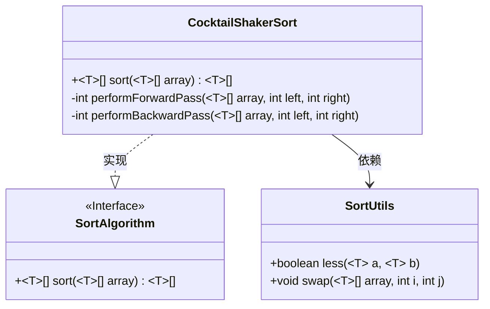
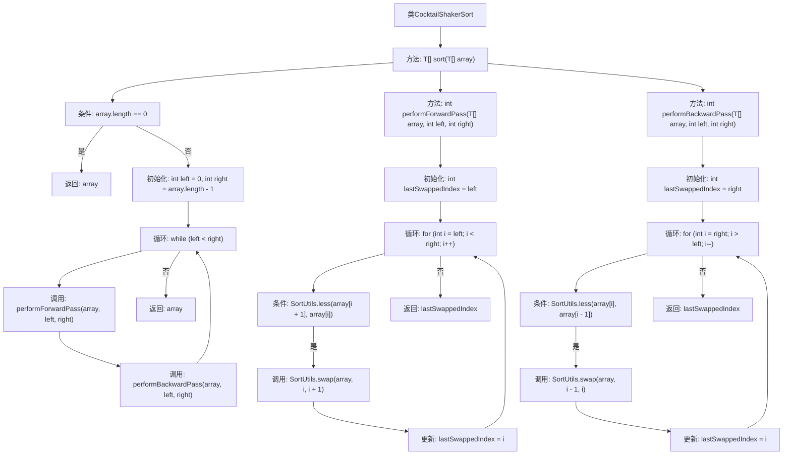

# 基础信息

|      |      |
|------|------|
| 名称 | CocktailShakerSort |
| 编码语言 | .java |
| 代码路径 | Java/src/main/java/com/thealgorithms/sorts/CocktailShakerSort.java |
| 包名 | com.thealgorithms.sorts |
| 依赖项 | [] |
| 概述说明 | 鸡尾酒排序算法实现双向交替冒泡排序。 |

# 说明

鸡尾酒排序算法是一种改进的冒泡排序算法，也称为双向冒泡排序。它通过在每一轮排序中交替地从左到右和从右到左进行元素比较和交换，从而减少排序所需的轮数。与传统的冒泡排序相比，鸡尾酒排序在处理某些特定数据分布时效率更高，尤其是在数据中已经存在部分有序的情况下。该算法通过双向遍历数组，确保每一轮都能将最大和最小的元素移动到正确的位置，从而提高整体排序效率。

# 类列表 Class Summary

| 名称   | 类型  | 说明 |
|-------|------|-------------|
| CocktailShakerSort | class | 鸡尾酒排序算法实现双向冒泡排序。 |

## 类 CocktailShakerSort

|      |      |
|------|------|
| 访问范围 | None |
| 类型 | class |
| 名称 | CocktailShakerSort |
| 说明 | 鸡尾酒排序算法实现双向冒泡排序。 |

### UML类图

这段代码实现了Cocktail Shaker Sort算法，该算法是一种双向冒泡排序，通过交替进行正向和反向的遍历来排序数组。`CocktailShakerSort`类实现了`SortAlgorithm`接口，并依赖于`SortUtils`类中的工具方法来进行元素的比较和交换。`performForwardPass`方法负责将较大的元素移动到数组的末尾，而`performBackwardPass`方法则将较小的元素移动到数组的开头。通过这种方式，算法能够更高效地完成排序任务。

### 内部方法调用关系图

**描述：**  
该流程图展示了`CocktailShakerSort`类的排序过程。首先检查数组是否为空，若为空则直接返回。否则，初始化左右边界，通过循环进行前向和后向遍历，分别调用`performForwardPass`和`performBackwardPass`方法，交换元素并更新边界，直到数组完全排序。前向遍历将较大元素移至末尾，后向遍历将较小元素移至开头，最终返回排序后的数组。

### 字段列表 Field List

| 名称  | 类型  | 说明 |
|-------|-------|------|

### 方法列表 Method List

| 名称  | 类型  | 说明 |
|-------|-------|------|
| sort | T[] | 实现双向排序算法，对数组进行排序。 |
| performBackwardPass | int | 私有方法实现数组反向遍历并交换元素，返回最后交换位置。 |
| performForwardPass | int | 该方法对数组进行前向遍历，比较相邻元素并交换，返回最后交换的索引。 |

