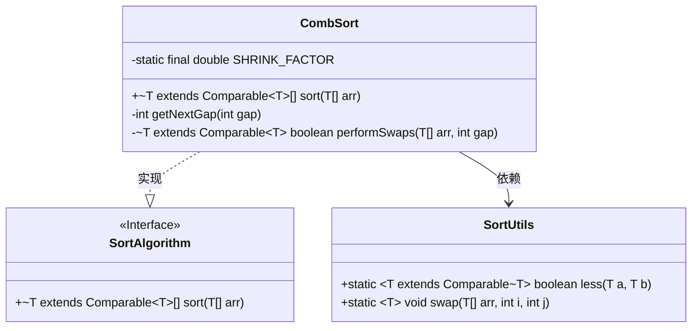
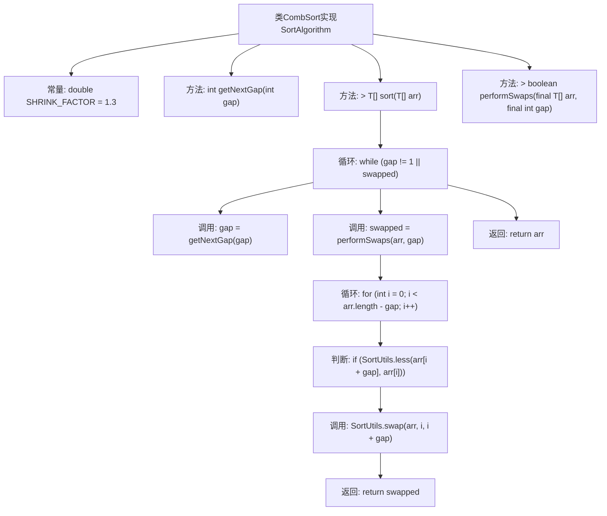

# 基础信息

|      |      |
|------|------|
| 名称 | CombSort |
| 编码语言 | .java |
| 代码路径 | Java/src/main/java/com/thealgorithms/sorts/CombSort.java |
| 包名 | com.thealgorithms.sorts |
| 依赖项 | [] |
| 概述说明 | CombSort算法通过动态调整间隔和交换元素来排序数组。 |

# 说明

CombSort算法是一种通过动态调整元素间隔并交换元素来实现数组排序的方法。该算法的核心思想是逐步缩小元素之间的间隔，通过比较和交换操作，将较大的元素逐步移动到数组的合适位置。通过不断调整间隔大小，CombSort能够在排序过程中有效减少逆序对的数量，从而提高排序效率。该算法结合了冒泡排序和希尔排序的优点，具有较好的平均时间复杂度，适用于多种场景。

# 类列表 Class Summary

| 名称   | 类型  | 说明 |
|-------|------|-------------|
| CombSort | class | CombSort算法通过动态调整间隔并交换元素实现数组排序。 |

## 类 CombSort

|      |      |
|------|------|
| 访问范围 | None |
| 类型 | class |
| 名称 | CombSort |
| 说明 | CombSort算法通过动态调整间隔并交换元素实现数组排序。 |

### UML类图

这段代码定义了一个`CombSort`类，它实现了`SortAlgorithm`接口，用于对数组进行梳排序。`CombSort`类包含一个常量`SHRINK_FACTOR`，用于计算排序时的间隙值。`sort`方法通过不断调整间隙值并执行交换操作，直到数组完全排序。`performSwaps`方法用于在数组中根据当前间隙值执行元素交换。`SortUtils`类提供了辅助方法`less`和`swap`，分别用于比较和交换数组元素。整个类图展示了`CombSort`如何依赖`SortUtils`并实现`SortAlgorithm`接口来完成排序任务。

### 内部方法调用关系图

这段代码实现了CombSort排序算法，通过不断缩小间隔（gap）来对数组进行排序。代码首先定义了一个常量SHRINK_FACTOR用于计算下一个间隔，然后通过getNextGap方法计算新的间隔。sort方法中，通过循环和performSwaps方法进行元素交换，直到数组排序完成。performSwaps方法遍历数组并根据当前间隔交换元素，返回是否发生交换的标志。

### 字段列表 Field List

| 名称  | 类型  | 说明 |
|-------|-------|------|
| SHRINK_FACTOR = 1.3 | double | 定义了一个私有静态常量SHRINK_FACTOR，值为1.3。 |

### 方法列表 Method List

| 名称  | 类型  | 说明 |
|-------|-------|------|
| getNextGap | int | 该方法计算并返回缩小后的间隔值，最小为1。 |
| sort | T[] | 实现基于间隔排序的通用数组排序方法。 |
| performSwaps | boolean | 私有方法执行数组元素交换，返回是否发生交换。 |

