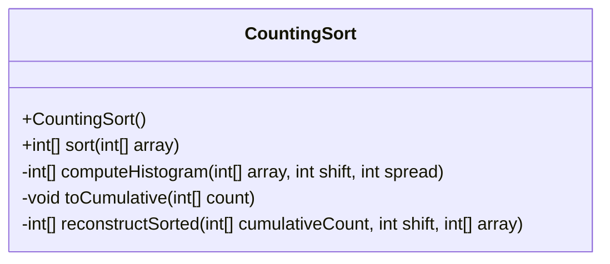
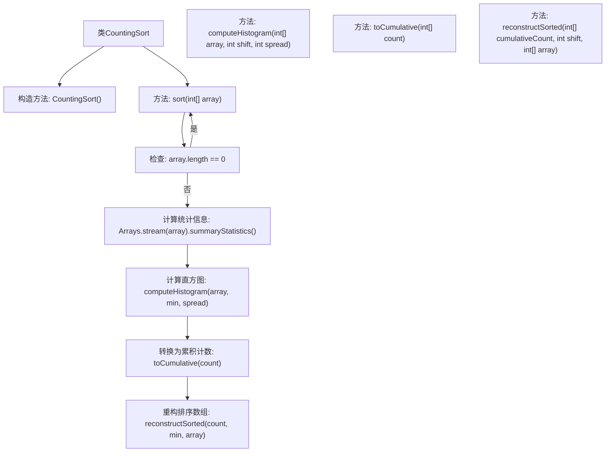

# 基础信息

|      |      |
|------|------|
| 名称 | CountingSort |
| 编码语言 | .java |
| 代码路径 | Java/src/main/java/com/thealgorithms/sorts/CountingSort.java |
| 包名 | com.thealgorithms.sorts |
| 依赖项 | ['java.util.Arrays'] |
| 概述说明 | 计数排序通过直方图、累加和重构数组实现排序。 |

# 说明

计数排序算法实现包括三个主要步骤：首先计算直方图，统计每个元素出现的次数；接着累加直方图，确定每个元素在排序后数组中的最终位置；最后重构排序数组，根据累加直方图将元素放置到正确位置，完成排序。该算法适用于整数排序，时间复杂度为O(n+k)，其中n为元素数量，k为元素范围。

# 类列表 Class Summary

| 名称   | 类型  | 说明 |
|-------|------|-------------|
| CountingSort | class | 计数排序算法实现，包含计算直方图、累加和重构排序数组步骤。 |

## 类 CountingSort

|      |      |
|------|------|
| 访问范围 | public final |
| 类型 | class |
| 名称 | CountingSort |
| 说明 | 计数排序算法实现，包含计算直方图、累加和重构排序数组步骤。 |

### UML类图

这段代码实现了一个计数排序算法，用于对整数数组进行排序。`CountingSort`类包含一个私有构造函数，防止外部实例化。主要方法`sort`负责调用其他私有方法来完成排序过程。`computeHistogram`方法计算数组中每个元素的频率，`toCumulative`方法将频率转换为累积频率，`reconstructSorted`方法根据累积频率重建排序后的数组。整个流程通过这三个步骤实现了高效的排序。

### 内部方法调用关系图

这段代码实现了一个计数排序算法。首先，`sort`方法检查输入数组是否为空，若为空则直接返回。否则，计算数组的最小值和最大值，并调用`computeHistogram`方法生成直方图。接着，`toCumulative`方法将直方图转换为累积计数。最后，`reconstructSorted`方法根据累积计数重构排序后的数组。整个流程清晰，逐步完成排序任务。

### 字段列表 Field List

| 名称  | 类型  | 说明 |
|-------|-------|------|

### 方法列表 Method List

| 名称  | 类型  | 说明 |
|-------|-------|------|
| sort | int[] | 静态方法对数组排序，先计算统计信息，再生成直方图，累加后重构排序数组。 |
| reconstructSorted | int[] | 重构排序数组，基于累加计数和偏移量调整元素位置。 |
| computeHistogram | int[] | 计算数组直方图，根据偏移和范围生成统计结果。 |
| toCumulative | void | 将数组元素累加为前缀和。 |

