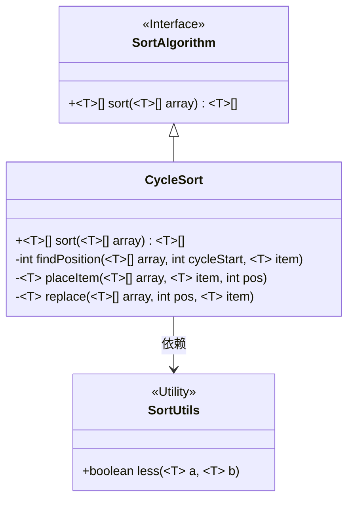
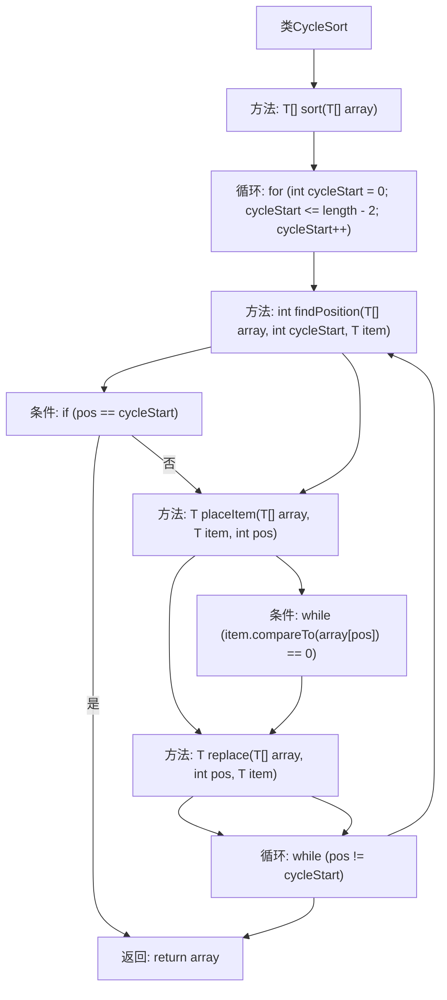

# 基础信息

|      |      |
|------|------|
| 名称 | CycleSort |
| 编码语言 | .java |
| 代码路径 | Java/src/main/java/com/thealgorithms/sorts/CycleSort.java |
| 包名 | com.thealgorithms.sorts |
| 依赖项 | [] |
| 概述说明 | CycleSort类通过循环定位和替换元素实现数组排序。 |

# 说明

CycleSort类实现了一种排序算法，该算法通过循环定位和替换数组中的元素来完成排序。其核心思想是通过不断将元素移动到它们在最终排序数组中正确的位置，从而逐步完成整个数组的排序。这种方法减少了不必要的元素交换，确保了排序过程的高效性。CycleSort适用于需要最小化写入操作次数的场景，特别适合处理写入成本较高的数据结构。

# 类列表 Class Summary

| 名称   | 类型  | 说明 |
|-------|------|-------------|
| CycleSort | class | CycleSort类实现排序算法，通过循环定位和替换元素来排序数组。 |

## 类 CycleSort

|      |      |
|------|------|
| 访问范围 | None |
| 类型 | class |
| 名称 | CycleSort |
| 说明 | CycleSort类实现排序算法，通过循环定位和替换元素来排序数组。 |

### UML类图

这段代码实现了CycleSort类，该类实现了SortAlgorithm接口，用于对可比较类型的数组进行排序。CycleSort类通过循环排序算法来排序数组，主要方法包括`sort`、`findPosition`、`placeItem`和`replace`。`findPosition`方法用于找到元素在数组中的正确位置，`placeItem`方法将元素放置到正确位置并处理重复元素，`replace`方法用于替换数组中的元素。此外，CycleSort类依赖于SortUtils工具类来比较元素的大小。整体设计遵循了面向对象的原则，将排序算法封装在独立的类中，并通过接口定义统一的排序方法。

### 内部方法调用关系图

该流程图描述了`CycleSort`类中`sort`方法的执行流程。首先，`sort`方法通过循环遍历数组，调用`findPosition`方法找到元素的正确位置。如果位置正确，则继续下一个循环；否则，调用`placeItem`方法将元素放置到正确位置，并处理重复元素。`placeItem`方法内部调用`replace`方法进行元素替换。整个过程通过循环和条件判断确保数组最终有序。

### 字段列表 Field List

| 名称  | 类型  | 说明 |
|-------|-------|------|

### 方法列表 Method List

| 名称  | 类型  | 说明 |
|-------|-------|------|
| replace | T | 泛型方法替换数组指定位置的元素并返回被替换的元素。 |
| sort | T[] | 该方法对数组进行排序，通过循环和位置查找确保元素正确排列。 |
| findPosition | int | 私有方法，在数组中从指定位置开始查找元素的位置。 |
| placeItem | T | 私有方法在数组中放置元素，若重复则后移，最后替换指定位置。 |

