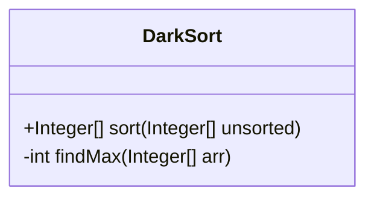
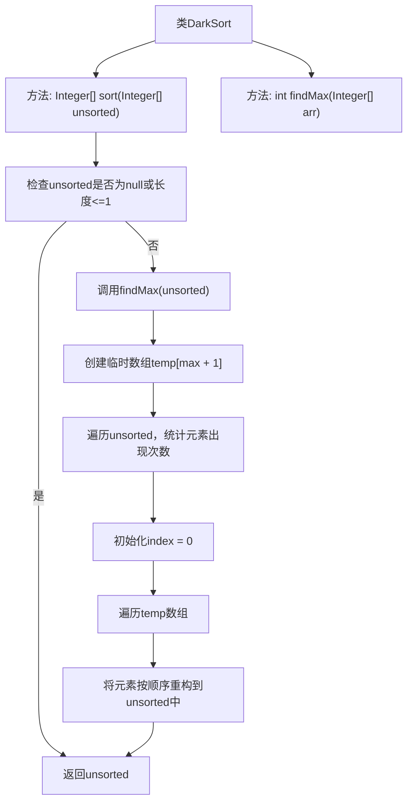

# 基础信息

|      |      |
|------|------|
| 名称 | DarkSort |
| 编码语言 | .java |
| 代码路径 | Java/src/main/java/com/thealgorithms/sorts/DarkSort.java |
| 包名 | com.thealgorithms.sorts |
| 依赖项 | [] |
| 概述说明 | DarkSort类利用计数和数组重构实现高效排序。 |

# 说明

DarkSort类实现了一种排序算法，其核心机制是通过计数和重构数组来完成排序过程。该算法首先对数组中的元素进行计数，统计每个元素出现的次数，然后根据计数结果重构数组，确保元素按顺序排列。这种方法避免了传统的比较排序，通过直接操作数组元素的位置来实现高效排序。DarkSort类适用于处理特定类型的数据集，尤其在元素范围有限且分布均匀的情况下表现出色。该算法的实现简洁且高效，适合需要快速排序的场景。

# 类列表 Class Summary

| 名称   | 类型  | 说明 |
|-------|------|-------------|
| DarkSort | class | DarkSort类实现排序算法，通过计数和重构数组实现排序。 |

## 类 DarkSort

|      |      |
|------|------|
| 访问范围 | None |
| 类型 | class |
| 名称 | DarkSort |
| 说明 | DarkSort类实现排序算法，通过计数和重构数组实现排序。 |

### UML类图

这段代码定义了一个名为 `DarkSort` 的类，该类包含一个公有方法 `sort` 和一个私有方法 `findMax`。`sort` 方法实现了 Dark Sort 算法，用于对整数数组进行排序。该算法首先通过 `findMax` 方法找到数组中的最大值，然后使用计数排序的思想，通过一个临时数组记录每个元素的出现次数，最后根据这些计数重建排序后的数组。`findMax` 方法用于辅助查找数组中的最大值。

### 内部方法调用关系图

这段代码实现了一个名为DarkSort的类，其中包含两个方法：`sort`和`findMax`。`sort`方法使用计数排序算法对输入的整数数组进行排序，首先检查数组是否为空或长度小于等于1，如果是则直接返回。否则，调用`findMax`方法找到数组中的最大值，创建一个临时数组用于统计每个元素的出现次数，最后根据统计结果重构排序后的数组并返回。`findMax`方法用于查找数组中的最大值。

### 字段列表 Field List

| 名称  | 类型  | 说明 |
|-------|-------|------|

### 方法列表 Method List

| 名称  | 类型  | 说明 |
|-------|-------|------|
| findMax | int | 该方法用于查找整数数组中的最大值。 |
| sort | Integer[] | 实现计数排序算法，先找最大值，再统计元素频率，最后重构排序数组。 |

