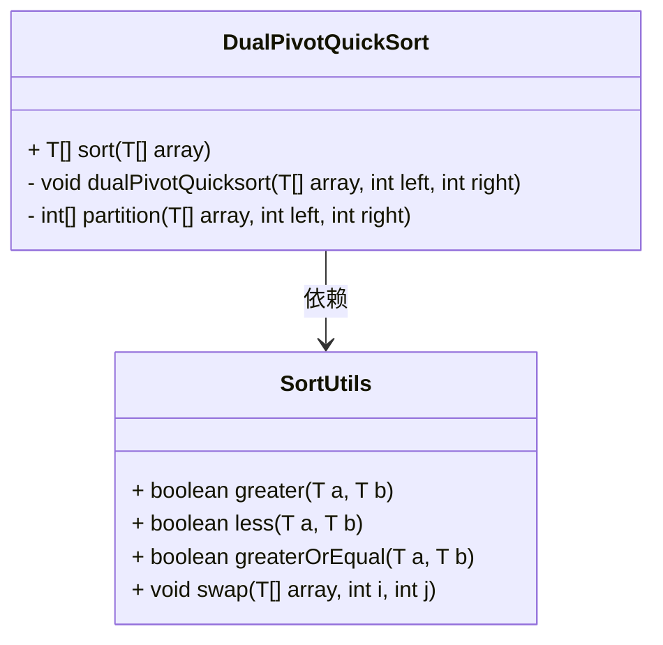
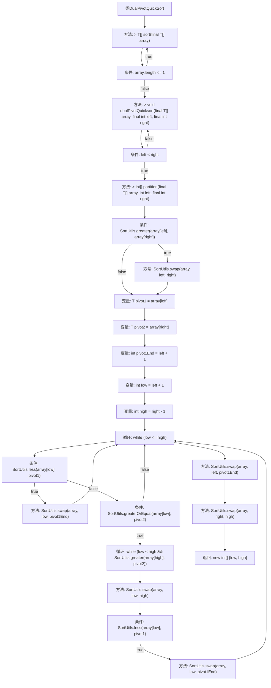

# 基础信息

|      |      |
|------|------|
| 名称 | DualPivotQuickSort |
| 编码语言 | .java |
| 代码路径 | Java/src/main/java/com/thealgorithms/sorts/DualPivotQuickSort.java |
| 包名 | com.thealgorithms.sorts |
| 依赖项 | [] |
| 概述说明 | 双轴快速排序递归分区并排序数组。 |

# 说明

双轴快速排序算法是一种高效的排序方法，通过递归分区和排序数组来实现。该算法使用两个轴点将数组分为三个部分，分别进行排序，从而提高排序效率。其核心思想是通过递归将数组不断分割，直到每个子数组有序，最终合并成完整的有序数组。这种算法在处理大规模数据时表现出色，尤其适用于需要快速排序的场景。

# 类列表 Class Summary

| 名称   | 类型  | 说明 |
|-------|------|-------------|
| DualPivotQuickSort | class | 双轴快速排序算法实现，递归分区并排序数组。 |

## 类 DualPivotQuickSort

|      |      |
|------|------|
| 访问范围 | public |
| 类型 | class |
| 名称 | DualPivotQuickSort |
| 说明 | 双轴快速排序算法实现，递归分区并排序数组。 |

### UML类图

**描述：**  
`DualPivotQuickSort` 类实现了双轴快速排序算法，适用于可比较类型的数组。它包含一个公共方法 `sort` 用于启动排序，以及两个私有方法 `dualPivotQuicksort` 和 `partition` 用于递归排序和分区操作。`SortUtils` 类提供了比较和交换数组元素的实用方法，`DualPivotQuickSort` 依赖于 `SortUtils` 来完成这些操作。整个类图展示了双轴快速排序的核心逻辑及其依赖关系。

### 内部方法调用关系图

**描述：**
该流程图展示了DualPivotQuickSort类的执行流程。首先，sort方法检查数组长度，若长度小于等于1则直接返回，否则调用dualPivotQuicksort方法进行递归排序。dualPivotQuicksort方法在left小于right时，调用partition方法进行分区，并递归处理三个子数组。partition方法通过两个枢轴将数组分为三部分，并在循环中交换元素以完成分区，最后返回两个枢轴的索引。

### 字段列表 Field List

| 名称  | 类型  | 说明 |
|-------|-------|------|

### 方法列表 Method List

| 名称  | 类型  | 说明 |
|-------|-------|------|
| sort | T[] | 重写sort方法，对数组进行双轴快速排序。 |
| partition | int[] | 双轴分区算法，交换元素使数组按双轴排序。 |
| dualPivotQuicksort | void | 双轴快速排序递归实现，通过分区对数组进行排序。 |

