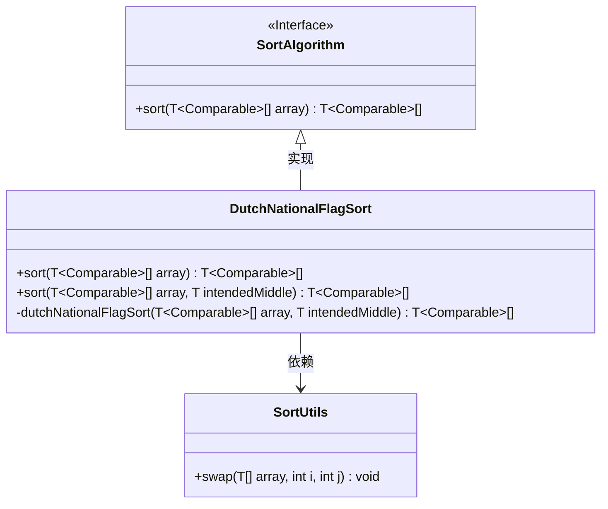
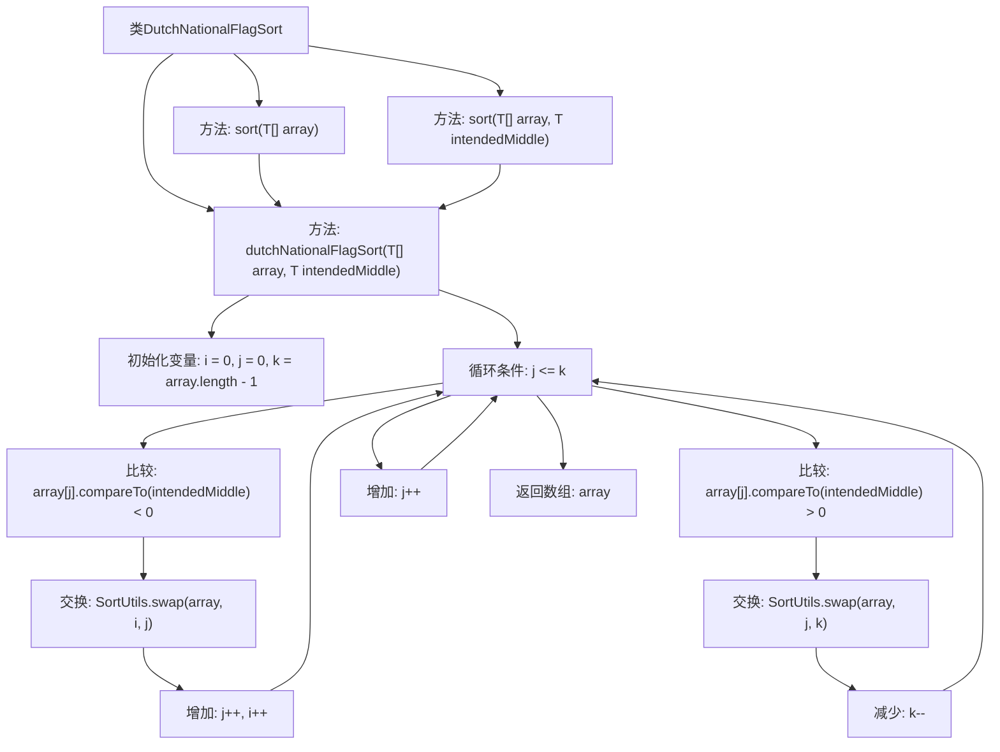

# 基础信息

|      |      |
|------|------|
| 名称 | DutchNationalFlagSort |
| 编码语言 | .java |
| 代码路径 | Java/src/main/java/com/thealgorithms/sorts/DutchNationalFlagSort.java |
| 包名 | com.thealgorithms.sorts |
| 依赖项 | [] |
| 概述说明 | 荷兰国旗算法通过交换元素将数组分为三部分。 |

# 说明

荷兰国旗排序算法是一种通过交换元素将数组分为三部分的排序方法。该算法的主要目标是将数组中的元素按照特定标准划分为三个区域，通常是将元素分为小于、等于和大于某个基准值的三部分。通过遍历数组并交换元素位置，算法能够高效地将元素分类并确保每部分内部元素的相对顺序。这种方法在处理三色分类或类似问题时非常有效，能够以线性时间复杂度完成排序任务。

# 类列表 Class Summary

| 名称   | 类型  | 说明 |
|-------|------|-------------|
| DutchNationalFlagSort | class | 荷兰国旗排序算法实现，通过交换元素将数组分为三部分。 |

## 类 DutchNationalFlagSort

|      |      |
|------|------|
| 访问范围 | public |
| 类型 | class |
| 名称 | DutchNationalFlagSort |
| 说明 | 荷兰国旗排序算法实现，通过交换元素将数组分为三部分。 |

### UML类图

### 描述
这段代码实现了荷兰国旗问题（Dutch National Flag Problem）的排序算法，用于将数组中的元素按照给定的中间值进行三向分区。`DutchNationalFlagSort`类实现了`SortAlgorithm`接口，提供了两种排序方法：一种默认使用数组中间值作为分区基准，另一种允许自定义分区基准。`SortUtils`类提供了交换数组元素的功能。整个算法通过`dutchNationalFlagSort`方法实现，使用三个指针进行分区操作，确保数组中的元素按照小于、等于和大于基准值的顺序排列。

### 内部方法调用关系图

这段代码实现了荷兰国旗排序算法，该算法通过将数组分为三部分来排序：小于、等于和大于某个中间值。代码首先初始化三个指针，然后在循环中根据元素与中间值的比较结果进行交换操作，直到所有元素都被正确分类。最终返回排序后的数组。

### 字段列表 Field List

| 名称  | 类型  | 说明 |
|-------|-------|------|

### 方法列表 Method List

| 名称  | 类型  | 说明 |
|-------|-------|------|
| sort | T[] | 实现荷兰国旗排序算法，对可比较数组进行排序。 |
| dutchNationalFlagSort | T[] | 荷兰国旗排序算法，将数组按指定中值分区。 |
| sort | T[] | 该方法对数组进行荷兰国旗排序，返回排序后的数组。 |

