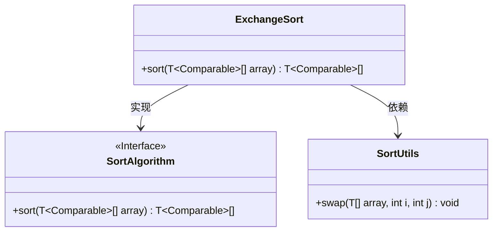
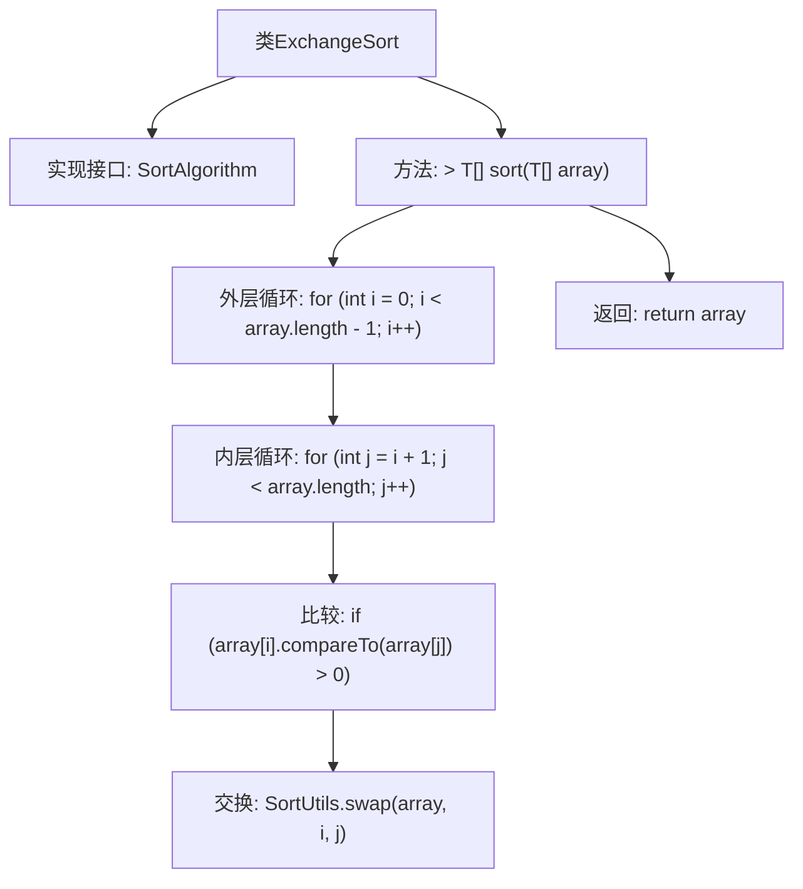

# 基础信息

|      |      |
|------|------|
| 名称 | ExchangeSort |
| 编码语言 | .java |
| 代码路径 | Java/src/main/java/com/thealgorithms/sorts/ExchangeSort.java |
| 包名 | com.thealgorithms.sorts |
| 依赖项 | [] |
| 概述说明 | 交换排序算法通过双重循环比较并交换数组元素实现排序。 |

# 说明

交换排序算法是一种通过双重循环比较并交换数组元素来实现排序的算法。该算法的核心思想是通过不断比较相邻元素的大小，并根据比较结果交换它们的位置，从而逐步将数组中的元素按升序或降序排列。外层循环控制整个排序过程的遍历次数，内层循环则负责在每次遍历中比较和交换相邻元素。通过多次遍历和交换，最终实现整个数组的有序排列。该算法简单直观，但在处理大规模数据时效率较低。

# 类列表 Class Summary

| 名称   | 类型  | 说明 |
|-------|------|-------------|
| ExchangeSort | class | 交换排序算法实现，通过双重循环比较并交换数组元素实现排序。 |

## 类 ExchangeSort

|      |      |
|------|------|
| 访问范围 | None |
| 类型 | class |
| 名称 | ExchangeSort |
| 说明 | 交换排序算法实现，通过双重循环比较并交换数组元素实现排序。 |

### UML类图

这段代码定义了一个 `ExchangeSort` 类，它实现了 `SortAlgorithm` 接口。`ExchangeSort` 类中的 `sort` 方法使用了交换排序算法来对数组进行排序。在排序过程中，`ExchangeSort` 类依赖于 `SortUtils` 类中的 `swap` 方法来交换数组中的元素。`SortAlgorithm` 接口定义了 `sort` 方法，`ExchangeSort` 类通过实现该接口来提供具体的排序逻辑。

### 内部方法调用关系图

这段代码实现了交换排序算法（Exchange Sort），属于一种简单的排序算法。它通过双重循环遍历数组，外层循环从第一个元素开始，内层循环从外层循环的下一个元素开始，比较两个元素的大小，如果外层循环的元素大于内层循环的元素，则交换它们的位置。最终返回排序后的数组。流程图展示了类的结构、方法的调用顺序以及循环和条件判断的逻辑流程。

### 字段列表 Field List

| 名称  | 类型  | 说明 |
|-------|-------|------|

### 方法列表 Method List

| 名称  | 类型  | 说明 |
|-------|-------|------|
| sort | T[] | 该方法实现了数组的排序功能，通过双重循环和比较交换元素。 |

