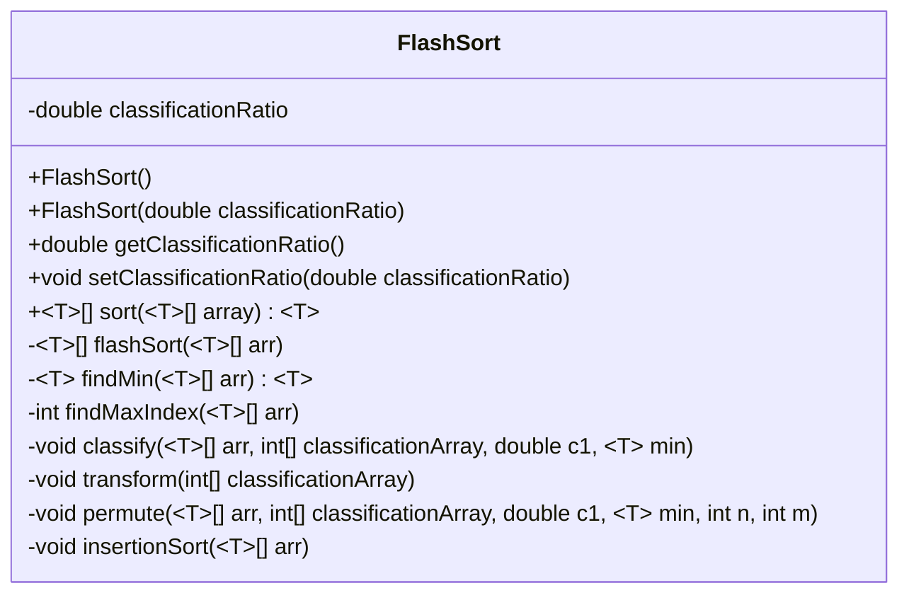
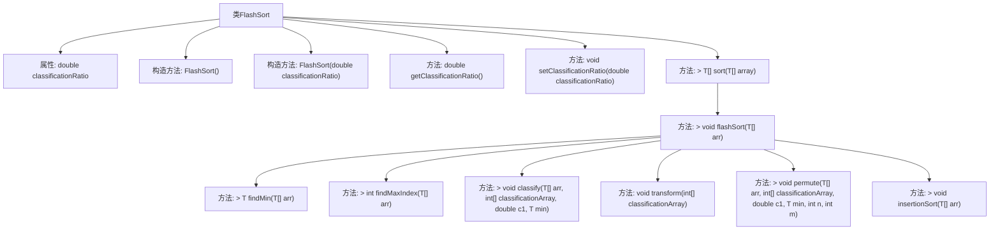

# 基础信息

|      |      |
|------|------|
| 名称 | FlashSort |
| 编码语言 | .java |
| 代码路径 | Java/src/main/java/com/thealgorithms/sorts/FlashSort.java |
| 包名 | com.thealgorithms.sorts |
| 依赖项 | [] |
| 概述说明 | FlashSort类实现排序算法，涵盖分类、转换、排列和插入排序步骤。 |

# 说明

FlashSort类实现了一种高效的排序算法，该算法通过分类、转换、排列和插入排序四个步骤来完成排序过程。首先，算法将数据分类，根据数据的分布情况将其划分为不同的组。接着，通过转换步骤确定每个数据在排序后数组中的位置。然后，排列步骤将数据移动到其正确的位置。最后，使用插入排序对数据进行微调，确保排序的准确性。该算法在处理大规模数据时表现出较高的效率。

# 类列表 Class Summary

| 名称   | 类型  | 说明 |
|-------|------|-------------|
| FlashSort | class | FlashSort类实现排序算法，包含分类、转换、排列和插入排序步骤。 |

## 类 FlashSort

|      |      |
|------|------|
| 访问范围 | public |
| 类型 | class |
| 名称 | FlashSort |
| 说明 | FlashSort类实现排序算法，包含分类、转换、排列和插入排序步骤。 |

### UML类图

**描述：**
`FlashSort` 类实现了 `SortAlgorithm` 接口，用于对数组进行排序。它使用 Flash Sort 算法，通过分类、变换和置换等步骤将数组元素排序。类中包含多个私有方法，如 `findMin`、`findMaxIndex`、`classify`、`transform`、`permute` 和 `insertionSort`，用于辅助排序过程。`FlashSort` 还提供了构造方法和设置分类比例的功能，确保分类比例在有效范围内。

### 内部方法调用关系图

这段代码实现了Flash Sort算法，主要用于对数组进行排序。代码首先通过`flashSort`方法进行初步分类和排列，然后使用`insertionSort`方法进行最终排序。`flashSort`方法依赖于多个辅助方法，如`findMin`、`findMaxIndex`、`classify`、`transform`和`permute`，这些方法分别用于找到数组中的最小值、最大值的索引、将元素分类、转换分类数组以及进行元素置换。整个流程通过`sort`方法调用，最终返回排序后的数组。

### 字段列表 Field List

| 名称  | 类型  | 说明 |
|-------|-------|------|
| classificationRatio = 0.45 | double | 分类比率设置为0.45。 |

### 方法列表 Method List

| 名称  | 类型  | 说明 |
|-------|-------|------|
| getClassificationRatio | double | 获取分类比率的方法，返回双精度浮点数。 |
| sort | T[] | 重写sort方法，使用flashSort算法排序数组并返回。 |
| findMaxIndex | int | 泛型方法查找数组中最大元素的索引。 |
| permute | void | 私有方法用于根据分类数组和比较条件重新排列数组元素。 |
| classify | void | 私有方法根据数组元素与最小值的比较结果进行分类统计。 |
| insertionSort | void | 实现插入排序，对泛型数组按升序排列。 |
| transform | void | 该方法通过遍历数组，将每个元素与前一个元素相加并更新当前元素。 |
| flashSort | void | FlashSort算法实现：查找极值、分类、变换、排列、插入排序。 |
| setClassificationRatio | void | 设置分类比例，需在0到1之间，否则抛出异常。 |
| findMin | T | 该方法用于查找数组中最小元素，适用于实现Comparable接口的类型。 |

