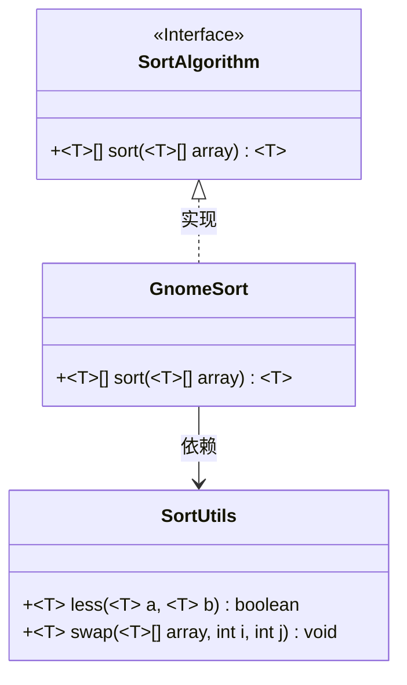
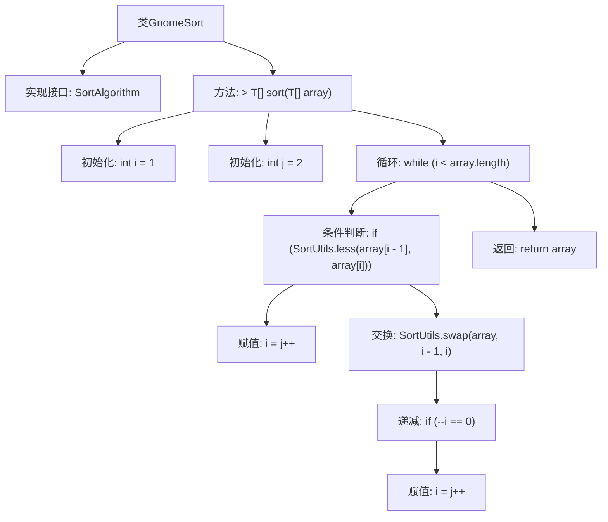

# 基础信息

|      |      |
|------|------|
| 名称 | GnomeSort |
| 编码语言 | .java |
| 代码路径 | Java/src/main/java/com/thealgorithms/sorts/GnomeSort.java |
| 包名 | com.thealgorithms.sorts |
| 依赖项 | [] |
| 概述说明 | GnomeSort通过交换和比较数组元素实现排序。 |

# 说明

GnomeSort是一种简单的排序算法，通过比较和交换数组中的元素来实现排序。该算法从数组的第一个元素开始，逐个比较相邻的元素，如果顺序正确则继续向后移动，如果顺序错误则交换元素并向前移动。这个过程重复进行，直到整个数组排序完成。GnomeSort的特点是其实现简单，但效率较低，适合用于小规模数据集的排序。

# 类列表 Class Summary

| 名称   | 类型  | 说明 |
|-------|------|-------------|
| GnomeSort | class | GnomeSort实现排序算法，通过交换和比较数组元素进行排序。 |

## 类 GnomeSort

|      |      |
|------|------|
| 访问范围 | public |
| 类型 | class |
| 名称 | GnomeSort |
| 说明 | GnomeSort实现排序算法，通过交换和比较数组元素进行排序。 |

### UML类图

这段代码定义了一个 `GnomeSort` 类，该类实现了 `SortAlgorithm` 接口，并提供了一个泛型方法 `sort` 用于对数组进行排序。`GnomeSort` 使用了 `SortUtils` 类中的 `less` 和 `swap` 方法来比较和交换数组元素。`GnomeSort` 的排序算法通过遍历数组，并在必要时交换元素，直到数组完全排序。该算法的核心是通过调整指针 `i` 和 `j` 来控制排序过程。

### 内部方法调用关系图

这段代码实现了Gnome Sort（地精排序）算法，用于对数组进行排序。通过初始化两个指针i和j，代码在循环中比较相邻元素，如果顺序正确则移动指针，否则交换元素并回退指针。最终返回排序后的数组。流程图展示了代码的执行流程，包括初始化、循环、条件判断、交换和返回等步骤。

### 字段列表 Field List

| 名称  | 类型  | 说明 |
|-------|-------|------|

### 方法列表 Method List

| 名称  | 类型  | 说明 |
|-------|-------|------|
| sort | T[] | 实现数组排序，通过比较和交换元素完成升序排列。 |

