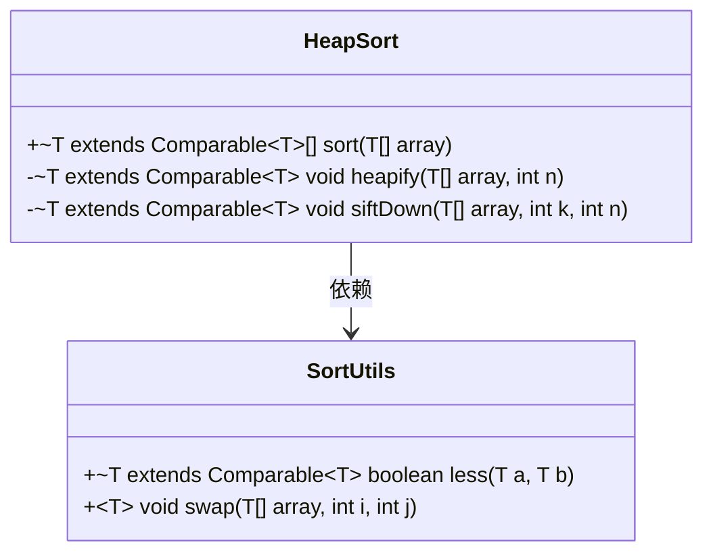
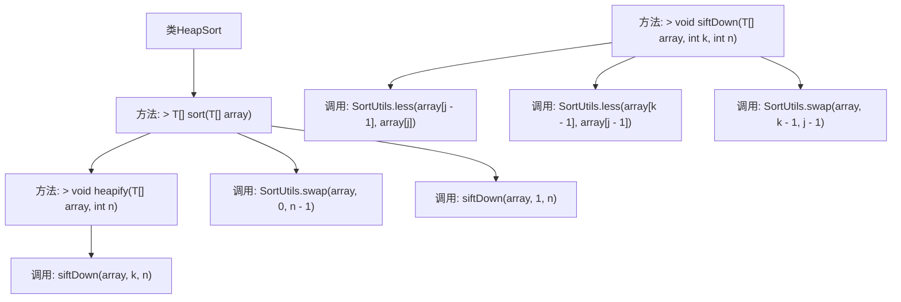

# 基础信息

|      |      |
|------|------|
| 名称 | HeapSort |
| 编码语言 | .java |
| 代码路径 | Java/src/main/java/com/thealgorithms/sorts/HeapSort.java |
| 包名 | com.thealgorithms.sorts |
| 依赖项 | [] |
| 概述说明 | 堆排序算法实现，根索引从1开始，简化计算。 |

# 说明

堆排序算法实现中，根索引从1开始的设计简化了计算过程。这种调整使得父子节点之间的关系计算更加直观和高效，减少了索引转换的复杂性，从而提升了算法的整体性能和可读性。通过这种方式，堆排序的实现更加简洁，便于理解和维护。

# 类列表 Class Summary

| 名称   | 类型  | 说明 |
|-------|------|-------------|
| HeapSort | class | 堆排序算法实现，根索引从1开始，简化计算。 |

## 类 HeapSort

|      |      |
|------|------|
| 访问范围 | public |
| 类型 | class |
| 名称 | HeapSort |
| 说明 | 堆排序算法实现，根索引从1开始，简化计算。 |

### UML类图

这段代码实现了一个堆排序算法（HeapSort），它通过构建最大堆并对数组进行排序。`HeapSort`类实现了`SortAlgorithm`接口，并包含三个主要方法：`sort`、`heapify`和`siftDown`。`sort`方法负责整个排序过程，`heapify`方法将数组转换为最大堆，`siftDown`方法用于维护堆的性质。`SortUtils`类提供了比较和交换元素的工具方法。堆排序的时间复杂度为O(n log n)，适用于大规模数据排序。

### 内部方法调用关系图

这段代码实现了堆排序算法。`HeapSort`类包含三个主要方法：`sort`、`heapify`和`siftDown`。`sort`方法首先调用`heapify`方法将数组构建成最大堆，然后通过不断交换堆顶元素和最后一个元素，并调用`siftDown`方法调整堆结构，最终完成排序。`heapify`方法从数组中间开始，逐步将数组调整为最大堆。`siftDown`方法用于在堆中调整元素位置，确保父节点大于子节点。整个流程通过多次调用`SortUtils`类的`less`和`swap`方法来实现元素比较和交换。

### 字段列表 Field List

| 名称  | 类型  | 说明 |
|-------|-------|------|

### 方法列表 Method List

| 名称  | 类型  | 说明 |
|-------|-------|------|
| siftDown | void | 堆排序中，siftDown方法用于调整堆结构，确保父节点大于子节点。 |
| sort | T[] | 实现堆排序，通过堆化和下沉操作对数组进行排序。 |
| heapify | void | 私有方法heapify对数组进行堆化，从n/2开始下沉操作。 |

