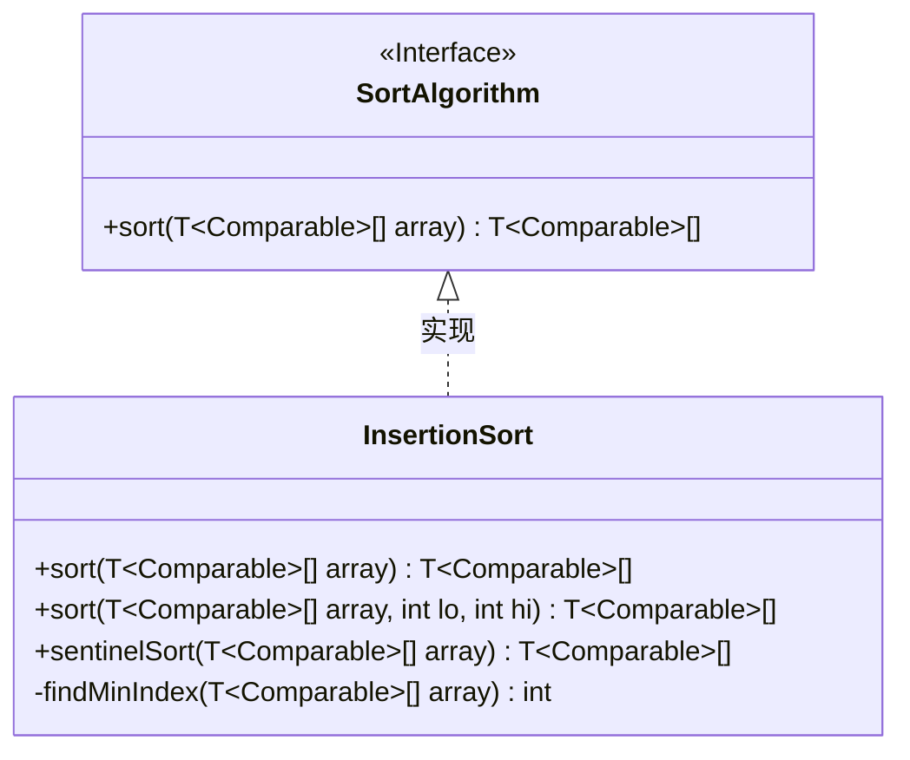
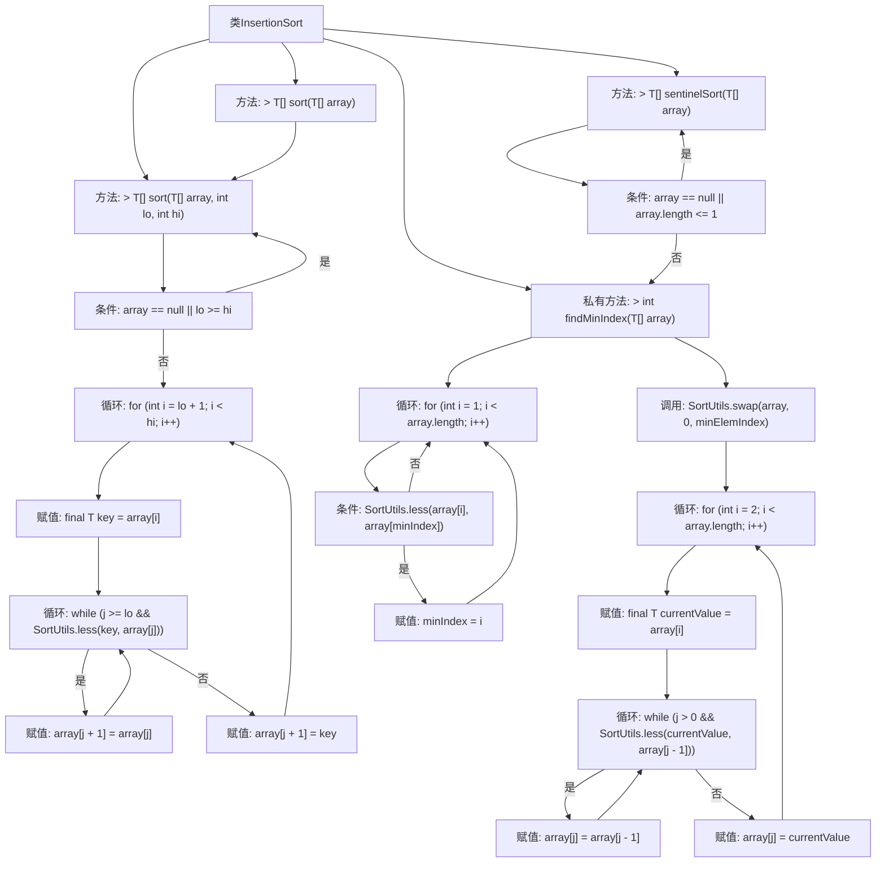

# 基础信息

|      |      |
|------|------|
| 名称 | InsertionSort |
| 编码语言 | .java |
| 代码路径 | Java/src/main/java/com/thealgorithms/sorts/InsertionSort.java |
| 包名 | com.thealgorithms.sorts |
| 依赖项 | [] |
| 概述说明 | 插入排序类实现全数组和子数组排序，优化哨兵排序。 |

# 说明

插入排序类实现了一种排序算法，支持对整个数组或子数组进行排序。该算法通过逐步将未排序部分的元素插入到已排序部分的适当位置来实现排序。为了提高效率，算法还引入了哨兵排序优化，通过减少比较次数来提升性能。这种优化在处理大规模数据时尤其有效，能够显著减少排序所需的时间。整体上，该实现兼顾了功能性和性能，适用于多种排序场景。

# 类列表 Class Summary

| 名称   | 类型  | 说明 |
|-------|------|-------------|
| InsertionSort | class | 插入排序类实现排序算法，支持全数组和子数组排序，包含哨兵排序优化。 |

## 类 InsertionSort

|      |      |
|------|------|
| 访问范围 | None |
| 类型 | class |
| 名称 | InsertionSort |
| 说明 | 插入排序类实现排序算法，支持全数组和子数组排序，包含哨兵排序优化。 |

### UML类图

类图描述：
`InsertionSort` 类实现了 `SortAlgorithm` 接口，提供了三种排序方法：`sort`、`sort`（带范围参数）、`sentinelSort`。其中，`sort` 方法实现了标准的插入排序算法，`sentinelSort` 方法通过查找最小元素并放置在数组首位来优化排序过程。`findMinIndex` 是一个私有方法，用于查找数组中最小元素的索引。

### 内部方法调用关系图

这段代码实现了插入排序算法，并提供了两种排序方式：标准插入排序和哨兵插入排序。标准插入排序通过遍历数组，将每个元素插入到已排序部分的正确位置。哨兵插入排序在排序前先找到最小元素并将其放在数组开头，从而减少比较次数。代码中还包含一个辅助方法用于查找数组中的最小元素索引。

### 字段列表 Field List

| 名称  | 类型  | 说明 |
|-------|-------|------|

### 方法列表 Method List

| 名称  | 类型  | 说明 |
|-------|-------|------|
| sort | T[] | 对数组指定范围进行插入排序，返回排序后数组。 |
| findMinIndex | int | 私有方法findMinIndex用于查找数组中最小元素的索引。 |
| sentinelSort | T[] | 哨兵排序算法，先交换最小元素到首位，再插入排序。 |
| sort | T[] | 重写sort方法，支持泛型数组排序，默认范围从0到数组长度。 |

