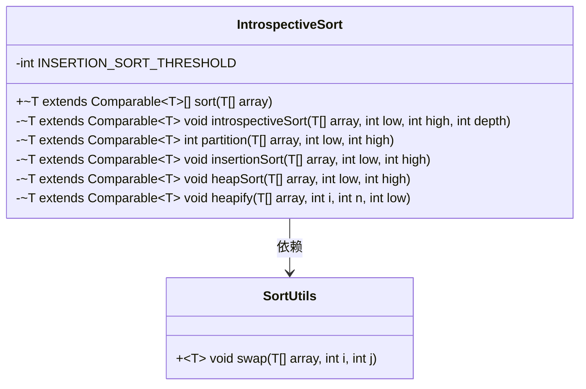
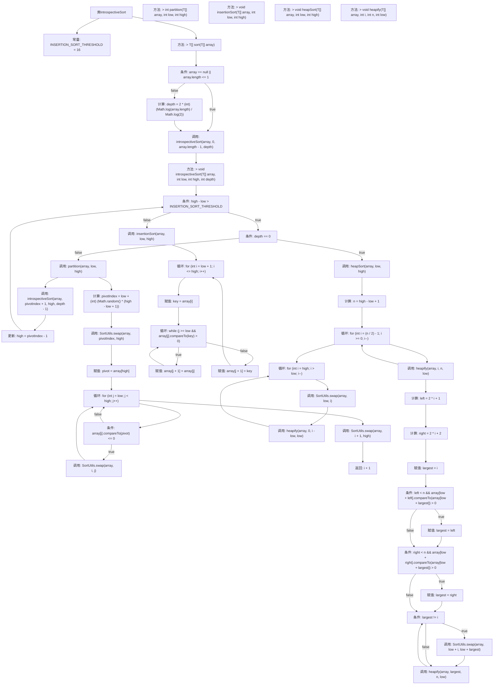

# 基础信息

|      |      |
|------|------|
| 名称 | IntrospectiveSort |
| 编码语言 | .java |
| 代码路径 | Java/src/main/java/com/thealgorithms/sorts/IntrospectiveSort.java |
| 包名 | com.thealgorithms.sorts |
| 依赖项 | [] |
| 概述说明 | 内省排序融合快排、堆排和插排，通过递归深度优化排序策略。 |

# 说明

内省排序是一种结合了快速排序、堆排序和插入排序的混合排序算法。它通过递归深度控制来动态选择最适合的排序策略，以提高整体排序效率。具体来说，内省排序在递归深度较小时使用快速排序，以利用其平均时间复杂度较低的优势；当递归深度达到一定阈值时，切换到堆排序，以避免快速排序在最坏情况下的性能退化；对于小规模数据，则使用插入排序，因为其在处理小数据量时具有较高的效率。这种策略使得内省排序在各种情况下都能保持良好的性能。

# 类列表 Class Summary

| 名称   | 类型  | 说明 |
|-------|------|-------------|
| IntrospectiveSort | class | 内省排序结合快速排序、堆排序和插入排序，递归深度控制排序策略。 |

## 类 IntrospectiveSort

|      |      |
|------|------|
| 访问范围 | public |
| 类型 | class |
| 名称 | IntrospectiveSort |
| 说明 | 内省排序结合快速排序、堆排序和插入排序，递归深度控制排序策略。 |

### UML类图

### 描述
`IntrospectiveSort` 类实现了自省排序算法，结合了快速排序、堆排序和插入排序的优点。该类包含多个私有方法，如 `introspectiveSort`、`partition`、`insertionSort`、`heapSort` 和 `heapify`，用于处理不同规模的数组排序。`SortUtils` 类提供了一个静态方法 `swap`，用于交换数组中的元素。`IntrospectiveSort` 类依赖于 `SortUtils` 类来实现元素交换操作。

### 内部方法调用关系图

这段代码实现了自省排序（Introspective Sort），它结合了快速排序、堆排序和插入排序的优点。首先，代码检查数组是否为空或长度小于等于1，如果是则直接返回。否则，计算递归深度并调用`introspectiveSort`方法。在`introspectiveSort`中，根据子数组长度和递归深度决定使用堆排序、快速排序还是插入排序。快速排序通过`partition`方法划分数组，堆排序通过`heapSort`和`heapify`方法维护堆性质，插入排序通过`insertionSort`方法对小数组进行排序。

### 字段列表 Field List

| 名称  | 类型  | 说明 |
|-------|-------|------|
| INSERTION_SORT_THRESHOLD = 16 | int | 插入排序阈值为16。 |

### 方法列表 Method List

| 名称  | 类型  | 说明 |
|-------|-------|------|
| heapSort | void | 堆排序算法，构建堆并逐步排序数组元素。 |
| partition | int | 随机选择基准元素，进行数组分区并返回分区点。 |
| insertionSort | void | 插入排序实现，对数组指定范围进行升序排列。 |
| heapify | void | 堆排序中调整堆结构的私有方法，确保最大元素位于堆顶。 |
| introspectiveSort | void | 内省排序算法结合堆排序、快速排序和插入排序，递归处理数组。 |
| sort | T[] | 重写sort方法，处理空或单元素数组，计算深度并调用内省排序。 |

