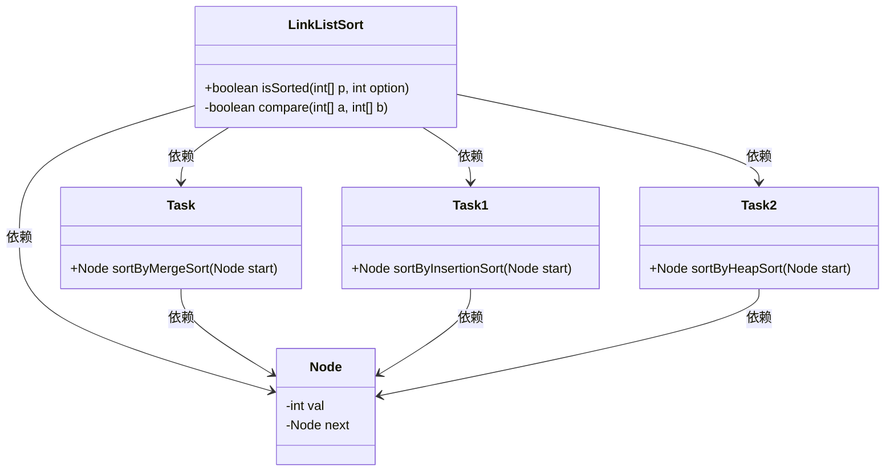
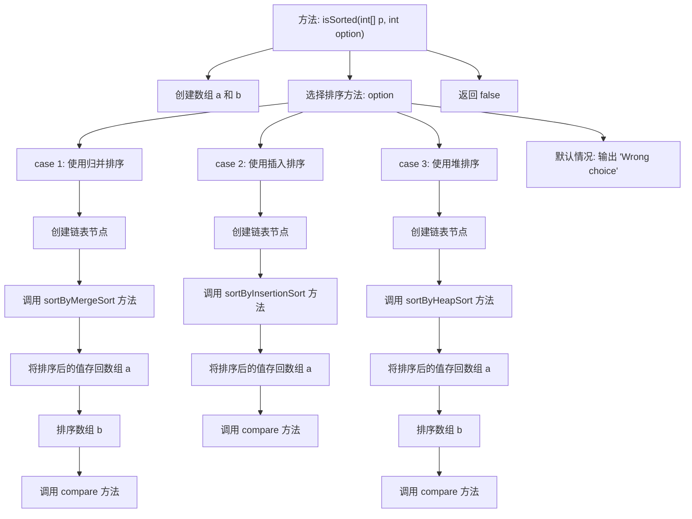
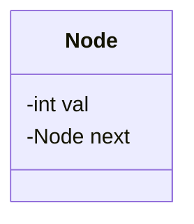
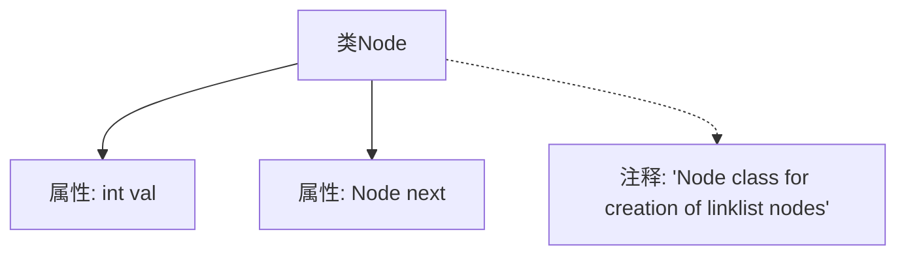
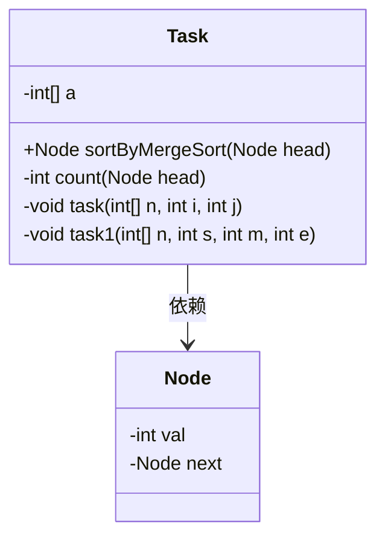
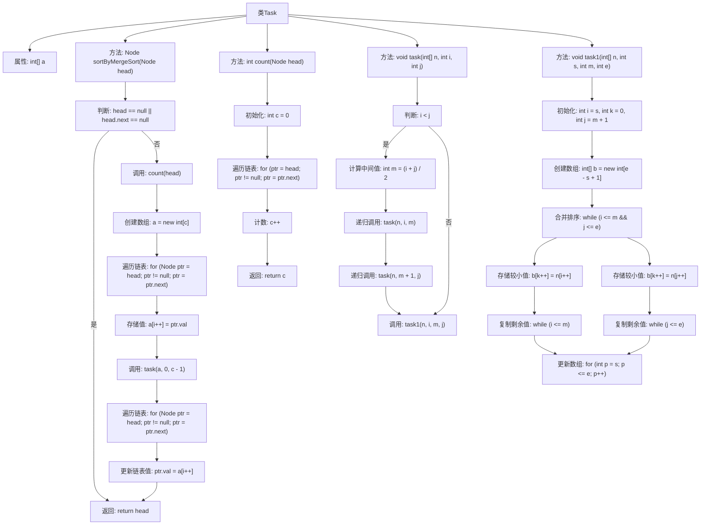
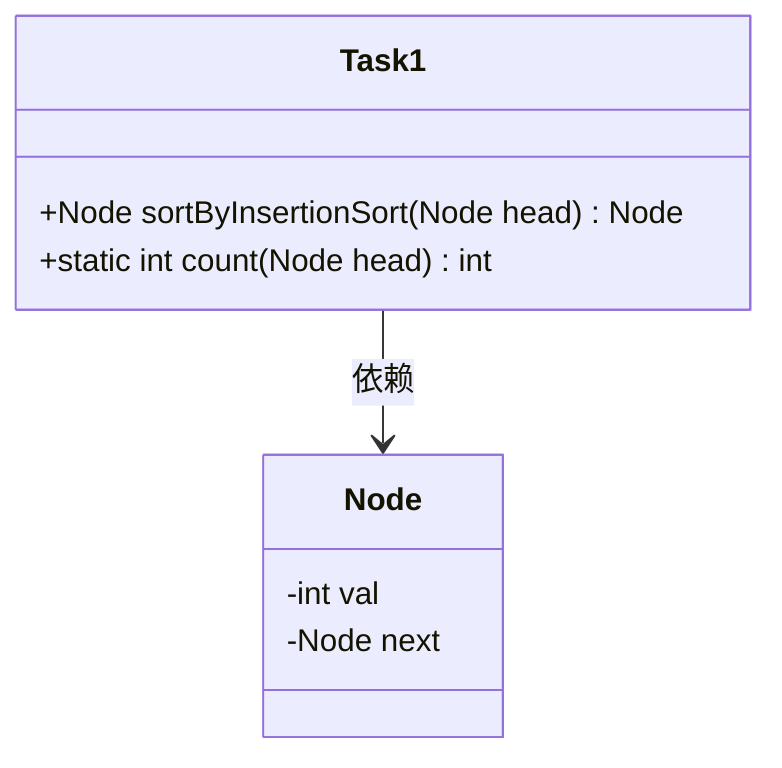
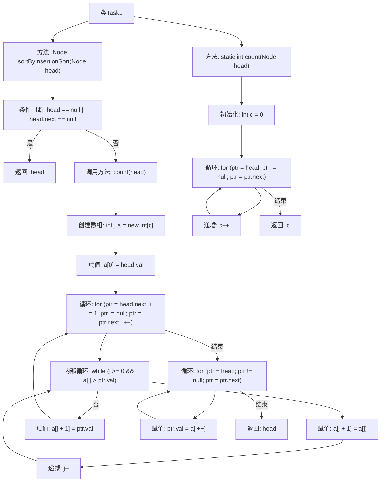
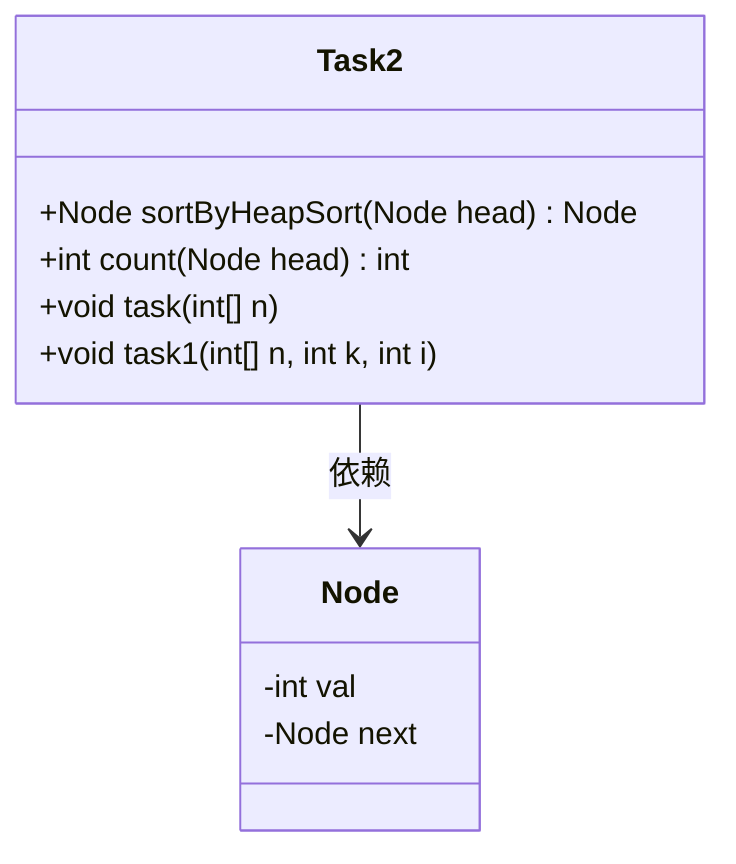
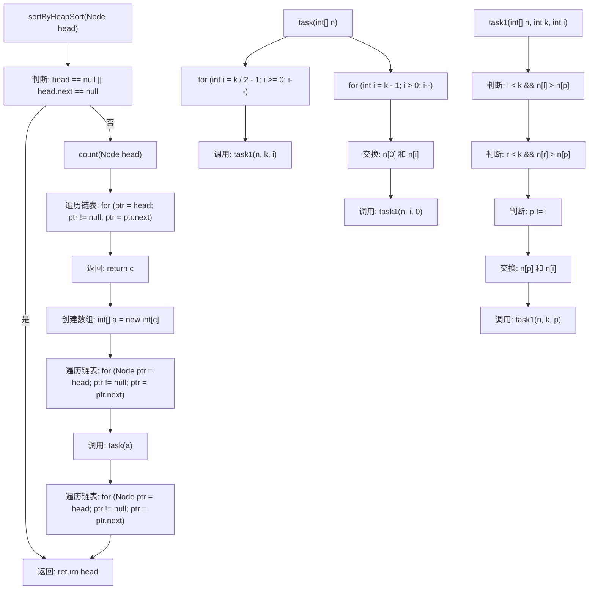

# 基础信息

|      |      |
|------|------|
| 名称 | LinkListSort |
| 编码语言 | .java |
| 代码路径 | Java/src/main/java/com/thealgorithms/sorts/LinkListSort.java |
| 包名 | com.thealgorithms.sorts |
| 依赖项 | ['java.util.Arrays'] |
| 概述说明 | LinkListSort类用归并、插入和堆排序算法对链表排序，Node类创建链表节点。 |

# 说明

LinkListSort类提供了多种排序算法对链表进行排序，并验证排序结果的正确性。Node类用于创建链表节点，包含整型val和指向下一个节点的next。归并排序将链表值存入数组，排序后更新链表。插入排序直接对链表进行排序，返回排序后的链表。堆排序通过计数、数组转换和堆排序操作实现链表排序。

# 类列表 Class Summary

| 名称   | 类型  | 说明 |
|-------|------|-------------|
| LinkListSort | class | LinkListSort类通过选择不同排序算法对链表排序，并验证排序结果是否正确。 |
| Node | class | Node类用于创建链表节点，包含整型val和指向下一个节点的next。 |
| Task | class | 使用归并排序对链表进行排序，将链表值存入数组，排序后更新链表。 |
| Task1 | class | 使用插入排序对链表进行排序，返回排序后的链表。 |
| Task2 | class | 链表通过堆排序实现排序，包含计数、数组转换和堆排序操作。 |

## 类 LinkListSort

|      |      |
|------|------|
| 访问范围 | public |
| 类型 | class |
| 名称 | LinkListSort |
| 说明 | LinkListSort类通过选择不同排序算法对链表排序，并验证排序结果是否正确。 |

### UML类图

### 描述
`LinkListSort` 类包含一个公共方法 `isSorted`，用于检查数组是否已排序，并根据用户选择的排序方法（1: 归并排序, 2: 插入排序, 3: 堆排序）对链表进行排序。`compare` 方法用于比较两个数组是否相等。`Node` 类表示链表节点，包含值和指向下一个节点的指针。`Task`、`Task1` 和 `Task2` 类分别实现了归并排序、插入排序和堆排序算法。这些类通过 `LinkListSort` 类进行调用，并依赖于 `Node` 类来构建和操作链表。

### 内部方法调用关系图

这段代码实现了一个链表排序的功能，根据用户选择的不同排序方法（归并排序、插入排序、堆排序）对链表进行排序，并将排序后的结果与预期结果进行比较。代码通过 `isSorted` 方法接收一个数组和排序选项，根据选项选择相应的排序方法，最后调用 `compare` 方法比较排序结果与预期结果是否一致。

### 字段列表 Field List

| 名称  | 类型  | 说明 |
|-------|-------|------|

### 方法列表 Method List

| 名称  | 类型  | 说明 |
|-------|-------|------|
| compare | boolean | 比较两个数组是否相等，相等返回true，否则返回false。 |
| isSorted | boolean | 方法根据选项选择排序算法并验证数组是否已排序。 |

## 类 Node

|      |      |
|------|------|
| 访问范围 | None |
| 类型 | class |
| 名称 | Node |
| 说明 | Node类用于创建链表节点，包含整型val和指向下一个节点的next。 |

### UML类图

这段代码定义了一个名为 `Node` 的类，用于表示链表中的节点。该类包含两个私有成员变量：`val` 用于存储节点的值，`next` 用于指向下一个节点的引用。通过这个类，可以创建链表中的各个节点，并通过 `next` 成员变量将它们连接起来，形成一个链表结构。

### 内部方法调用关系图

这段代码定义了一个名为 `Node` 的类，用于创建链表节点。类中包含两个属性：`val` 用于存储节点的值，`next` 用于指向下一个节点。代码中的注释说明了该类的作用是用于创建链表节点。流程图清晰地展示了类的结构及其属性之间的关系。

### 字段列表 Field List

| 名称  | 类型  | 说明 |
|-------|-------|------|
| val | int | 声明一个整型变量val。 |
| next | Node | 定义指向下一个节点的指针。 |

### 方法列表 Method List

| 名称  | 类型  | 说明 |
|-------|-------|------|

## 类 Task

|      |      |
|------|------|
| 访问范围 | None |
| 类型 | class |
| 名称 | Task |
| 说明 | 使用归并排序对链表进行排序，将链表值存入数组，排序后更新链表。 |

### UML类图

### 描述
`Task`类实现了一个归并排序算法，用于对链表中的元素进行排序。该类包含一个私有数组`a`用于存储链表中的值，以及四个方法：`sortByMergeSort`用于对链表进行排序，`count`用于计算链表中的节点数量，`task`和`task1`用于执行归并排序的核心逻辑。`Node`类表示链表中的节点，包含一个整数值`val`和一个指向下一个节点的指针`next`。`Task`类依赖于`Node`类来完成链表的操作。

### 内部方法调用关系图

这段代码实现了一个基于归并排序的链表排序算法。首先，通过`count`方法计算链表中的节点数量，然后创建一个数组来存储链表中的值。接着，调用`task`方法对数组进行归并排序，最后将排序后的值重新赋值给链表节点。`task`和`task1`方法共同实现了归并排序的核心逻辑，包括分割数组、递归排序和合并排序后的数组。

### 字段列表 Field List

| 名称  | 类型  | 说明 |
|-------|-------|------|
| a | int[] | 声明一个私有整型数组a。 |

### 方法列表 Method List

| 名称  | 类型  | 说明 |
|-------|-------|------|
| task1 | void | 合并两个有序数组，结果存储在原数组中。 |
| count | int | 计算链表节点数量的方法，返回节点总数。 |
| task | void | 递归函数分割数组并排序。 |
| sortByMergeSort | Node | 链表节点通过归并排序排序，值存入数组并排序后更新链表。 |

## 类 Task1

|      |      |
|------|------|
| 访问范围 | None |
| 类型 | class |
| 名称 | Task1 |
| 说明 | 使用插入排序对链表进行排序，返回排序后的链表。 |

### UML类图

这段代码定义了一个 `Task1` 类，其中包含两个方法：`sortByInsertionSort` 和 `count`。`sortByInsertionSort` 方法用于对链表进行插入排序，而 `count` 方法用于计算链表中的节点数量。`Node` 类表示链表节点，包含一个整数值 `val` 和一个指向下一个节点的指针 `next`。`Task1` 类依赖于 `Node` 类来实现链表操作。

### 内部方法调用关系图

**描述：**
这段代码实现了对链表的插入排序。首先，通过`count`方法计算链表的节点数量，然后创建一个数组来存储链表节点的值。接着，使用插入排序算法对数组进行排序，最后将排序后的值重新赋值给链表节点。整个过程包括链表遍历、数组排序和链表更新，最终返回排序后的链表头节点。

### 字段列表 Field List

| 名称  | 类型  | 说明 |
|-------|-------|------|

### 方法列表 Method List

| 名称  | 类型  | 说明 |
|-------|-------|------|
| count | int | 该方法用于计算链表中节点数量，返回整数表示节点总数。 |
| sortByInsertionSort | Node | 使用插入排序对链表进行排序，并将结果存回链表。 |

## 类 Task2

|      |      |
|------|------|
| 访问范围 | None |
| 类型 | class |
| 名称 | Task2 |
| 说明 | 链表通过堆排序实现排序，包含计数、数组转换和堆排序操作。 |

### UML类图

该代码实现了一个基于堆排序的链表排序算法。`Task2`类包含四个方法：`sortByHeapSort`用于对链表进行排序，`count`用于计算链表的节点数量，`task`和`task1`用于执行堆排序的核心逻辑。`Node`类表示链表节点，包含一个整数值`val`和指向下一个节点的指针`next`。通过将链表转换为数组、对数组进行堆排序，再将排序后的值写回链表，最终实现链表的排序。

### 内部方法调用关系图

该流程图描述了`Task2`类中的`sortByHeapSort`方法的执行过程。首先，判断链表是否为空或只有一个节点，如果是则直接返回。否则，调用`count`方法计算链表长度，创建相应大小的数组，并将链表中的值存储到数组中。接着，调用`task`方法对数组进行堆排序，最后将排序后的值重新赋值给链表节点并返回链表头。`task`和`task1`方法共同实现了堆排序算法。

### 字段列表 Field List

| 名称  | 类型  | 说明 |
|-------|-------|------|

### 方法列表 Method List

| 名称  | 类型  | 说明 |
|-------|-------|------|
| count | int | 计算链表中节点数量的方法。 |
| task1 | void | 函数task1用于调整数组n的堆结构，确保最大堆性质。 |
| task | void | 函数对数组进行堆排序，先构建最大堆，再逐步交换并调整堆。 |
| sortByHeapSort | Node | 使用堆排序对链表进行排序，将链表值存入数组，排序后更新链表节点值。 |

