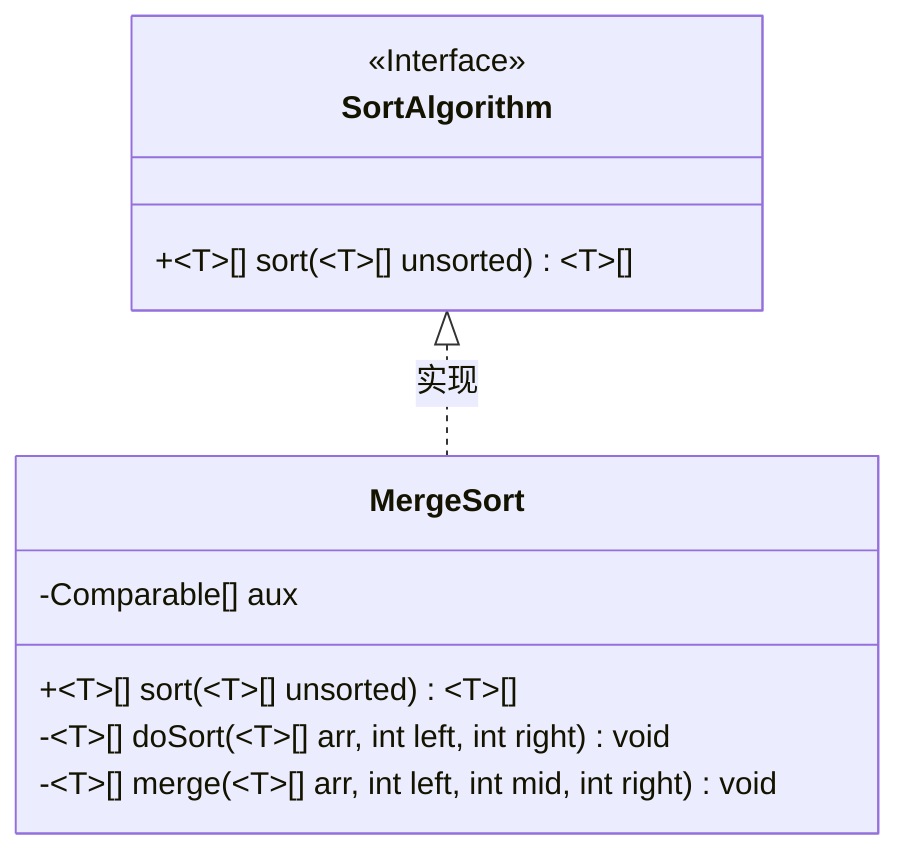
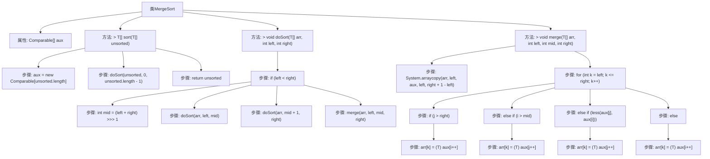

# 基础信息

|      |      |
|------|------|
| 名称 | MergeSort |
| 编码语言 | .java |
| 代码路径 | Java/src/main/java/com/thealgorithms/sorts/MergeSort.java |
| 包名 | com.thealgorithms.sorts |
| 依赖项 | ['com.thealgorithms.sorts.SortUtils.less'] |
| 概述说明 | 归并排序算法实现，含排序与合并功能。 |

# 说明

该内容描述了实现归并排序算法的过程，涵盖了两个主要功能：排序和合并。归并排序是一种分治算法，通过将数组分成较小的子数组进行排序，然后将这些有序子数组合并成一个完整的有序数组。排序功能负责递归地将数组分解，直到每个子数组只有一个元素，此时它们自然有序。合并功能则负责将两个有序子数组合并成一个更大的有序数组，确保最终整个数组有序。整个过程强调分治策略和递归实现，确保算法的高效性和稳定性。

# 类列表 Class Summary

| 名称   | 类型  | 说明 |
|-------|------|-------------|
| MergeSort | class | 实现归并排序算法，包括排序和合并功能。 |

## 类 MergeSort

|      |      |
|------|------|
| 访问范围 | None |
| 类型 | class |
| 名称 | MergeSort |
| 说明 | 实现归并排序算法，包括排序和合并功能。 |

### UML类图

### 描述
该代码实现了一个归并排序算法。`MergeSort`类实现了`SortAlgorithm`接口，提供了`sort`方法来对数组进行排序。`doSort`方法递归地将数组分成两半进行排序，而`merge`方法则将两个有序数组合并成一个有序数组。整个过程通过递归和合并操作，最终将整个数组排序完成。

### 内部方法调用关系图

这段代码实现了归并排序算法。`MergeSort`类包含一个辅助数组`aux`，用于在合并过程中存储临时数据。`sort`方法初始化`aux`并调用`doSort`方法进行递归排序。`doSort`方法将数组分成两部分，分别进行排序，然后调用`merge`方法将两部分合并。`merge`方法通过比较两部分元素的大小，将它们按顺序合并回原数组。整个过程通过递归和合并操作实现了数组的排序。

### 字段列表 Field List

| 名称  | 类型  | 说明 |
|-------|-------|------|
| aux | Comparable[] | 定义了一个私有的Comparable类型数组aux。 |

### 方法列表 Method List

| 名称  | 类型  | 说明 |
|-------|-------|------|
| merge | void | 泛型合并排序算法实现，将数组分成两部分并合并。 |
| sort | T[] | 重写sort方法，对未排序数组进行排序并返回。 |
| doSort | void | 私有方法doSort对数组进行递归排序，使用归并操作合并子数组。 |

