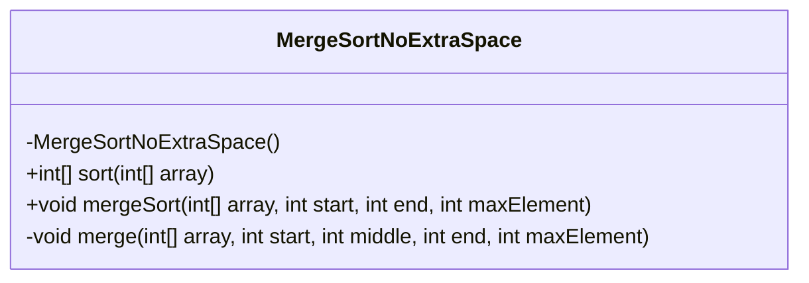
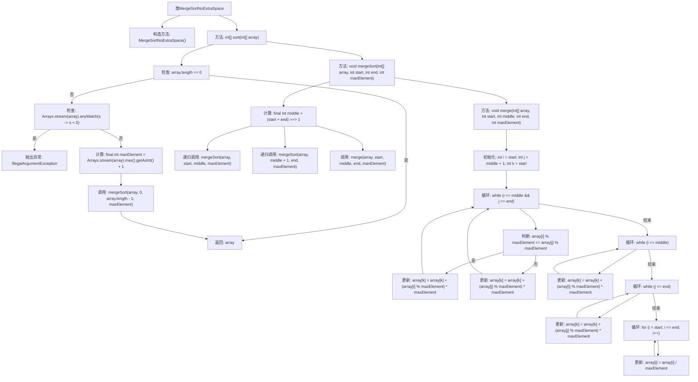

# 基础信息

|      |      |
|------|------|
| 名称 | MergeSortNoExtraSpace |
| 编码语言 | .java |
| 代码路径 | Java/src/main/java/com/thealgorithms/sorts/MergeSortNoExtraSpace.java |
| 包名 | com.thealgorithms.sorts |
| 依赖项 | ['java.util.Arrays'] |
| 概述说明 | 无额外空间原地归并排序，适用于非负整数数组。 |

# 说明

该内容描述了一种实现无额外空间原地归并排序的方法，适用于非负整数数组的排序。原地归并排序的核心在于在不使用额外存储空间的情况下，通过巧妙的算法设计和数据交换，将数组中的元素进行归并排序。这种方法特别适用于内存资源有限的场景，能够有效节省空间，同时保持排序的稳定性和效率。

# 类列表 Class Summary

| 名称   | 类型  | 说明 |
|-------|------|-------------|
| MergeSortNoExtraSpace | class | 实现无额外空间原地归并排序，支持非负整数数组排序。 |

## 类 MergeSortNoExtraSpace

|      |      |
|------|------|
| 访问范围 | public final |
| 类型 | class |
| 名称 | MergeSortNoExtraSpace |
| 说明 | 实现无额外空间原地归并排序，支持非负整数数组排序。 |

### UML类图

### 类图描述
`MergeSortNoExtraSpace` 类实现了一个不使用额外空间的归并排序算法。该类包含一个私有构造函数，防止实例化，并提供了三个静态方法：`sort` 用于排序数组并处理异常情况，`mergeSort` 用于递归地将数组分为两半并进行排序，`merge` 用于合并两个已排序的子数组。该算法通过编码和解码的方式在原始数组中进行排序，避免了额外的空间开销。

### 内部方法调用关系图

这段代码实现了一个不使用额外空间的归并排序算法。首先，`sort`方法检查数组是否为空或包含负数，若包含负数则抛出异常。然后，计算数组中的最大值加1作为`maxElement`，并调用`mergeSort`方法进行递归排序。`mergeSort`方法将数组分为两半，分别排序后再调用`merge`方法合并。`merge`方法通过编码和解码的方式在原始数组中进行合并操作，避免了使用额外空间。

### 字段列表 Field List

| 名称  | 类型  | 说明 |
|-------|-------|------|

### 方法列表 Method List

| 名称  | 类型  | 说明 |
|-------|-------|------|
| sort | int[] | 静态方法对非负整数数组进行归并排序，拒绝负数输入。 |
| mergeSort | void | 归并排序递归实现，分割数组后合并。 |
| merge | void | 合并排序算法，通过取模和乘法操作合并两个有序子数组。 |

