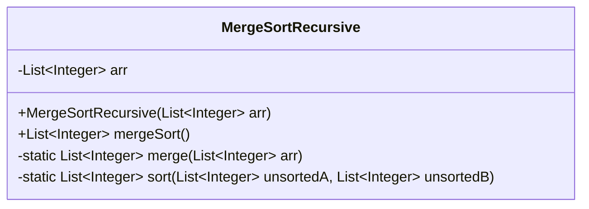
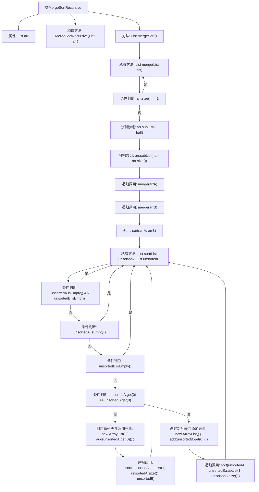

# 基础信息

|      |      |
|------|------|
| 名称 | MergeSortRecursive |
| 编码语言 | .java |
| 代码路径 | Java/src/main/java/com/thealgorithms/sorts/MergeSortRecursive.java |
| 包名 | com.thealgorithms.sorts |
| 依赖项 | ['java.util.ArrayList', 'java.util.List'] |
| 概述说明 | 递归归并排序，包含合并与排序方法。 |

# 说明

递归实现归并排序是一种基于分治策略的排序算法。该算法首先将待排序数组不断递归地分成两半，直到每个子数组只包含一个元素，此时子数组自然有序。接着，通过合并方法将两个有序子数组合并为一个更大的有序数组。合并过程中，依次比较两个子数组的元素，将较小的元素放入新数组，直到所有元素合并完成。最终，整个数组被排序为有序序列。该方法的时间复杂度为O(n log n)，空间复杂度为O(n)，适用于大规模数据排序。

# 类列表 Class Summary

| 名称   | 类型  | 说明 |
|-------|------|-------------|
| MergeSortRecursive | class | 递归实现归并排序，包含合并和排序方法。 |

## 类 MergeSortRecursive

|      |      |
|------|------|
| 访问范围 | public |
| 类型 | class |
| 名称 | MergeSortRecursive |
| 说明 | 递归实现归并排序，包含合并和排序方法。 |

### UML类图

**描述：**  
`MergeSortRecursive` 类实现了一个递归的归并排序算法。该类包含一个私有成员 `arr`，用于存储待排序的整数列表。`mergeSort` 方法启动排序过程，`merge` 方法递归地将列表分成两半并进行排序，`sort` 方法将两个已排序的子列表合并为一个有序列表。通过递归和合并操作，最终实现对列表的归并排序。

### 内部方法调用关系图

这段代码实现了一个递归的归并排序算法。类`MergeSortRecursive`包含一个列表`arr`作为属性，并通过构造方法初始化。`mergeSort`方法调用`merge`方法进行排序。`merge`方法递归地将数组分割成两半，直到数组大小为1，然后调用`sort`方法将两个有序数组合并成一个有序数组。`sort`方法通过比较两个数组的元素，逐步构建新的有序数组。整个流程通过递归和条件判断实现了归并排序的核心逻辑。

### 字段列表 Field List

| 名称  | 类型  | 说明 |
|-------|-------|------|
| arr | List<Integer> | 定义一个整数类型的列表变量arr。 |

### 方法列表 Method List

| 名称  | 类型  | 说明 |
|-------|-------|------|
| sort | List<Integer> | 合并两个未排序列表，按升序排列。 |
| merge | List<Integer> | 递归实现列表归并排序。 |
| mergeSort | List<Integer> | 合并排序方法返回排序后的整数列表。 |

