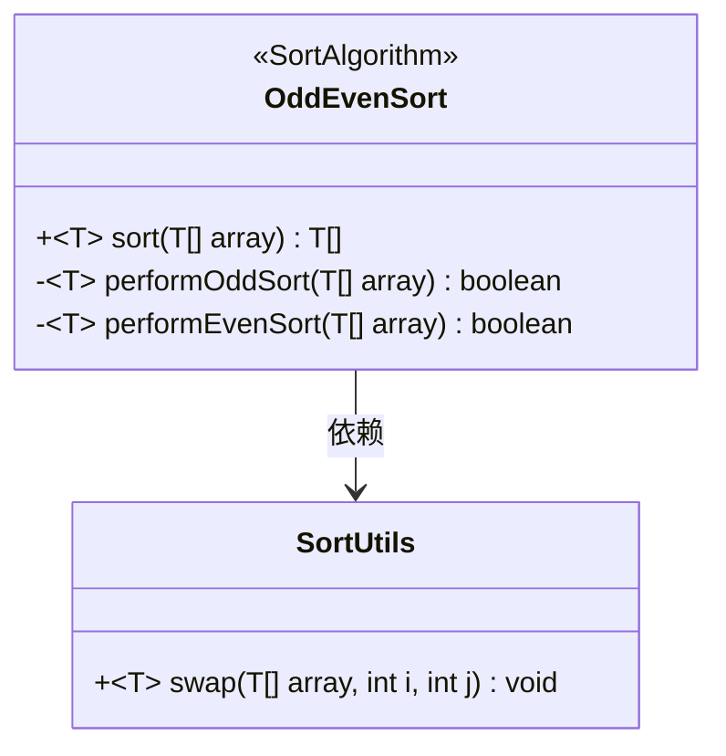
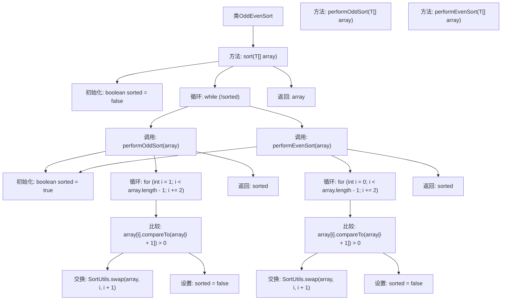

# 基础信息

|      |      |
|------|------|
| 名称 | OddEvenSort |
| 编码语言 | .java |
| 代码路径 | Java/src/main/java/com/thealgorithms/sorts/OddEvenSort.java |
| 包名 | com.thealgorithms.sorts |
| 依赖项 | [] |
| 概述说明 | OddEvenSort类实现奇偶排序，交替奇偶索引排序数组。 |

# 说明

OddEvenSort类实现了奇偶排序算法，该算法通过交替比较和交换数组中奇数和偶数索引位置的元素来排序。该过程重复进行，直到整个数组有序。奇偶排序是一种并行排序算法，适用于多处理器系统，能够有效利用并行计算资源。

# 类列表 Class Summary

| 名称   | 类型  | 说明 |
|-------|------|-------------|
| OddEvenSort | class | OddEvenSort类实现奇偶排序算法，通过交替奇偶索引排序数组。 |

## 类 OddEvenSort

|      |      |
|------|------|
| 访问范围 | public final |
| 类型 | class |
| 名称 | OddEvenSort |
| 说明 | OddEvenSort类实现奇偶排序算法，通过交替奇偶索引排序数组。 |

### UML类图

类图描述：
`OddEvenSort` 类实现了 `SortAlgorithm` 接口，用于执行奇偶排序算法。它包含两个私有方法 `performOddSort` 和 `performEvenSort`，分别用于处理奇数索引和偶数索引的排序操作。`OddEvenSort` 依赖于 `SortUtils` 类中的 `swap` 方法来进行元素交换。通过不断调用这两个私有方法，`sort` 方法最终返回排序后的数组。

### 内部方法调用关系图

这段代码实现了奇偶排序算法，通过交替比较和交换相邻的奇数和偶数位置的元素，直到数组完全排序。流程图展示了`OddEvenSort`类的主要方法和内部逻辑，包括`sort`方法的主循环，以及`performOddSort`和`performEvenSort`方法的具体实现。

### 字段列表 Field List

| 名称  | 类型  | 说明 |
|-------|-------|------|

### 方法列表 Method List

| 名称  | 类型  | 说明 |
|-------|-------|------|
| sort | T[] | 实现泛型数组排序，通过奇偶排序循环直至完成。 |
| performEvenSort | boolean | 私有方法，对偶数索引数组元素进行排序，返回是否已排序。 |
| performOddSort | boolean | 私有方法对数组奇数位排序，返回是否已排序。 |

