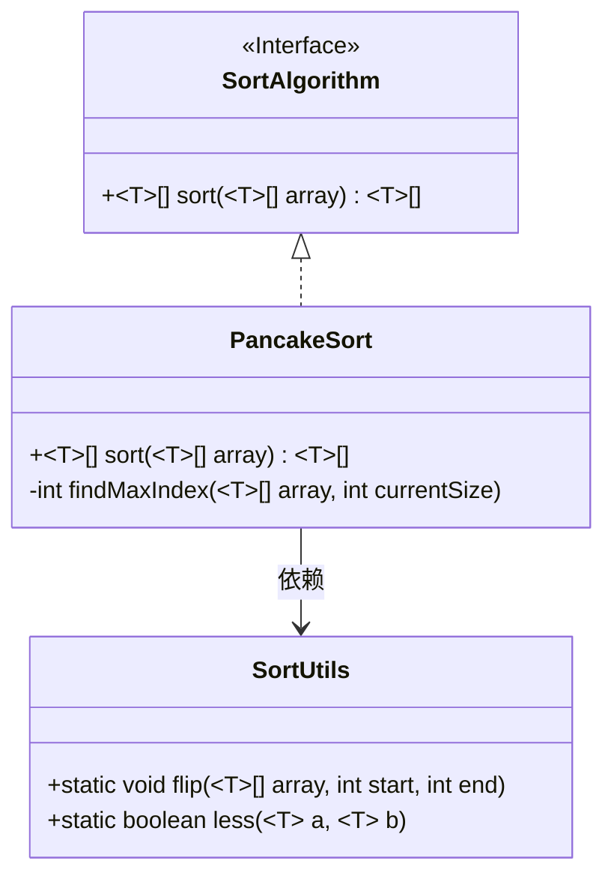
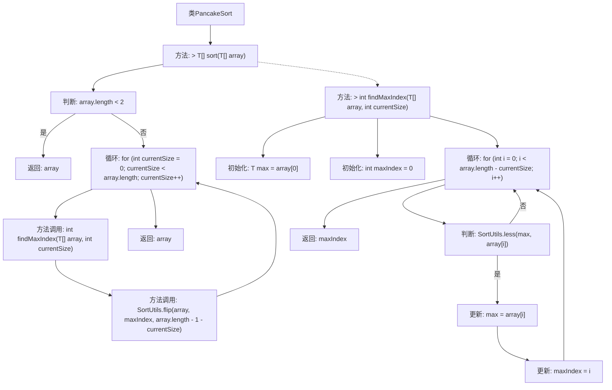

# 基础信息

|      |      |
|------|------|
| 名称 | PancakeSort |
| 编码语言 | .java |
| 代码路径 | Java/src/main/java/com/thealgorithms/sorts/PancakeSort.java |
| 包名 | com.thealgorithms.sorts |
| 依赖项 | [] |
| 概述说明 | 煎饼排序通过翻转操作将最大元素移至正确位置。 |

# 说明

PancakeSort是一种排序算法，通过翻转操作将最大元素逐步移动到正确位置。该算法的核心思想是每次找到当前未排序部分中的最大元素，通过翻转将其移动到数组的顶部，然后再通过一次翻转将其移动到正确的位置。这个过程重复进行，直到所有元素都按顺序排列。PancakeSort的特点在于它仅使用翻转操作来排序，不涉及元素交换，因此在某些特定场景下具有独特的优势。

# 类列表 Class Summary

| 名称   | 类型  | 说明 |
|-------|------|-------------|
| PancakeSort | class | PancakeSort实现排序算法，通过翻转操作将最大元素移到正确位置。 |

## 类 PancakeSort

|      |      |
|------|------|
| 访问范围 | public |
| 类型 | class |
| 名称 | PancakeSort |
| 说明 | PancakeSort实现排序算法，通过翻转操作将最大元素移到正确位置。 |

### UML类图

这段代码实现了一个煎饼排序算法（Pancake Sort），它通过不断翻转数组中的子数组来将数组排序。`PancakeSort`类实现了`SortAlgorithm`接口，并提供了`sort`方法来执行排序操作。`findMaxIndex`方法用于查找数组中最大元素的索引，`SortUtils`类提供了辅助方法`flip`和`less`来执行数组翻转和元素比较操作。整个排序过程通过多次翻转将最大元素移动到正确的位置，最终实现数组的升序排列。

### 内部方法调用关系图

这段代码实现了煎饼排序算法，通过翻转数组中的子数组来排序。首先检查数组长度，若小于2则直接返回。否则，通过循环找到未排序部分的最大值索引，并使用翻转操作将其移动到正确位置。`findMaxIndex`方法用于查找当前未排序部分的最大值索引，`SortUtils.flip`方法用于翻转数组的指定部分。整个过程通过多次翻转逐步将数组排序。

### 字段列表 Field List

| 名称  | 类型  | 说明 |
|-------|-------|------|

### 方法列表 Method List

| 名称  | 类型  | 说明 |
|-------|-------|------|
| findMaxIndex | int | 查找数组中最大元素的索引，忽略已排序部分。 |
| sort | T[] | 重写sort方法，通过翻转操作对数组进行排序。 |

