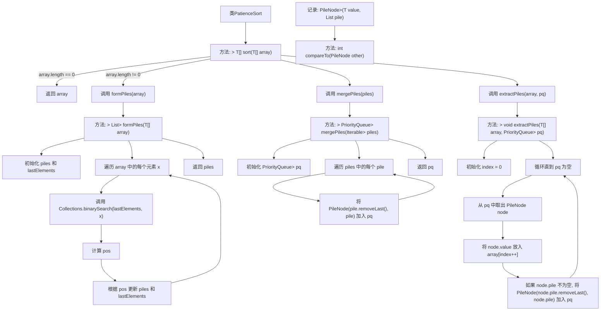

# 基础信息

|      |      |
|------|------|
| 名称 | PatienceSort |
| 编码语言 | .java |
| 代码路径 | Java/src/main/java/com/thealgorithms/sorts/PatienceSort.java |
| 包名 | com.thealgorithms.sorts |
| 依赖项 | ['java.util.ArrayList', 'java.util.Collections', 'java.util.List', 'java.util.PriorityQueue'] |
| 概述说明 | PatienceSort算法通过分堆、合并堆和提取堆元素排序数组。 |

# 说明

PatienceSort算法是一种用于数组排序的算法，其核心过程包括分堆、合并堆和提取堆元素三个主要步骤。首先，算法将数组中的元素按照特定规则分成多个堆。接着，通过合并这些堆，进一步整理和排序元素。最后，算法从合并后的堆中逐个提取元素，最终得到一个有序的数组。这种方法通过分阶段处理元素，逐步实现排序，确保最终结果的正确性和效率。

# 类列表 Class Summary

| 名称   | 类型  | 说明 |
|-------|------|-------------|
| PatienceSort | class | PatienceSort算法通过分堆、合并堆和提取堆元素实现数组排序。 |


## 类 PatienceSort

|      |      |
|------|------|
| 访问范围 | public |
| 类型 | class |
| 名称 | PatienceSort |
| 说明 | PatienceSort算法通过分堆、合并堆和提取堆元素实现数组排序。 |


### UML类图

```mermaid
classDiagram
    class PatienceSort {
        +~T extends Comparable~T~ sort(T[] array) T[]
        -~T extends Comparable~T~ formPiles(T[] array) List~List~T~~
        -~T extends Comparable~T~ mergePiles(Iterable~List~T~~ piles) PriorityQueue~PileNode~T~~
        -~T extends Comparable~T~ extractPiles(T[] array, PriorityQueue~PileNode~T~~ pq) void
    }

    class PileNode~T extends Comparable~T~~ {
        -T value
        -List~T~ pile
        +int compareTo(PileNode~T~ other)
    }

    PatienceSort --> PileNode : 依赖
```

### 描述
`PatienceSort` 类实现了 `SortAlgorithm` 接口，使用 Patience Sort 算法对可比较类型的数组进行排序。该类包含三个私有方法：`formPiles` 用于将数组元素组织成堆，`mergePiles` 将堆合并到优先队列中，`extractPiles` 从优先队列中提取元素以形成排序后的数组。`PileNode` 是一个辅助记录类，用于在优先队列中表示堆的节点，并实现 `Comparable` 接口以支持比较操作。


### 内部方法调用关系图



这段代码实现了Patience Sort算法，用于对可比较元素的数组进行排序。首先，`formPiles`方法将数组元素组织成多个堆，每个堆中的元素按升序排列。然后，`mergePiles`方法将这些堆合并成一个优先队列，队列中的元素按升序排列。最后，`extractPiles`方法从优先队列中提取元素，生成排序后的数组。整个流程通过多个方法的协作，逐步完成排序任务。

### 字段列表 Field List

| 名称  | 类型  | 说明 |
|-------|-------|------|

### 方法列表 Method List

| 名称  | 类型  | 说明 |
|-------|-------|------|
| mergePiles | PriorityQueue<PileNode<T>> | 静态方法合并有序列表，返回优先队列。 |
| sort | T[] | 重写sort方法，对空数组直接返回，否则分堆、合并并提取排序。 |
| formPiles | List<List<T>> | 该方法将数组元素按大小分组，生成有序堆栈列表。 |
| extractPiles | void | 从优先队列提取元素并填充数组，同时更新队列。 |


