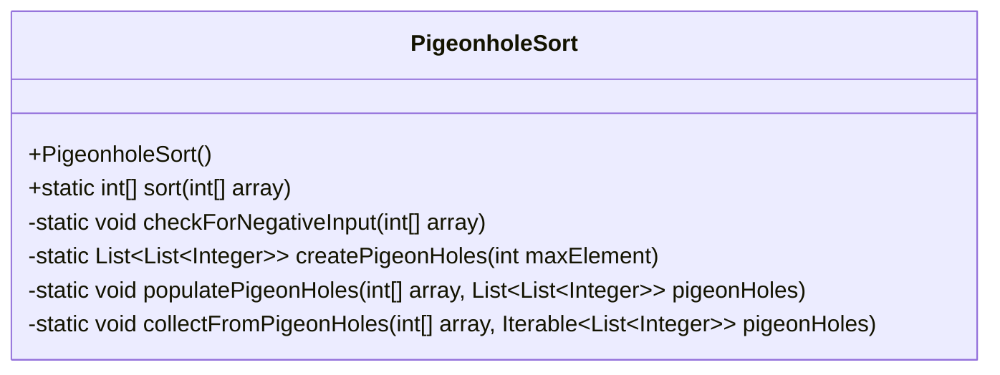
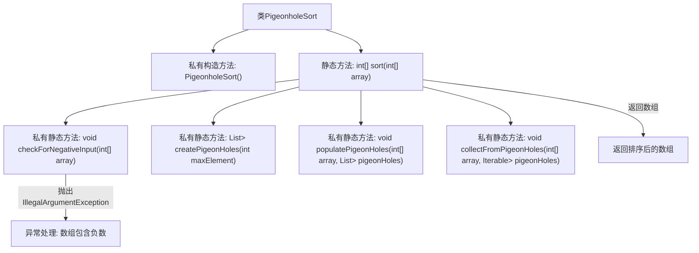

# 基础信息

|      |      |
|------|------|
| 名称 | PigeonholeSort |
| 编码语言 | .java |
| 代码路径 | Java/src/main/java/com/thealgorithms/sorts/PigeonholeSort.java |
| 包名 | com.thealgorithms.sorts |
| 依赖项 | ['java.util.ArrayList', 'java.util.Arrays', 'java.util.List'] |
| 概述说明 | PigeonholeSort类实现鸽巢排序，处理负数，创建鸽巢并排序。 |

# 说明

PigeonholeSort类实现了鸽巢排序算法，该算法首先检查输入元素中是否存在负数，若存在则无法排序。接着，算法根据元素的范围创建相应数量的鸽巢，每个鸽巢对应一个特定的值。然后，将输入元素逐一放入对应的鸽巢中，确保每个鸽巢内的元素值相同。最后，按照鸽巢的顺序收集所有元素，完成排序过程。该方法适用于整数排序，尤其适合元素值范围较小的情况。

# 类列表 Class Summary

| 名称   | 类型  | 说明 |
|-------|------|-------------|
| PigeonholeSort | class | PigeonholeSort类实现鸽巢排序算法，检查负数，创建鸽巢，填充并收集排序元素。 |

## 类 PigeonholeSort

|      |      |
|------|------|
| 访问范围 | public final |
| 类型 | class |
| 名称 | PigeonholeSort |
| 说明 | PigeonholeSort类实现鸽巢排序算法，检查负数，创建鸽巢，填充并收集排序元素。 |

### UML类图

**描述：**  
`PigeonholeSort` 类实现了一种名为鸽巢排序的算法，用于对整数数组进行排序。该类包含一个私有构造函数，防止实例化。主要方法 `sort` 负责排序过程，首先检查数组是否包含负数，然后创建鸽巢，将数组元素分配到相应的鸽巢中，最后从鸽巢中收集元素以完成排序。辅助方法 `checkForNegativeInput` 用于检查负数，`createPigeonHoles` 创建鸽巢，`populatePigeonHoles` 将元素分配到鸽巢，`collectFromPigeonHoles` 从鸽巢中收集排序后的元素。

### 内部方法调用关系图

这段代码实现了鸽巢排序算法，用于对非负整数数组进行排序。代码首先检查数组中是否包含负数，如果发现负数则抛出异常。接着，根据数组中的最大值创建鸽巢，并将数组中的元素放入对应的鸽巢中。最后，从鸽巢中按顺序收集元素，完成排序。流程图展示了类中各个方法的调用关系，以及异常处理和返回排序后数组的流程。

### 字段列表 Field List

| 名称  | 类型  | 说明 |
|-------|-------|------|

### 方法列表 Method List

| 名称  | 类型  | 说明 |
|-------|-------|------|
| collectFromPigeonHoles | void | 从鸽巢中收集元素并存入数组。 |
| createPigeonHoles | List<List<Integer>> | 创建包含maxElement+1个空列表的二维列表。 |
| checkForNegativeInput | void | 检查数组元素，若存在负数则抛出异常。 |
| sort | int[] | 该方法对数组进行排序，先检查负数，为空则返回，否则使用鸽巢排序法处理。 |
| populatePigeonHoles | void | 该方法将数组元素按值分组存储到对应的列表中。 |

