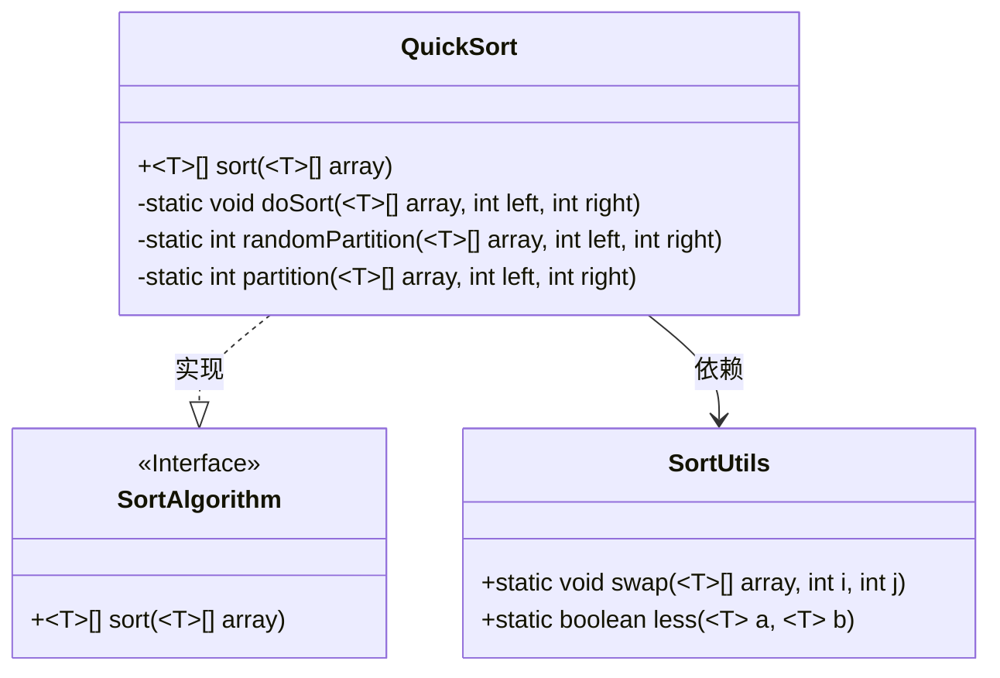
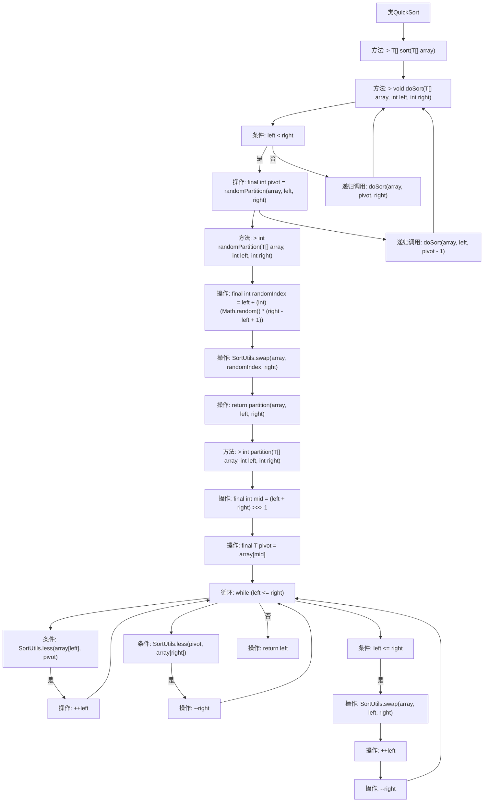

# 基础信息

|      |      |
|------|------|
| 名称 | QuickSort |
| 编码语言 | .java |
| 代码路径 | Java/src/main/java/com/thealgorithms/sorts/QuickSort.java |
| 包名 | com.thealgorithms.sorts |
| 依赖项 | [] |
| 概述说明 | 快速排序利用递归分治和随机分区对数组进行排序。 |

# 说明

快速排序是一种高效的排序算法，采用递归分治策略。其核心思想是通过随机选择一个基准元素，将数组分为两部分：一部分小于基准，另一部分大于基准。然后递归地对这两部分进行排序，最终合并得到有序数组。该算法的时间复杂度平均为O(n log n)，最坏情况下为O(n²)，但通过随机化分区可以有效避免最坏情况的发生。快速排序因其高效性和广泛应用而成为经典排序算法之一。

# 类列表 Class Summary

| 名称   | 类型  | 说明 |
|-------|------|-------------|
| QuickSort | class | 快速排序实现，通过递归分治和随机分区排序数组。 |

## 类 QuickSort

|      |      |
|------|------|
| 访问范围 | None |
| 类型 | class |
| 名称 | QuickSort |
| 说明 | 快速排序实现，通过递归分治和随机分区排序数组。 |

### UML类图

### 描述
这段代码实现了一个通用的快速排序算法 `QuickSort`，它实现了 `SortAlgorithm` 接口。`QuickSort` 类包含四个方法：`sort` 是公有方法，负责启动排序过程；`doSort` 是私有方法，递归地进行排序；`randomPartition` 是私有方法，随机选择分区点以避免基本有序序列；`partition` 是私有方法，用于找到分区索引。`SortUtils` 类提供了两个静态工具方法 `swap` 和 `less`，分别用于交换数组元素和比较元素大小。`QuickSort` 依赖于 `SortUtils` 来完成排序操作。

### 内部方法调用关系图

这段代码实现了快速排序算法。首先，`sort`方法调用`doSort`方法开始排序过程。`doSort`方法通过递归调用自身，并使用`randomPartition`方法随机选择分区点，以避免基本有序序列的性能问题。`randomPartition`方法通过随机选择一个索引并交换元素来打乱数组，然后调用`partition`方法进行分区操作。`partition`方法通过比较和交换元素，最终返回分区点的索引。整个流程通过递归和分区操作实现了数组的快速排序。

### 字段列表 Field List

| 名称  | 类型  | 说明 |
|-------|-------|------|

### 方法列表 Method List

| 名称  | 类型  | 说明 |
|-------|-------|------|
| sort | T[] | 重写sort方法，对数组进行排序并返回。 |
| randomPartition | int | 随机分区方法用于在指定范围内随机选择元素并交换，返回分区索引。 |
| doSort | void | 递归实现快速排序，分治处理数组左右部分。 |
| partition | int | 快速排序分区函数，选择中位数作为基准，交换并返回分区点。 |

