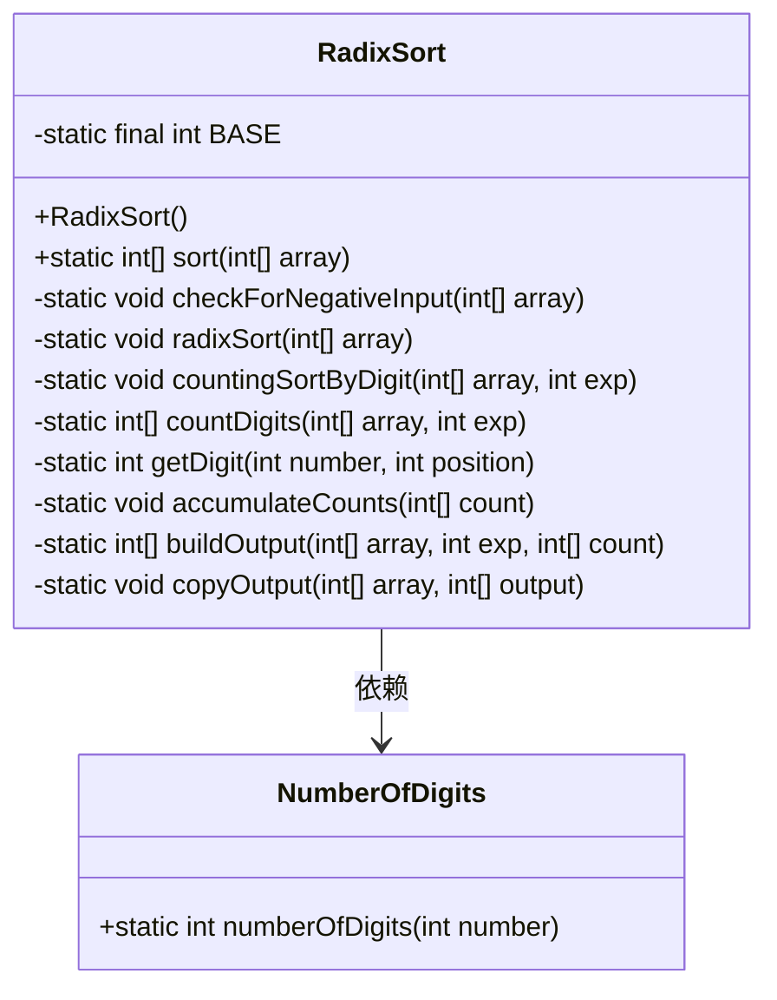
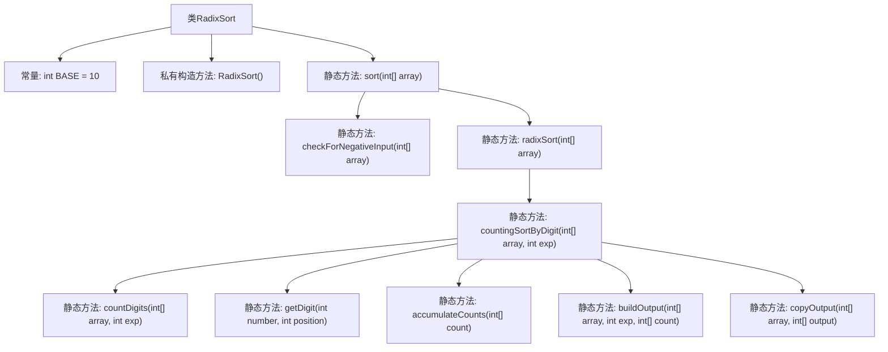

# 基础信息

|      |      |
|------|------|
| 名称 | RadixSort |
| 编码语言 | .java |
| 代码路径 | Java/src/main/java/com/thealgorithms/sorts/RadixSort.java |
| 包名 | com.thealgorithms.sorts |
| 依赖项 | ['com.thealgorithms.maths.NumberOfDigits', 'java.util.Arrays'] |
| 概述说明 | 基数排序支持非负整数排序，包含输入检查和计数排序辅助方法。 |

# 说明

基数排序是一种非负整数排序算法，通过逐位比较数值的每一位来实现排序。该实现包含输入检查，确保所有输入为非负整数，避免无效数据影响排序结果。算法使用计数排序作为辅助方法，对每一位进行稳定排序，确保整体排序的准确性。通过逐位处理，基数排序能够高效地完成大规模数据的排序任务。

# 类列表 Class Summary

| 名称   | 类型  | 说明 |
|-------|------|-------------|
| RadixSort | class | 基数排序实现，支持非负整数排序，包含输入检查和计数排序辅助方法。 |

## 类 RadixSort

|      |      |
|------|------|
| 访问范围 | public final |
| 类型 | class |
| 名称 | RadixSort |
| 说明 | 基数排序实现，支持非负整数排序，包含输入检查和计数排序辅助方法。 |

### UML类图

这段代码实现了一个基数排序算法，用于对非负整数数组进行排序。`RadixSort`类包含多个静态方法，用于执行排序过程中的各个步骤，包括检查输入数组中的负数、按位进行计数排序以及最终的输出复制。`NumberOfDigits`类用于计算整数的位数，`RadixSort`类依赖于`NumberOfDigits`类来获取最大值的位数，从而确定排序的轮次。整个排序过程通过多次按位计数排序完成，确保数组最终按升序排列。

### 内部方法调用关系图

这段代码实现了基数排序算法，用于对非负整数数组进行排序。代码首先检查数组是否包含负数，如果包含则抛出异常。然后，通过`radixSort`方法对数组进行排序，该方法依赖于`countingSortByDigit`方法，后者按指定位数进行计数排序。`countingSortByDigit`方法又调用了多个辅助方法，如`countDigits`、`getDigit`、`accumulateCounts`、`buildOutput`和`copyOutput`，以完成排序过程。整个流程从检查输入开始，逐步进行排序，最终返回排序后的数组。

### 字段列表 Field List

| 名称  | 类型  | 说明 |
|-------|-------|------|
| BASE = 10 | int | 定义一个私有静态常量BASE，值为10。 |

### 方法列表 Method List

| 名称  | 类型  | 说明 |
|-------|-------|------|
| getDigit | int | 获取指定位置数字的静态方法。 |
| countingSortByDigit | void | 私有方法实现基于指定位数的计数排序。 |
| radixSort | void | 基数排序实现，通过按位计数排序完成数组排序。 |
| checkForNegativeInput | void | 检查数组中是否存在负数，若有则抛出异常。 |
| sort | int[] | 静态方法对数组进行排序，检查负数后执行基数排序。 |
| countDigits | int[] | 统计数组中各数字在指定位上的出现次数。 |
| copyOutput | void | 将输出数组复制到目标数组。 |
| accumulateCounts | void | 私有方法累加数组元素，从第二个元素开始依次叠加前一个元素的值。 |
| buildOutput | int[] | 根据数组和指数构建输出数组，通过递减计数更新位置。 |

