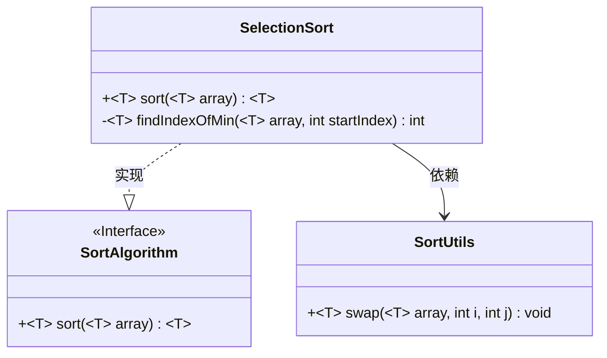
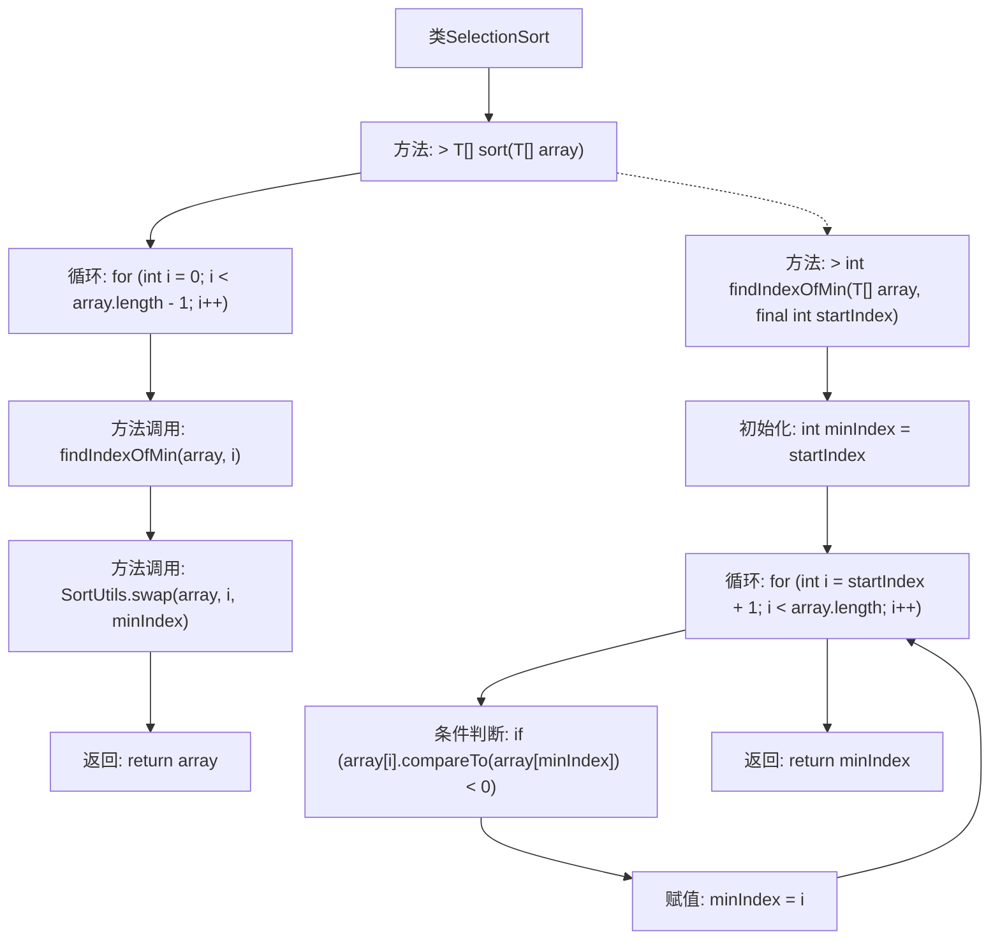

# 基础信息

|      |      |
|------|------|
| 名称 | SelectionSort |
| 编码语言 | .java |
| 代码路径 | Java/src/main/java/com/thealgorithms/sorts/SelectionSort.java |
| 包名 | com.thealgorithms.sorts |
| 依赖项 | [] |
| 概述说明 | 实现选择排序算法，按升序排列数组元素。 |

# 说明

实现选择排序算法，用于将可比较元素的数组按升序排列。选择排序通过遍历数组，每次从未排序部分中找出最小元素，并将其与未排序部分的第一个元素交换位置，逐步将数组排序。该算法的时间复杂度为O(n^2)，适用于小规模数据集或对内存使用有限制的场景。

# 类列表 Class Summary

| 名称   | 类型  | 说明 |
|-------|------|-------------|
| SelectionSort | class | 实现选择排序算法，按升序排列可比较元素数组。 |

## 类 SelectionSort

|      |      |
|------|------|
| 访问范围 | public |
| 类型 | class |
| 名称 | SelectionSort |
| 说明 | 实现选择排序算法，按升序排列可比较元素数组。 |

### UML类图

这段代码定义了一个实现 `SortAlgorithm` 接口的 `SelectionSort` 类，该类使用选择排序算法对数组进行排序。`SelectionSort` 类中的 `sort` 方法通过调用 `findIndexOfMin` 方法找到最小元素的索引，并使用 `SortUtils` 类中的 `swap` 方法交换元素位置。`SortUtils` 类提供了通用的数组元素交换功能。整个设计体现了接口与实现类的分离，并通过依赖关系实现了代码的复用。

### 内部方法调用关系图

这段代码实现了选择排序算法。`SelectionSort`类包含两个主要方法：`sort`和`findIndexOfMin`。`sort`方法通过循环调用`findIndexOfMin`找到当前最小元素的索引，然后使用`SortUtils.swap`方法交换元素位置，最终返回排序后的数组。`findIndexOfMin`方法通过遍历数组找到从指定起始位置开始的最小元素索引。整个流程通过循环和条件判断实现排序功能。

### 字段列表 Field List

| 名称  | 类型  | 说明 |
|-------|-------|------|

### 方法列表 Method List

| 名称  | 类型  | 说明 |
|-------|-------|------|
| findIndexOfMin | int | 查找数组中最小值的索引，从指定位置开始。 |
| sort | T[] | 重写排序方法，使用选择排序算法对数组进行排序。 |

