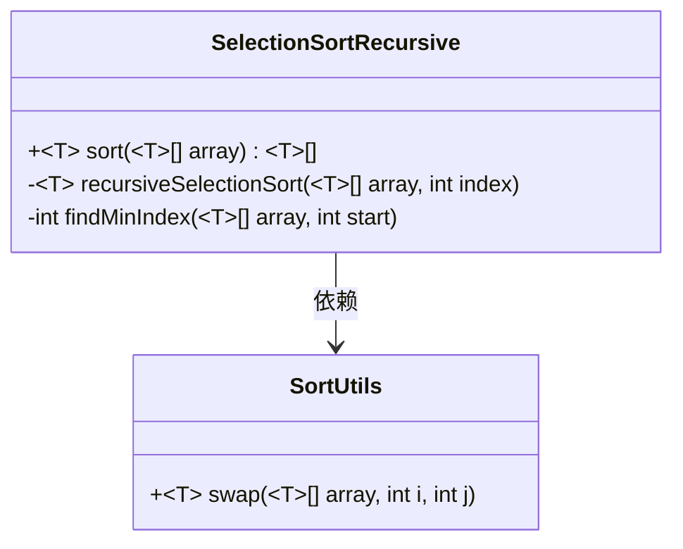
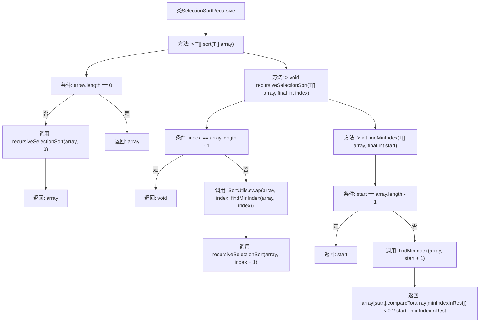

# 基础信息

|      |      |
|------|------|
| 名称 | SelectionSortRecursive |
| 编码语言 | .java |
| 代码路径 | Java/src/main/java/com/thealgorithms/sorts/SelectionSortRecursive.java |
| 包名 | com.thealgorithms.sorts |
| 依赖项 | [] |
| 概述说明 | 递归选择排序实现排序、交换和查找最小元素功能。 |

# 说明

递归选择排序实现包含三个主要功能：排序、交换和查找最小元素。排序功能通过递归调用自身，逐步将列表中的元素按升序排列。交换功能用于在每次递归过程中将当前最小元素与未排序部分的第一个元素交换位置。查找最小元素功能用于在未排序部分中确定最小元素的位置，以便进行交换。整个算法通过不断缩小未排序部分的范围，最终完成整个列表的排序。

# 类列表 Class Summary

| 名称   | 类型  | 说明 |
|-------|------|-------------|
| SelectionSortRecursive | class | 递归选择排序实现，包含排序、交换和查找最小元素功能。 |

## 类 SelectionSortRecursive

|      |      |
|------|------|
| 访问范围 | public |
| 类型 | class |
| 名称 | SelectionSortRecursive |
| 说明 | 递归选择排序实现，包含排序、交换和查找最小元素功能。 |

### UML类图

**描述：**  
`SelectionSortRecursive` 类实现了递归选择排序算法。该类包含一个公有方法 `sort`，用于对数组进行排序，以及两个私有方法 `recursiveSelectionSort` 和 `findMinIndex`，分别用于递归排序和查找最小元素索引。`SelectionSortRecursive` 依赖于 `SortUtils` 类中的 `swap` 方法，用于交换数组中的元素。该算法通过递归调用逐步将数组排序，确保每次选择最小元素并将其放置在正确位置。

### 内部方法调用关系图

这段代码实现了一个递归的选择排序算法。`sort`方法首先检查数组是否为空，若为空则直接返回。否则，调用`recursiveSelectionSort`方法从索引0开始递归排序。`recursiveSelectionSort`方法通过`findMinIndex`找到当前最小元素的索引，并与当前索引交换元素，然后递归处理剩余数组。`findMinIndex`方法递归地找到从指定索引开始的最小元素索引，并返回该索引。整个流程通过递归调用逐步完成数组的排序。

### 字段列表 Field List

| 名称  | 类型  | 说明 |
|-------|-------|------|

### 方法列表 Method List

| 名称  | 类型  | 说明 |
|-------|-------|------|
| sort | T[] | 泛型方法递归选择排序，空数组直接返回。 |
| findMinIndex | int | 递归查找数组最小元素索引，比较当前与剩余部分。 |
| recursiveSelectionSort | void | 递归选择排序，通过交换最小元素并递归处理剩余数组实现排序。 |

