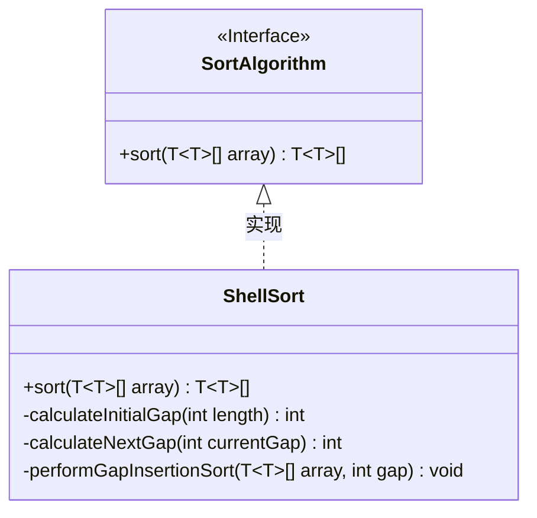
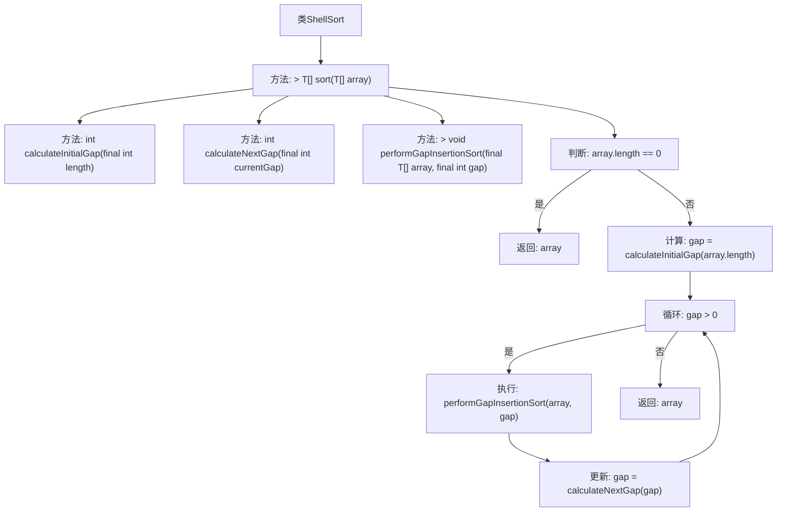

# 基础信息

|      |      |
|------|------|
| 名称 | ShellSort |
| 编码语言 | .java |
| 代码路径 | Java/src/main/java/com/thealgorithms/sorts/ShellSort.java |
| 包名 | com.thealgorithms.sorts |
| 依赖项 | [] |
| 概述说明 | ShellSort使用Knuth序列计算间隔，执行插入排序实现通用排序。 |

# 说明

ShellSort是一种通用的排序算法，采用Knuth序列来计算初始和后续的间隔，通过执行间隔插入排序来实现排序。该方法通过逐步减小间隔，对数组进行多次插入排序，最终达到整体有序的效果。Knuth序列的使用确保了算法的高效性和稳定性。

# 类列表 Class Summary

| 名称   | 类型  | 说明 |
|-------|------|-------------|
| ShellSort | class | ShellSort实现通用排序算法，使用Knuth序列计算初始和后续间隔，执行间隔插入排序。 |

## 类 ShellSort

|      |      |
|------|------|
| 访问范围 | public |
| 类型 | class |
| 名称 | ShellSort |
| 说明 | ShellSort实现通用排序算法，使用Knuth序列计算初始和后续间隔，执行间隔插入排序。 |

### UML类图

### 描述
该代码实现了一个ShellSort类，该类实现了SortAlgorithm接口。ShellSort类提供了sort方法用于对数组进行排序，其中使用了Knuth序列来计算初始和后续的gap值，并通过performGapInsertionSort方法进行基于gap的插入排序。整个排序过程通过不断缩小gap值来完成，最终返回排序后的数组。

### 内部方法调用关系图

这段代码实现了Shell排序算法，通过逐步减小间隔（gap）来对数组进行排序。首先，代码检查数组是否为空，若为空则直接返回。否则，计算初始间隔值，并在每次循环中执行插入排序，直到间隔值减小到0。流程图展示了从数组检查到排序完成的完整流程，包括间隔计算、插入排序执行和间隔更新等关键步骤。

### 字段列表 Field List

| 名称  | 类型  | 说明 |
|-------|-------|------|

### 方法列表 Method List

| 名称  | 类型  | 说明 |
|-------|-------|------|
| calculateNextGap | int | 计算下一个间隔值为当前间隔值除以3。 |
| calculateInitialGap | int | 计算初始间隔，满足小于长度三分之一的条件下，按3倍加1递增。 |
| sort | T[] | 实现希尔排序算法，通过逐步减小间隔对数组进行插入排序。 |
| performGapInsertionSort | void | 实现基于间隔的插入排序，通过比较和移动元素完成排序。 |

