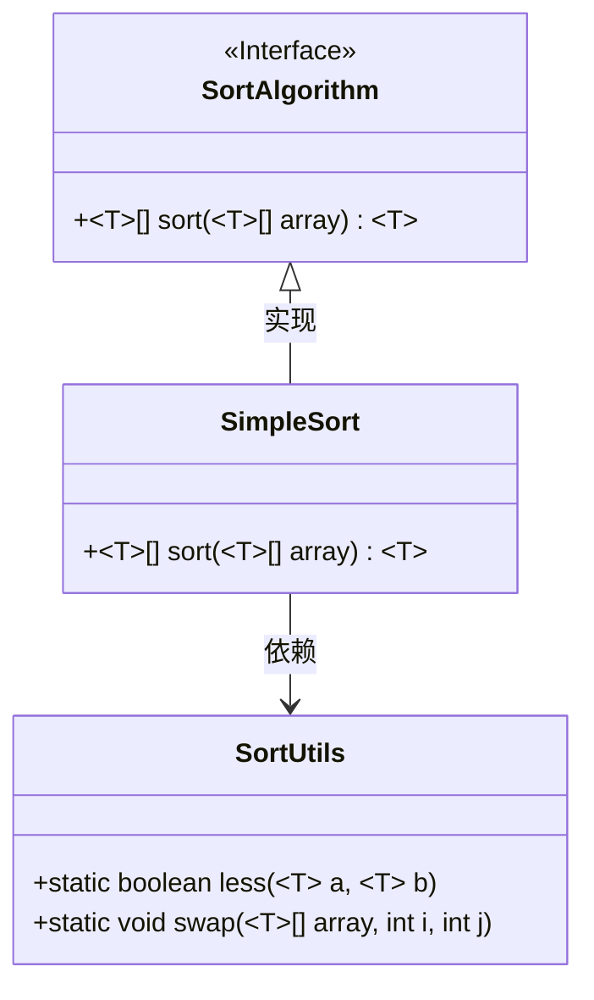
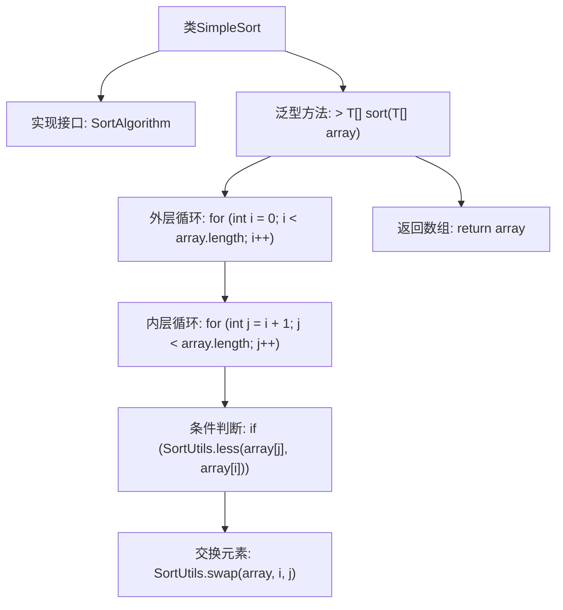

# 基础信息

|      |      |
|------|------|
| 名称 | SimpleSort |
| 编码语言 | .java |
| 代码路径 | Java/src/main/java/com/thealgorithms/sorts/SimpleSort.java |
| 包名 | com.thealgorithms.sorts |
| 依赖项 | [] |
| 概述说明 | SimpleSort类实现SortAlgorithm接口，通过双重循环比较交换数组元素完成排序。 |

# 说明

SimpleSort类实现了SortAlgorithm接口，采用双重循环结构对数组元素进行比较和交换，从而实现排序功能。该排序方法通过遍历数组，逐一对相邻元素进行比较，并在必要时进行交换，以确保数组最终按升序或降序排列。这种实现方式简单直观，适用于小规模数据集的排序需求。

# 类列表 Class Summary

| 名称   | 类型  | 说明 |
|-------|------|-------------|
| SimpleSort | class | SimpleSort类实现SortAlgorithm接口，通过双重循环比较并交换数组元素实现排序。 |

## 类 SimpleSort

|      |      |
|------|------|
| 访问范围 | public |
| 类型 | class |
| 名称 | SimpleSort |
| 说明 | SimpleSort类实现SortAlgorithm接口，通过双重循环比较并交换数组元素实现排序。 |

### UML类图

这段代码展示了一个简单的排序算法实现 `SimpleSort`，它实现了 `SortAlgorithm` 接口。`SimpleSort` 类中的 `sort` 方法使用了双重循环来比较和交换数组中的元素，以实现排序。`SortUtils` 类提供了 `less` 和 `swap` 两个静态方法，分别用于比较两个元素的大小和交换数组中的两个元素。`SimpleSort` 类依赖于 `SortUtils` 类来完成排序操作。

### 内部方法调用关系图

这段代码实现了一个简单的排序算法，通过双重循环遍历数组，并使用`SortUtils.less`方法比较元素大小，若满足条件则通过`SortUtils.swap`方法交换元素位置，最终返回排序后的数组。流程图清晰地展示了类结构、方法调用及循环逻辑的执行顺序。

### 字段列表 Field List

| 名称  | 类型  | 说明 |
|-------|-------|------|

### 方法列表 Method List

| 名称  | 类型  | 说明 |
|-------|-------|------|
| sort | T[] | 实现了一个通用排序方法，使用双重循环比较并交换数组元素。 |

