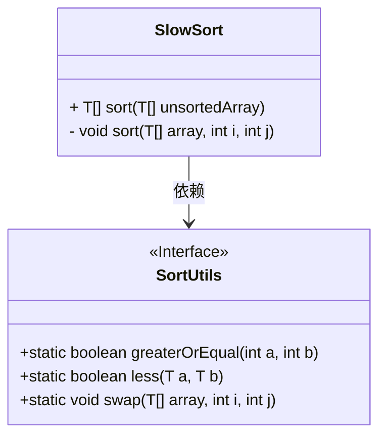
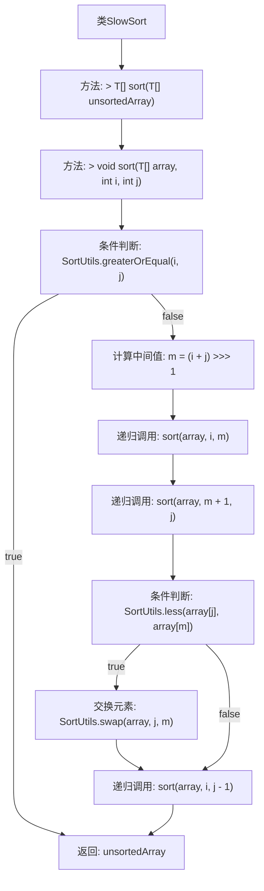

# 基础信息

|      |      |
|------|------|
| 名称 | SlowSort |
| 编码语言 | .java |
| 代码路径 | Java/src/main/java/com/thealgorithms/sorts/SlowSort.java |
| 包名 | com.thealgorithms.sorts |
| 依赖项 | [] |
| 概述说明 | SlowSort通过递归分治和元素交换实现数组排序。 |

# 说明

SlowSort是一种基于递归分治策略的排序算法。它通过将数组分成更小的子数组，逐步递归地对这些子数组进行排序。在排序过程中，算法会通过比较和交换元素的位置，确保最终数组按升序排列。由于其递归和分治的特性，SlowSort的时间复杂度较高，通常不适用于大规模数据集的排序任务。该算法主要用于教学或理论研究，展示递归分治的基本思想。

# 类列表 Class Summary

| 名称   | 类型  | 说明 |
|-------|------|-------------|
| SlowSort | class | SlowSort实现排序算法，递归分治并交换元素以排序数组。 |

## 类 SlowSort

|      |      |
|------|------|
| 访问范围 | public |
| 类型 | class |
| 名称 | SlowSort |
| 说明 | SlowSort实现排序算法，递归分治并交换元素以排序数组。 |

### UML类图

这段代码定义了一个名为 `SlowSort` 的类，实现了排序算法。`SlowSort` 类包含一个公共方法 `sort`，用于对实现了 `Comparable` 接口的泛型数组进行排序。此外，`SlowSort` 类还包含一个私有方法 `sort`，用于递归地对数组的指定区间进行排序。`SlowSort` 类依赖于 `SortUtils` 接口，该接口提供了比较和交换数组元素的方法。`SortUtils` 接口标记为 `<<Interface>>`，表示它是一个接口。

### 内部方法调用关系图

这段代码实现了`SlowSort`排序算法，通过递归地将数组分成两部分，分别排序后再合并。流程图展示了从主排序方法到递归排序方法的调用过程，包括条件判断、中间值计算、元素交换等步骤。整个过程通过递归逐步缩小排序范围，最终返回排序后的数组。

### 字段列表 Field List

| 名称  | 类型  | 说明 |
|-------|-------|------|

### 方法列表 Method List

| 名称  | 类型  | 说明 |
|-------|-------|------|
| sort | T[] | 重写sort方法，对数组进行排序并返回。 |
| sort | void | 私有方法递归排序数组，先分治后合并，确保有序。 |

