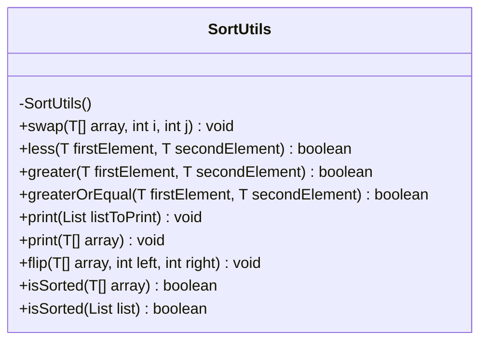

# 基础信息

|      |      |
|------|------|
| 名称 | SortUtils |
| 编码语言 | .java |
| 代码路径 | Java/src/main/java/com/thealgorithms/sorts/SortUtils.java |
| 包名 | com.thealgorithms.sorts |
| 依赖项 | ['java.util.Arrays', 'java.util.List', 'java.util.stream.Collectors'] |
| 概述说明 | SortUtils类提供数组和列表的排序辅助功能，涵盖交换、比较、翻转、打印及排序检查。 |

# 说明

SortUtils类是一个工具类，专门用于提供数组和列表的排序辅助方法。它包含多种功能，如元素交换、比较、翻转、打印和排序检查。这些方法旨在帮助开发者更高效地处理排序相关操作，提升代码的可读性和维护性。通过使用SortUtils类，开发者可以简化排序逻辑的实现，确保数据的正确性和一致性。

# 类列表 Class Summary

| 名称   | 类型  | 说明 |
|-------|------|-------------|
| SortUtils | class | SortUtils类提供数组和列表的排序辅助方法，包括元素交换、比较、翻转、打印和排序检查。 |

## 类 SortUtils

|      |      |
|------|------|
| 访问范围 | final |
| 类型 | class |
| 名称 | SortUtils |
| 说明 | SortUtils类提供数组和列表的排序辅助方法，包括元素交换、比较、翻转、打印和排序检查。 |

### UML类图

这段代码定义了一个名为 `SortUtils` 的工具类，主要用于数组和列表的排序操作。该类提供了多种静态方法，包括交换数组元素、比较元素大小、打印数组或列表、翻转数组元素顺序以及检查数组或列表是否已排序等功能。`SortUtils` 类的所有方法都是静态的，因此不需要实例化即可使用。这些方法适用于泛型类型 `T`，并且 `T` 必须实现 `Comparable` 接口，以便进行比较操作。

### 内部方法调用关系图

```mermaid
graph TD
    A["类SortUtils"]
    B["私有构造方法: SortUtils()"]
    C["静态方法: <T> void swap(T[] array, int i, int j)"]
    D["静态方法: <T extends Comparable<T>> boolean less(T firstElement, T secondElement)"]
    E["静态方法: <T extends Comparable<T>> boolean greater(T firstElement, T secondElement)"]
    F["静态方法: <T extends Comparable<T>> boolean greaterOrEqual(T firstElement, T secondElement)"]
    G["静态方法: void print(List<?> listToPrint)"]
    H["静态方法: <T> void print(T[] array)"]
    I["静态方法: <T extends Comparable<T>> void flip(T[] array, int left, int right)"]
    J["静态方法: <T extends Comparable<T>> boolean isSorted(T[] array)"]
    K["静态方法: <T extends Comparable<T>> boolean isSorted(List<T> list)"]

    A --> B
    A --> C
    A --> D
    A --> E
    A --> F
    A --> G
    A --> H
    A --> I
    A --> J
    A --> K
```

这段代码定义了一个名为 `SortUtils` 的工具类，提供了多种静态方法用于数组和列表的排序操作。这些方法包括交换数组元素、比较元素大小、打印数组或列表内容、翻转数组元素顺序以及检查数组或列表是否已排序。每个方法都设计为独立的功能模块，可以方便地在排序算法中使用。

### 字段列表 Field List

| 名称  | 类型  | 说明 |
|-------|-------|------|

### 方法列表 Method List

| 名称  | 类型  | 说明 |
|-------|-------|------|
| isSorted | boolean | 检查数组是否按升序排列。 |
| flip | void | 静态泛型方法翻转数组指定区间元素。 |
| swap | void | 交换数组中指定位置的元素。 |
| isSorted | boolean | 该方法检查列表是否按升序排序。 |
| greater | boolean | 静态方法比较两个泛型对象大小，返回布尔值。 |
| greaterOrEqual | boolean | 静态方法比较两个可比较对象，返回第一个是否大于或等于第二个。 |
| print | void | 定义一个泛型方法，用于打印任意类型数组的内容。 |
| less | boolean | 比较两个可比较对象，若第一个小于第二个则返回真。 |
| print | void | 该方法将列表元素转换为字符串并用空格连接后输出。 |

