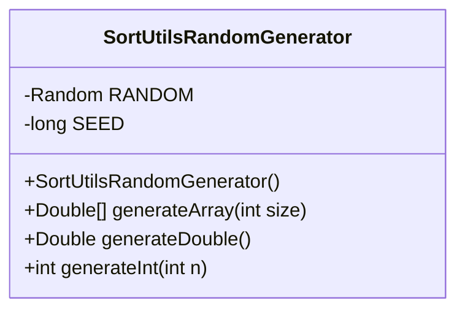
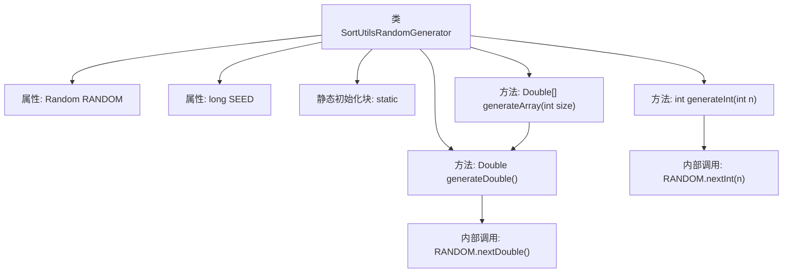

# 基础信息

|      |      |
|------|------|
| 名称 | SortUtilsRandomGenerator |
| 编码语言 | .java |
| 代码路径 | Java/src/main/java/com/thealgorithms/sorts/SortUtilsRandomGenerator.java |
| 包名 | com.thealgorithms.sorts |
| 依赖项 | ['java.util.Random'] |
| 概述说明 | SortUtilsRandomGenerator类生成随机数组和数值，支持双精度和整数类型。 |

# 说明

SortUtilsRandomGenerator类是一个用于生成随机数组和数值的工具类。它提供了多种方法，包括生成双精度数组、生成双精度值以及生成整数值的功能。通过这些方法，用户可以方便地获取所需的随机数据，适用于需要随机数值的各种应用场景。该类设计简洁，功能明确，能够有效满足随机数据生成的需求。

# 类列表 Class Summary

| 名称   | 类型  | 说明 |
|-------|------|-------------|
| SortUtilsRandomGenerator | class | SortUtilsRandomGenerator类用于生成随机数组和数值，包含生成双精度数组、双精度值和整数值的方法。 |

## 类 SortUtilsRandomGenerator

|      |      |
|------|------|
| 访问范围 | public final |
| 类型 | class |
| 名称 | SortUtilsRandomGenerator |
| 说明 | SortUtilsRandomGenerator类用于生成随机数组和数值，包含生成双精度数组、双精度值和整数值的方法。 |

### UML类图

**描述：**  
`SortUtilsRandomGenerator` 是一个工具类，用于生成随机数。它包含一个私有的 `Random` 对象和种子值 `SEED`，并通过静态初始化块进行初始化。该类提供了三个公有方法：`generateArray` 用于生成指定大小的 `Double` 数组，`generateDouble` 用于生成 `[0, 1)` 范围内的 `Double` 值，`generateInt` 用于生成 `[0, n)` 范围内的整数值。由于构造函数是私有的，该类不能被实例化，所有方法均为静态方法。

### 内部方法调用关系图

这段代码定义了一个名为`SortUtilsRandomGenerator`的工具类，用于生成随机数。类中包含两个静态属性`RANDOM`和`SEED`，并通过静态初始化块进行初始化。类提供了三个静态方法：`generateArray`用于生成指定大小的随机双精度浮点数数组，`generateDouble`用于生成一个[0, 1)范围内的随机双精度浮点数，`generateInt`用于生成一个[0, n)范围内的随机整数。方法之间通过内部调用`RANDOM.nextDouble()`和`RANDOM.nextInt(n)`来实现随机数生成。

### 字段列表 Field List

| 名称  | 类型  | 说明 |
|-------|-------|------|
| RANDOM | Random | 声明一个私有的静态随机数生成器常量。 |
| SEED | long | 定义了一个静态不可变的长整型种子变量。 |

### 方法列表 Method List

| 名称  | 类型  | 说明 |
|-------|-------|------|
| generateArray | Double[] | 生成指定大小的Double数组，元素由generateDouble()生成。 |
| generateDouble | Double | 生成随机双精度浮点数的方法。 |
| generateInt | int | 生成随机整数，范围为0到n-1。 |

