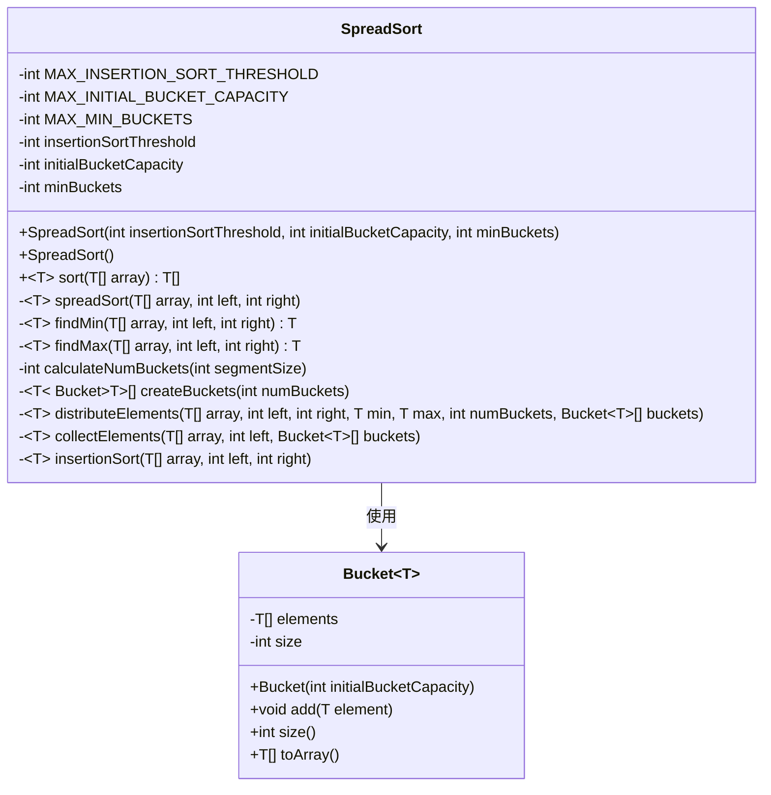
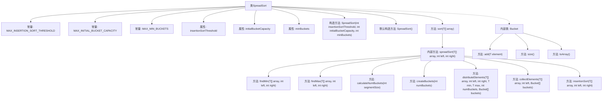

# 基础信息

|      |      |
|------|------|
| 名称 | SpreadSort |
| 编码语言 | .java |
| 代码路径 | Java/src/main/java/com/thealgorithms/sorts/SpreadSort.java |
| 包名 | com.thealgorithms.sorts |
| 依赖项 | ['java.util.Arrays'] |
| 概述说明 | SpreadSort算法支持自定义参数，适用于大规模数据排序。 |

# 说明

SpreadSort算法是一种高效的大规模数据排序方法，支持用户自定义多个关键参数以优化性能。这些参数包括插入排序的阈值、初始桶的容量以及最小桶数。通过调整这些参数，用户可以根据具体数据规模和特性来优化排序效率。该算法特别适用于处理大规模数据集，能够在保证排序准确性的同时，显著提升排序速度。其灵活性和高效性使其成为处理大数据排序任务的有力工具。

# 类列表 Class Summary

| 名称   | 类型  | 说明 |
|-------|------|-------------|
| SpreadSort | class | SpreadSort算法实现，支持自定义插入排序阈值、初始桶容量和最小桶数，适用于大规模数据排序。 |

## 类 SpreadSort

|      |      |
|------|------|
| 访问范围 | public |
| 类型 | class |
| 名称 | SpreadSort |
| 说明 | SpreadSort算法实现，支持自定义插入排序阈值、初始桶容量和最小桶数，适用于大规模数据排序。 |

### UML类图

**描述：**  
`SpreadSort` 是一个实现排序算法的类，它通过将元素分配到多个桶中进行排序。类中包含多个私有方法用于查找最小最大值、计算桶数量、创建桶、分配元素到桶中、从桶中收集元素以及插入排序。`Bucket` 是一个内部类，用于在排序过程中存储元素。`SpreadSort` 类通过构造函数初始化排序算法的参数，并提供了默认构造函数。`sort` 方法是主要的排序入口，内部调用 `spreadSort` 方法进行递归排序。

### 内部方法调用关系图

这段代码实现了一个名为`SpreadSort`的排序算法，它结合了插入排序和桶排序的思想。`SpreadSort`类包含多个内部方法和一个内部类`Bucket`，用于处理排序过程中的不同阶段。通过流程图可以清晰地看到各个方法之间的调用关系，以及`Bucket`类在排序过程中如何被使用。

### 字段列表 Field List

| 名称  | 类型  | 说明 |
|-------|-------|------|
| MAX_INSERTION_SORT_THRESHOLD = 1000 | int | 定义最大插入排序阈值为1000的静态常量。 |
| initialBucketCapacity | int | 私有整型变量initialBucketCapacity用于初始化桶容量。 |
| minBuckets | int | 私有整型变量minBuckets用于存储最小桶数。 |
| MAX_MIN_BUCKETS = 100 | int | 私有静态常量MAX_MIN_BUCKETS值为100。 |
| MAX_INITIAL_BUCKET_CAPACITY = 1000 | int | 私有静态常量MAX_INITIAL_BUCKET_CAPACITY值为1000。 |
| insertionSortThreshold | int | 私有整型变量，用于定义插入排序的阈值。 |

### 方法列表 Method List

| 名称  | 类型  | 说明 |
|-------|-------|------|
| collectElements | void | 将桶中元素排序并收集到数组中。 |
| findMax | T | 私有方法查找数组指定范围内的最大值。 |
| createBuckets | Bucket<T>[] | 创建指定数量的泛型桶数组，并初始化每个桶。 |
| sort | T[] | 重写sort方法，对空数组直接返回，否则调用spreadSort排序。 |
| insertionSort | void | 插入排序算法，对数组指定范围进行排序。 |
| spreadSort | void | 对数组进行分段排序，小段用插入排序，大段分桶排序后收集。 |
| calculateNumBuckets | int | 计算桶数量，确保不少于最小桶数。 |
| findMin | T | 泛型方法查找数组中最小元素，范围从left到right。 |
| distributeElements | void | 将数组元素按值范围分配到指定数量的桶中。 |

