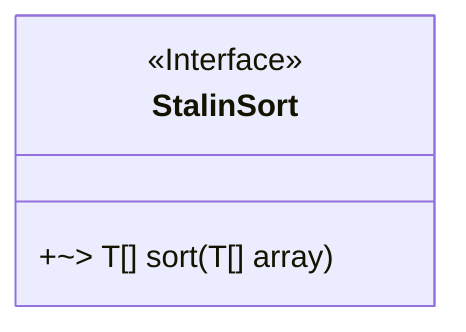
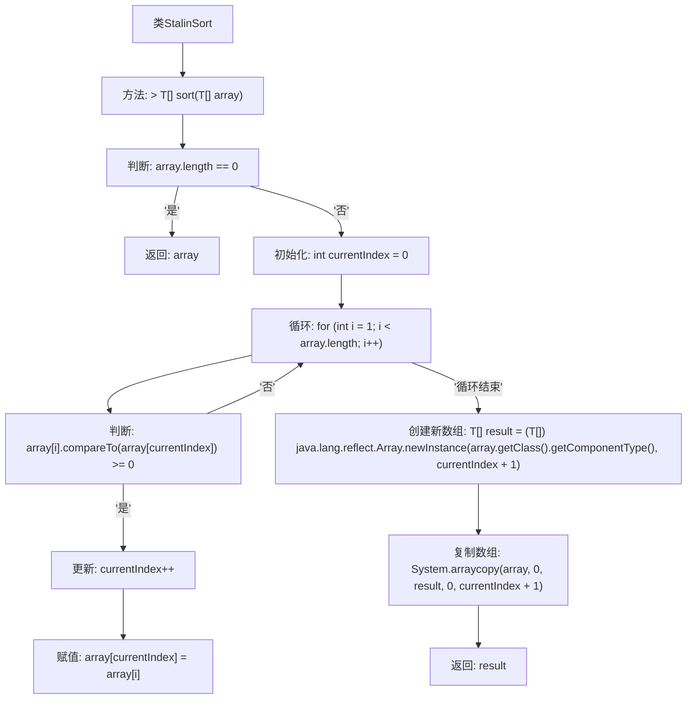

# 基础信息

|      |      |
|------|------|
| 名称 | StalinSort |
| 编码语言 | .java |
| 代码路径 | Java/src/main/java/com/thealgorithms/sorts/StalinSort.java |
| 包名 | com.thealgorithms.sorts |
| 依赖项 | [] |
| 概述说明 | StalinSort通过移除无序元素实现数组排序。 |

# 说明

StalinSort算法是一种独特的排序方法，其核心思想是通过移除数组中所有无序的元素来实现排序。具体来说，该算法从左到右遍历数组，保留符合顺序要求的元素，而移除那些破坏顺序的元素。最终，算法返回一个完全有序的数组。这种方法虽然简单，但在某些特定场景下可能具有实用性。

# 类列表 Class Summary

| 名称   | 类型  | 说明 |
|-------|------|-------------|
| StalinSort | class | StalinSort算法通过移除无序元素实现排序，返回有序数组。 |

## 类 StalinSort

|      |      |
|------|------|
| 访问范围 | public |
| 类型 | class |
| 名称 | StalinSort |
| 说明 | StalinSort算法通过移除无序元素实现排序，返回有序数组。 |

### UML类图

这段代码定义了一个名为 `StalinSort` 的类，该类实现了一个排序算法。该算法的核心思想是遍历数组，只保留符合递增顺序的元素，最终返回一个有序的子数组。`sort` 方法接受一个泛型数组作为参数，并返回一个经过排序的新数组。代码通过比较数组中的元素，确保结果数组中的元素始终保持递增顺序。这种排序算法的时间复杂度为 O(n)，因为它只需要一次遍历即可完成排序。

### 内部方法调用关系图

这段代码实现了一个名为StalinSort的排序算法。该算法通过遍历数组，只保留比当前最大值大或等于的元素，并将其移动到数组的前部，最终生成一个有序的数组。流程图展示了从判断数组是否为空、初始化索引、遍历数组、比较元素、更新索引、创建新数组到最终返回结果的全过程。

### 字段列表 Field List

| 名称  | 类型  | 说明 |
|-------|-------|------|

### 方法列表 Method List

| 名称  | 类型  | 说明 |
|-------|-------|------|
| sort | T[] | 该方法对可比较数组进行排序，返回有序子数组。 |

