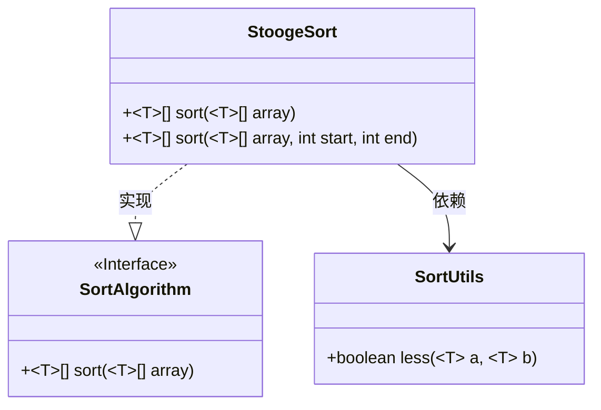
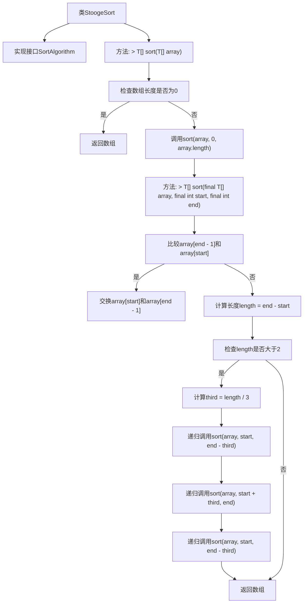

# 基础信息

|      |      |
|------|------|
| 名称 | StoogeSort |
| 编码语言 | .java |
| 代码路径 | Java/src/main/java/com/thealgorithms/sorts/StoogeSort.java |
| 包名 | com.thealgorithms.sorts |
| 依赖项 | [] |
| 概述说明 | StoogeSort通过递归分三段排序数组。 |

# 说明

StoogeSort是一种递归排序算法，通过将数组分为三段进行排序。首先，算法比较数组的第一个和最后一个元素，如果顺序错误则交换它们。然后，如果数组长度大于2，算法会递归地对前三分之二、后三分之二以及再次前三分之二的数组进行排序。这种方法确保数组最终被正确排序，但效率较低，适用于教学和理解递归概念。

# 类列表 Class Summary

| 名称   | 类型  | 说明 |
|-------|------|-------------|
| StoogeSort | class | StoogeSort实现排序算法，递归分三段排序数组。 |

## 类 StoogeSort

|      |      |
|------|------|
| 访问范围 | public |
| 类型 | class |
| 名称 | StoogeSort |
| 说明 | StoogeSort实现排序算法，递归分三段排序数组。 |

### UML类图

类图描述：
`StoogeSort`类实现了`SortAlgorithm`接口，提供了对数组进行排序的功能。`StoogeSort`类中定义了两个`sort`方法，其中一个用于对整个数组进行排序，另一个用于对数组的指定范围进行排序。`StoogeSort`类依赖于`SortUtils`类中的`less`方法，用于比较数组元素的大小。`SortAlgorithm`接口定义了排序算法的通用接口，`StoogeSort`类通过实现该接口来提供具体的排序逻辑。

### 内部方法调用关系图

这段代码实现了StoogeSort排序算法，它通过递归地将数组分成三部分并排序，最终完成整个数组的排序。代码首先检查数组是否为空，然后调用递归排序方法。在递归排序方法中，首先比较并交换数组的起始和结束元素，然后根据数组长度决定是否继续递归排序。流程图清晰地展示了代码的执行流程和递归调用的顺序。

### 字段列表 Field List

| 名称  | 类型  | 说明 |
|-------|-------|------|

### 方法列表 Method List

| 名称  | 类型  | 说明 |
|-------|-------|------|
| sort | T[] | 重写sort方法，对数组进行排序并返回。 |
| sort | T[] | 对数组进行递归三分排序，确保前小后大。 |

