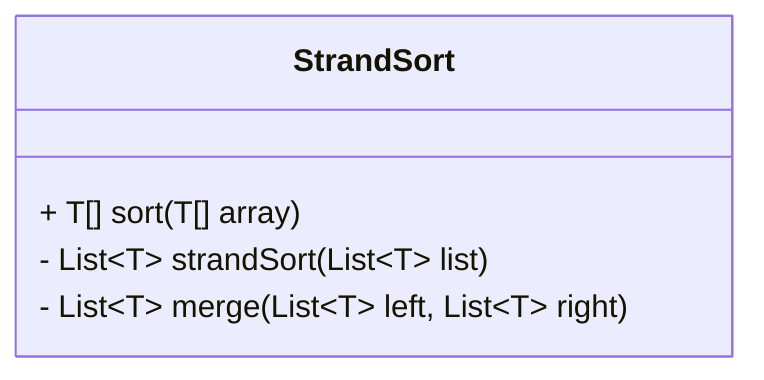
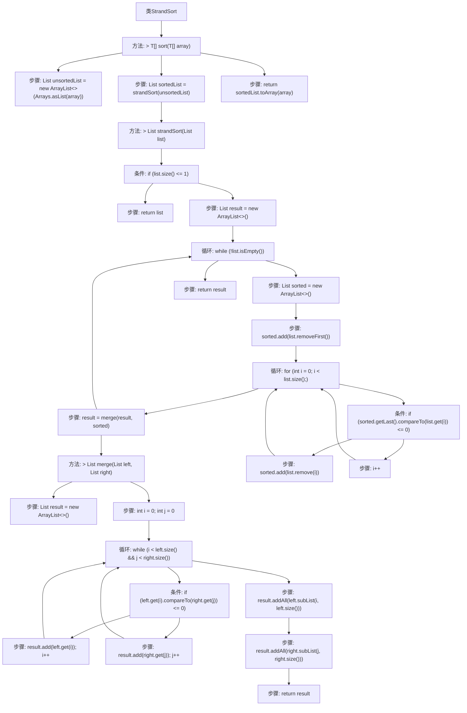

# 基础信息

|      |      |
|------|------|
| 名称 | StrandSort |
| 编码语言 | .java |
| 代码路径 | Java/src/main/java/com/thealgorithms/sorts/StrandSort.java |
| 包名 | com.thealgorithms.sorts |
| 依赖项 | ['java.util.ArrayList', 'java.util.Arrays', 'java.util.List'] |
| 概述说明 | StrandSort类实现Strand Sort算法，包含排序和合并方法。 |

# 说明

StrandSort类实现了Strand Sort排序算法，用于对数组进行排序。该类包含两个主要方法：排序方法和合并方法。排序方法负责将数组中的元素按照Strand Sort的规则进行排序，而合并方法则用于将已排序的子序列合并成一个完整的有序数组。该类的设计旨在通过Strand Sort算法高效地完成数组的排序任务。

# 类列表 Class Summary

| 名称   | 类型  | 说明 |
|-------|------|-------------|
| StrandSort | class | StrandSort类实现排序算法，使用Strand Sort对数组排序，包含排序和合并方法。 |

## 类 StrandSort

|      |      |
|------|------|
| 访问范围 | public final |
| 类型 | class |
| 名称 | StrandSort |
| 说明 | StrandSort类实现排序算法，使用Strand Sort对数组排序，包含排序和合并方法。 |

### UML类图

**描述：**  
`StrandSort` 类实现了一个名为 `Strand Sort` 的排序算法。该类包含一个公有方法 `sort`，用于对数组进行排序，以及两个私有方法 `strandSort` 和 `merge`，分别用于执行 Strand Sort 算法和合并两个已排序的列表。`StrandSort` 类使用了泛型 `T`，确保排序的元素必须实现 `Comparable` 接口，从而支持元素之间的比较操作。通过将数组转换为列表，执行 Strand Sort 算法，最终将排序后的列表转换回数组，实现了对数组的排序功能。

### 内部方法调用关系图

**描述：**
该流程图展示了`StrandSort`类的执行流程。`sort`方法首先将数组转换为列表，然后调用`strandSort`方法进行排序，最后将结果转换回数组。`strandSort`方法通过循环从列表中提取有序子列表，并将其与之前的结果合并。`merge`方法则负责将两个有序列表合并为一个有序列表。整个流程展示了Strand Sort算法的核心步骤和逻辑。

### 字段列表 Field List

| 名称  | 类型  | 说明 |
|-------|-------|------|

### 方法列表 Method List

| 名称  | 类型  | 说明 |
|-------|-------|------|
| merge | List<T> | 合并两个有序列表，返回新有序列表。 |
| sort | T[] | 重写sort方法，使用StrandSort对数组进行排序并返回结果。 |
| strandSort | List<T> | StrandSort算法实现，递归排序并合并列表。 |

