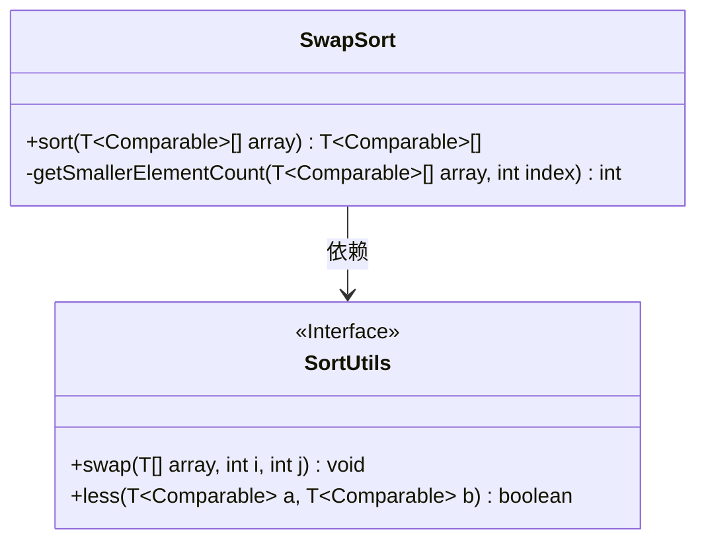
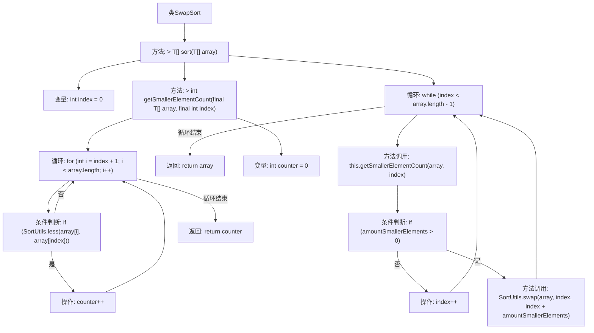

# 基础信息

|      |      |
|------|------|
| 名称 | SwapSort |
| 编码语言 | .java |
| 代码路径 | Java/src/main/java/com/thealgorithms/sorts/SwapSort.java |
| 包名 | com.thealgorithms.sorts |
| 依赖项 | [] |
| 概述说明 | SwapSort通过交换较小元素实现数组排序。 |

# 说明

SwapSort是一种基于交换操作的排序算法，其主要思想是通过不断交换数组中较小的元素，逐步将数组中的元素按升序排列。该算法通过遍历数组，每次比较相邻元素的大小，如果发现前一个元素大于后一个元素，则进行交换。这一过程会重复进行，直到整个数组中的元素都按照从小到大的顺序排列。SwapSort的核心在于通过简单的交换操作实现排序，其时间复杂度较高，适用于小规模数据的排序场景。

# 类列表 Class Summary

| 名称   | 类型  | 说明 |
|-------|------|-------------|
| SwapSort | class | SwapSort实现排序算法，通过交换较小元素完成数组排序。 |

## 类 SwapSort

|      |      |
|------|------|
| 访问范围 | public |
| 类型 | class |
| 名称 | SwapSort |
| 说明 | SwapSort实现排序算法，通过交换较小元素完成数组排序。 |

### UML类图

**描述：**  
`SwapSort`类实现了`SortAlgorithm`接口，提供了一个泛型排序方法`sort`，用于对实现了`Comparable`接口的数组进行排序。它通过`getSmallerElementCount`方法计算当前元素后比它小的元素数量，并根据结果决定是否交换元素位置。`SortUtils`接口提供了`swap`和`less`两个静态方法，分别用于交换数组元素和比较两个元素的大小。`SwapSort`类依赖于`SortUtils`接口来完成排序操作。

### 内部方法调用关系图

这段代码实现了一个名为`SwapSort`的排序算法。该算法通过比较数组中的元素，计算当前元素之后比它小的元素数量，并根据结果进行交换操作，直到数组排序完成。流程图展示了`sort`方法和`getSmallerElementCount`方法的内部逻辑，包括循环、条件判断和方法的调用关系。

### 字段列表 Field List

| 名称  | 类型  | 说明 |
|-------|-------|------|

### 方法列表 Method List

| 名称  | 类型  | 说明 |
|-------|-------|------|
| sort | T[] | 该方法通过比较和交换元素对数组进行排序。 |
| getSmallerElementCount | int | 计算数组中指定索引后小于该元素的个数。 |

