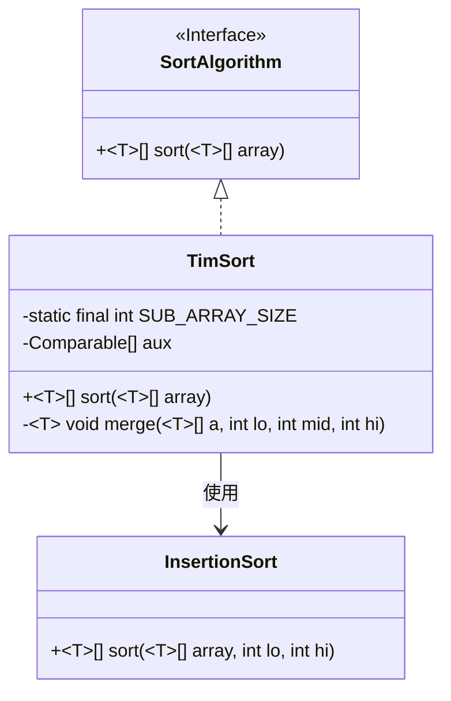
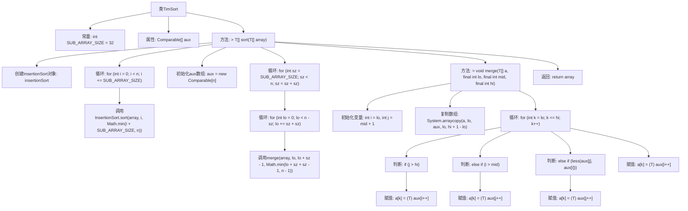

# 基础信息

|      |      |
|------|------|
| 名称 | TimSort |
| 编码语言 | .java |
| 代码路径 | Java/src/main/java/com/thealgorithms/sorts/TimSort.java |
| 包名 | com.thealgorithms.sorts |
| 依赖项 | ['com.thealgorithms.sorts.SortUtils.less'] |
| 概述说明 | TimSort算法先分段插入排序，再合并排序。 |

# 说明

TimSort算法是一种高效的排序算法，结合了插入排序和归并排序的优点。其实现过程首先将待排序的数组分割成多个较小的子段，对每个子段进行插入排序以确保局部有序。随后，通过归并排序的方式将这些有序子段逐步合并，最终形成一个完全有序的数组。TimSort算法在处理部分有序或包含重复元素的数组时表现尤为出色，广泛应用于Python等编程语言的排序操作中。

# 类列表 Class Summary

| 名称   | 类型  | 说明 |
|-------|------|-------------|
| TimSort | class | TimSort算法实现，先分段插入排序，再合并排序。 |

## 类 TimSort

|      |      |
|------|------|
| 访问范围 | None |
| 类型 | class |
| 名称 | TimSort |
| 说明 | TimSort算法实现，先分段插入排序，再合并排序。 |

### UML类图

这段代码展示了TimSort算法的实现，它是一种混合排序算法，结合了插入排序和归并排序的优点。TimSort类实现了SortAlgorithm接口，并使用了InsertionSort类来对数组进行局部排序。TimSort通过将数组分割成较小的子数组，先使用插入排序对子数组进行排序，然后使用归并排序将子数组合并成最终的有序数组。类图清晰地展示了TimSort与InsertionSort之间的依赖关系，以及TimSort对SortAlgorithm接口的实现。

### 内部方法调用关系图

这段代码实现了TimSort算法，主要用于对数组进行排序。首先，代码使用插入排序对数组进行分块排序，然后通过归并排序将分块后的数组合并成一个有序数组。归并排序过程中，代码通过比较和复制数组元素来完成排序。最终，返回排序后的数组。

### 字段列表 Field List

| 名称  | 类型  | 说明 |
|-------|-------|------|
| aux | Comparable[] | 声明了一个私有Comparable类型的辅助数组aux。 |
| SUB_ARRAY_SIZE = 32 | int | 定义常量SUB_ARRAY_SIZE，值为32。 |

### 方法列表 Method List

| 名称  | 类型  | 说明 |
|-------|-------|------|
| sort | T[] | 该方法使用插入排序和归并排序对数组进行分段排序和合并。 |
| merge | void | 合并排序算法中的合并步骤，用于合并两个有序子数组。 |

