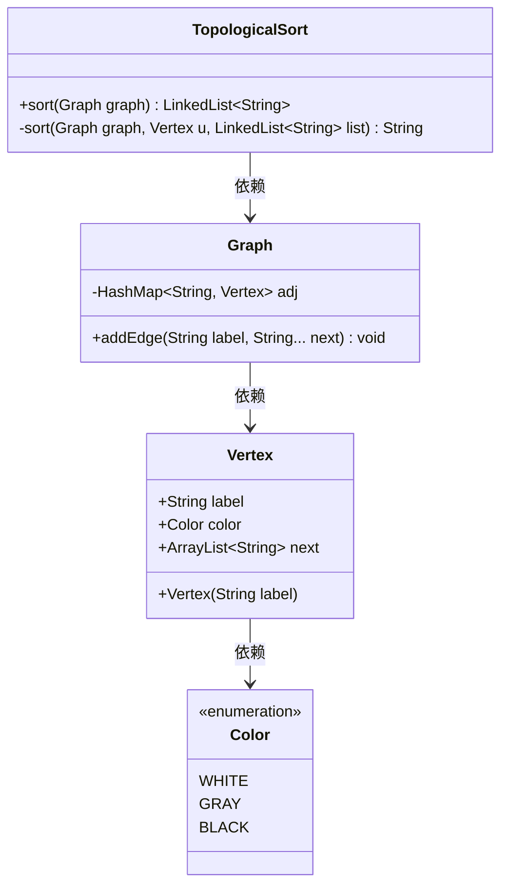
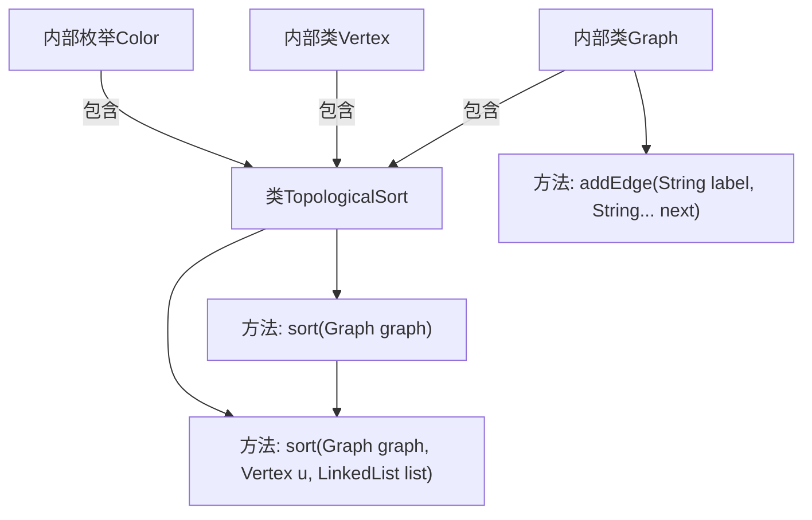

# 基础信息

|      |      |
|------|------|
| 名称 | TopologicalSort |
| 编码语言 | .java |
| 代码路径 | Java/src/main/java/com/thealgorithms/sorts/TopologicalSort.java |
| 包名 | com.thealgorithms.sorts |
| 依赖项 | ['java.util.ArrayList', 'java.util.Collections', 'java.util.HashMap', 'java.util.LinkedHashMap', 'java.util.LinkedList'] |
| 概述说明 | 实现拓扑排序的类，利用DFS检测环并生成线性顺序。 |

# 说明

该内容描述了一个用于实现拓扑排序的类，该类通过深度优先搜索（DFS）算法来检测图中是否存在环，并生成一个线性顺序。拓扑排序通常用于有向无环图（DAG），以确定节点的依赖关系。DFS算法在遍历过程中会检查是否有环存在，若检测到环则无法进行有效的拓扑排序。如果图中无环，DFS将生成一个线性序列，表示节点的合理顺序。该类的核心功能包括环检测和排序生成，适用于需要处理依赖关系的场景。

# 类列表 Class Summary

| 名称   | 类型  | 说明 |
|-------|------|-------------|
| TopologicalSort | class | 实现拓扑排序的类，使用DFS检测环并生成线性顺序。 |

## 类 TopologicalSort

|      |      |
|------|------|
| 访问范围 | public final |
| 类型 | class |
| 名称 | TopologicalSort |
| 说明 | 实现拓扑排序的类，使用DFS检测环并生成线性顺序。 |

### UML类图

### 描述
该代码实现了一个拓扑排序算法，使用深度优先搜索（DFS）来对有向无环图（DAG）进行排序。`TopologicalSort`类包含两个主要方法：`sort`用于执行拓扑排序，`sort`的重载版本用于DFS遍历。`Graph`类表示图结构，使用邻接表存储顶点和边。`Vertex`类表示图中的顶点，包含顶点标签、颜色标记（用于DFS）和邻接顶点列表。`Color`枚举用于表示DFS中的顶点状态（未访问、正在访问、已访问）。通过DFS遍历，算法检测图中是否存在环，并在发现环时抛出异常。

### 内部方法调用关系图

这段代码实现了一个拓扑排序算法，使用深度优先搜索（DFS）来检测图中的环并生成顶点的线性排序。代码包含一个`TopologicalSort`类，其中定义了`Color`枚举、`Vertex`内部类和`Graph`内部类。`Graph`类使用邻接表表示图，并提供了添加边的方法`addEdge`。`sort`方法通过DFS遍历图，检测环并生成拓扑排序结果。如果检测到环，则抛出异常。流程图展示了类和方法之间的调用关系，以及内部类的嵌套结构。

### 字段列表 Field List

| 名称  | 类型  | 说明 |
|-------|-------|------|

### 方法列表 Method List

| 名称  | 类型  | 说明 |
|-------|-------|------|
| sort | LinkedList<String> | 静态方法sort对图进行排序，返回字符串链表。 |
| sort | String | 深度优先搜索排序图顶点，检测循环并抛出异常。 |

