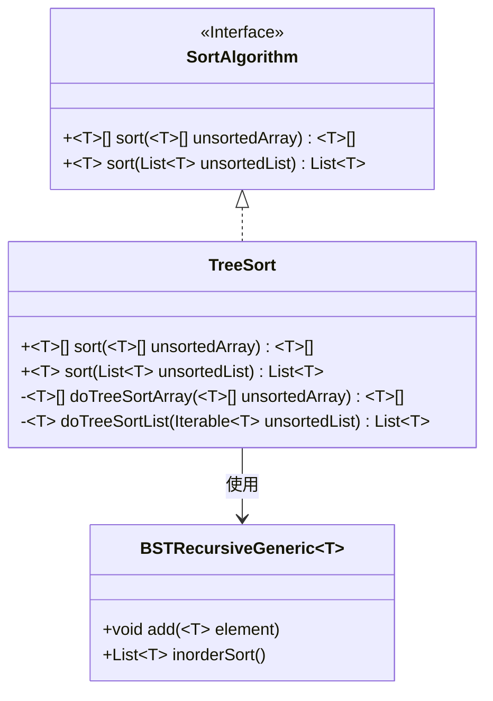
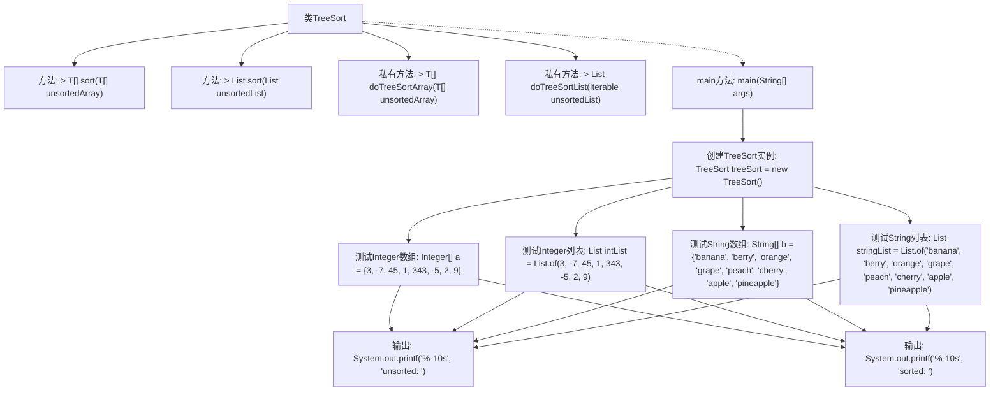

# 基础信息

|      |      |
|------|------|
| 名称 | TreeSort |
| 编码语言 | .java |
| 代码路径 | Java/src/main/java/com/thealgorithms/sorts/TreeSort.java |
| 包名 | com.thealgorithms.sorts |
| 依赖项 | ['com.thealgorithms.sorts.SortUtils.print', 'com.thealgorithms.datastructures.trees.BSTRecursiveGeneric', 'java.util.List'] |
| 概述说明 | TreeSort类利用二叉搜索树对数组和列表进行排序。 |

# 说明

TreeSort类实现了一种基于二叉搜索树的排序算法，能够对数组和列表进行排序。该算法通过构建二叉搜索树，将元素插入树中，然后通过中序遍历的方式获取有序序列。这种方法适用于各种数据类型，具有较好的稳定性和效率。TreeSort类提供了简洁的接口，方便用户调用，适用于需要排序的场景。

# 类列表 Class Summary

| 名称   | 类型  | 说明 |
|-------|------|-------------|
| TreeSort | class | TreeSort类实现排序算法，通过二叉搜索树对数组和列表进行排序。 |

## 类 TreeSort

|      |      |
|------|------|
| 访问范围 | public |
| 类型 | class |
| 名称 | TreeSort |
| 说明 | TreeSort类实现排序算法，通过二叉搜索树对数组和列表进行排序。 |

### UML类图

**描述**：`TreeSort`类实现了`SortAlgorithm`接口，提供了对数组和列表进行排序的功能。它通过`BSTRecursiveGeneric`类构建二叉搜索树，并使用中序遍历来实现排序。`TreeSort`类包含两个私有方法`doTreeSortArray`和`doTreeSortList`，分别用于处理数组和列表的排序。`BSTRecursiveGeneric`类负责二叉搜索树的构建和中序遍历。

### 内部方法调用关系图

这段代码实现了一个基于二叉搜索树（BST）的排序算法。`TreeSort`类提供了对数组和列表进行排序的方法，分别通过`doTreeSortArray`和`doTreeSortList`方法实现。`main`方法中测试了整数和字符串的数组与列表的排序功能，并输出排序前后的结果。代码通过创建BST、添加元素、中序遍历获取排序结果，并将结果返回或更新到原数组中。

### 字段列表 Field List

| 名称  | 类型  | 说明 |
|-------|-------|------|

### 方法列表 Method List

| 名称  | 类型  | 说明 |
|-------|-------|------|
| sort | List<T> | 重写sort方法，使用doTreeSortList对未排序列表进行排序。 |
| sort | T[] | 重写sort方法，使用树排序处理未排序数组。 |
| doTreeSortArray | T[] | 使用二叉搜索树对数组进行排序，返回排序后的数组。 |
| doTreeSortList | List<T> | 使用BST对可比较元素列表进行排序，返回有序列表。 |
| main | void | 测试TreeSort对整数数组、整数列表、字符串数组和字符串列表的排序功能。 |

