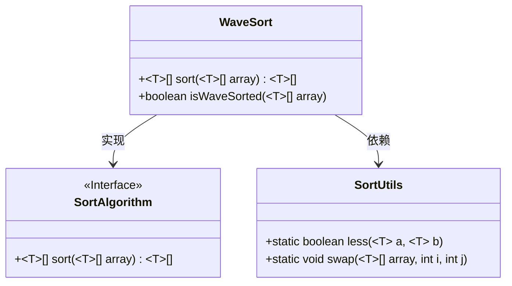
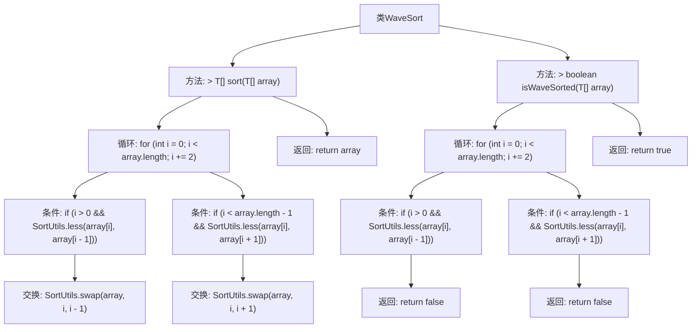

# 基础信息

|      |      |
|------|------|
| 名称 | WaveSort |
| 编码语言 | .java |
| 代码路径 | Java/src/main/java/com/thealgorithms/sorts/WaveSort.java |
| 包名 | com.thealgorithms.sorts |
| 依赖项 | [] |
| 概述说明 | WaveSort类实现波浪排序算法，确保交替元素大于相邻元素，并检查数组是否波浪排序。 |

# 说明

WaveSort类实现了波浪排序算法，该算法通过调整数组元素顺序，确保每个元素交替大于其相邻元素，从而形成波浪状排序。该类还提供了功能来检查数组是否已按波浪排序规则排列。波浪排序算法通过特定逻辑重新排列数组元素，使得奇数索引位置的元素大于其相邻的偶数索引位置元素，偶数索引位置的元素则小于其相邻的奇数索引位置元素，从而实现波浪排序的效果。

# 类列表 Class Summary

| 名称   | 类型  | 说明 |
|-------|------|-------------|
| WaveSort | class | WaveSort类实现波浪排序算法，确保交替元素大于相邻元素，并检查数组是否波浪排序。 |

## 类 WaveSort

|      |      |
|------|------|
| 访问范围 | public |
| 类型 | class |
| 名称 | WaveSort |
| 说明 | WaveSort类实现波浪排序算法，确保交替元素大于相邻元素，并检查数组是否波浪排序。 |

### UML类图

**描述：**  
`WaveSort` 类实现了 `SortAlgorithm` 接口，提供了一个波浪排序算法。该算法通过遍历数组，确保每个偶数位置的元素都大于其相邻元素。`WaveSort` 还提供了一个 `isWaveSorted` 方法，用于检查数组是否已经满足波浪排序的条件。`SortUtils` 类提供了比较和交换元素的静态方法，`WaveSort` 依赖于 `SortUtils` 来实现排序逻辑。

### 内部方法调用关系图

这段代码定义了一个名为 `WaveSort` 的类，该类实现了 `SortAlgorithm` 接口。`WaveSort` 类包含两个主要方法：`sort` 和 `isWaveSorted`。`sort` 方法通过遍历数组并确保每个交替元素大于其相邻元素来实现波浪排序。`isWaveSorted` 方法则用于检查数组是否已经按照波浪排序的方式排列。两个方法都依赖于 `SortUtils` 类中的 `less` 和 `swap` 方法来比较和交换数组元素。

### 字段列表 Field List

| 名称  | 类型  | 说明 |
|-------|-------|------|

### 方法列表 Method List

| 名称  | 类型  | 说明 |
|-------|-------|------|
| sort | T[] | 该方法对数组进行排序，通过比较和交换相邻元素实现。 |
| isWaveSorted | boolean | 检查数组是否为波浪排序，满足相邻元素大小交替条件。 |

