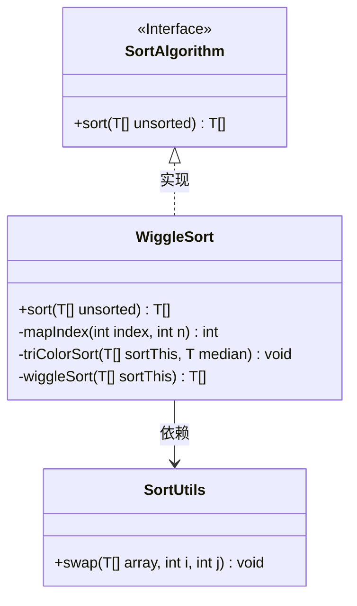
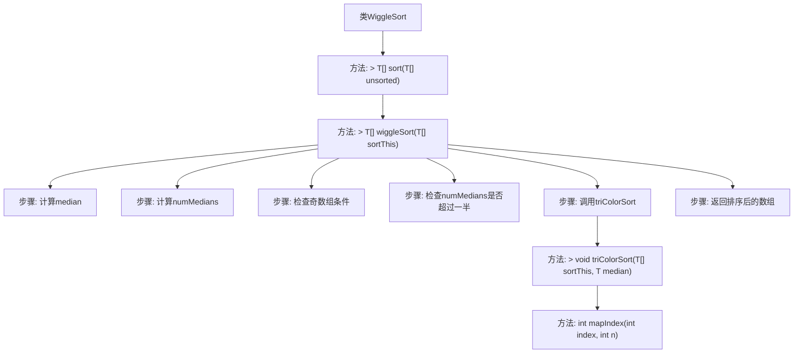

# 基础信息

|      |      |
|------|------|
| 名称 | WiggleSort |
| 编码语言 | .java |
| 代码路径 | Java/src/main/java/com/thealgorithms/sorts/WiggleSort.java |
| 包名 | com.thealgorithms.sorts |
| 依赖项 | ['com.thealgorithms.maths.Ceil.ceil', 'com.thealgorithms.maths.Floor.floor', 'com.thealgorithms.searches.QuickSelect.select', 'java.util.Arrays'] |
| 概述说明 | WiggleSort利用中值三色排序实现数组摆动有序。 |

# 说明

WiggleSort是一种基于中值的三色排序算法，旨在将数组调整为摆动有序的状态。该算法通过选取数组的中值，将元素分为三部分：小于中值的元素、等于中值的元素和大于中值的元素。然后，将这些元素重新排列，确保数组呈现摆动有序的模式，即相邻元素交替增大和减小。这种方法有效地平衡了数组的排序和摆动特性，适用于需要特定顺序的数组处理场景。

# 类列表 Class Summary

| 名称   | 类型  | 说明 |
|-------|------|-------------|
| WiggleSort | class | WiggleSort实现基于中值的三色排序，确保数组摆动有序。 |

## 类 WiggleSort

|      |      |
|------|------|
| 访问范围 | public |
| 类型 | class |
| 名称 | WiggleSort |
| 说明 | WiggleSort实现基于中值的三色排序，确保数组摆动有序。 |

### UML类图

类图描述：  
`WiggleSort` 类实现了 `SortAlgorithm` 接口，提供了 `sort` 方法用于对数组进行排序。`WiggleSort` 内部包含 `mapIndex`、`triColorSort` 和 `wiggleSort` 三个私有方法，分别用于索引映射、三色排序和摆动排序。`triColorSort` 方法依赖 `SortUtils` 类的 `swap` 方法进行元素交换。`wiggleSort` 方法通过选择中位数并进行三色排序来实现摆动排序，确保数组中的元素按照摆动顺序排列。

### 内部方法调用关系图

该流程图展示了`WiggleSort`类的内部方法调用关系。`sort`方法调用`wiggleSort`方法，`wiggleSort`方法首先计算中位数`median`，然后计算中位数的出现次数`numMedians`，并检查奇数组条件和`numMedians`是否超过一半。如果条件满足，则调用`triColorSort`方法进行三色排序，最后返回排序后的数组。`triColorSort`方法内部使用`mapIndex`方法进行索引映射。

### 字段列表 Field List

| 名称  | 类型  | 说明 |
|-------|-------|------|

### 方法列表 Method List

| 名称  | 类型  | 说明 |
|-------|-------|------|
| sort | T[] | 重写sort方法，调用wiggleSort对数组进行排序。 |
| wiggleSort | T[] | 使用快速选择找中位数，确保中位数条件满足后进行三色排序。 |
| mapIndex | int | 方法mapIndex通过公式计算并返回调整后的索引值。 |
| triColorSort | void | 三色排序算法通过交换元素将数组分为小于、等于和大于中位数的三部分。 |

